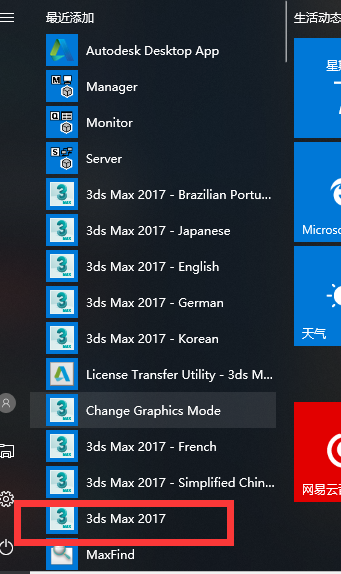
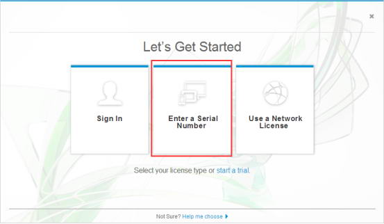
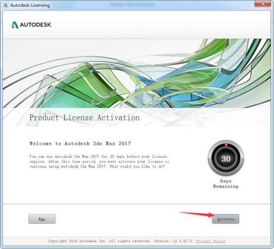
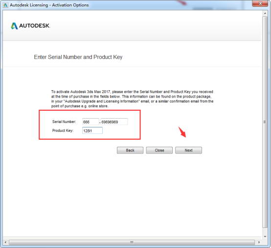
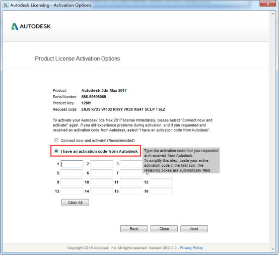
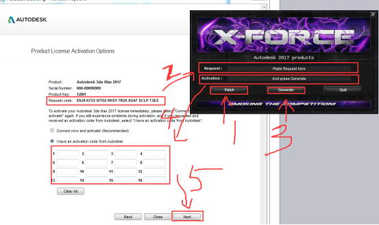

[](https://www.3d66.com/softhtml/softsetup_350.html)

总操作流程：
- 1、[下载安装](#3dmax-2017-01)；
- 2、[破解](#3dmax-2017-02)；

***

# <a name="3dmax-2017-01" href="#" >下载安装</a>

[](https://pan.baidu.com/s/1DY1I_ivM9HpQgyZ0YyErog)

# <a name="3dmax-2017-02" href="#" >破解</a>








```
序列号 ：666-69696969, 667-98989898、400-45454545、066-66666666
产品密钥：128I1
```



`
鼠标右击注册机的exe，以管理员身份运行
`


