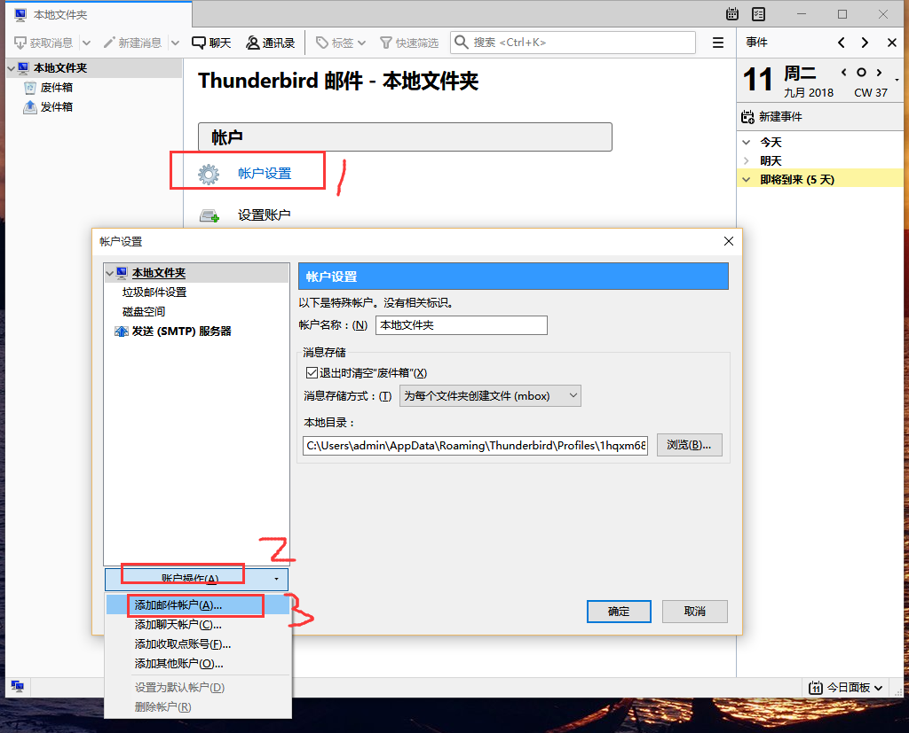
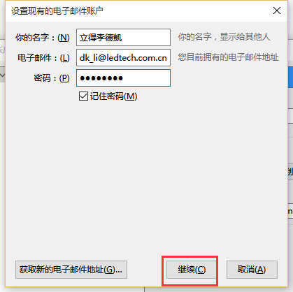
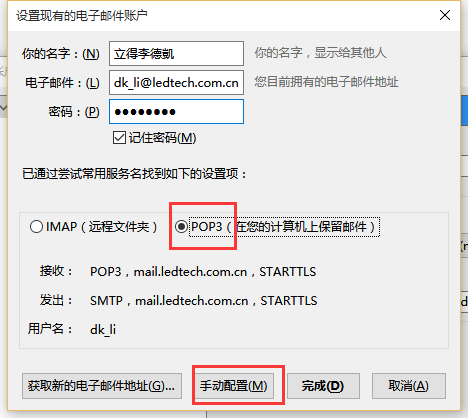
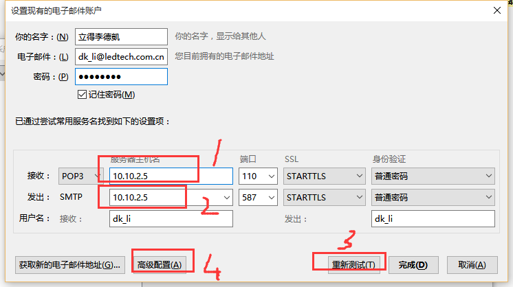
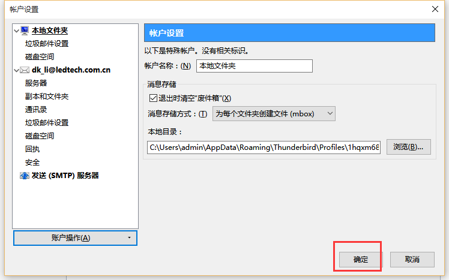
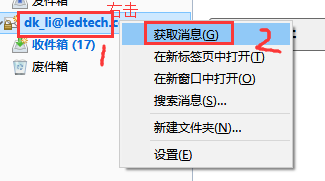
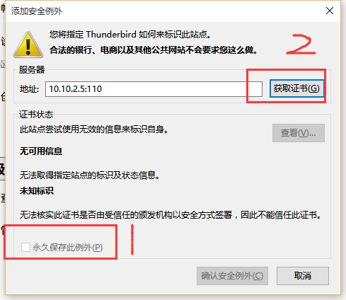

总操作流程:
- 1、[找到登陆处](#Thunderbird-01)
- 2、[登陆](#Thunderbird-02)
- 3、[获取信息](#Thunderbird-03)

***

# <a name="Thunderbird-01" href="#" >找到登陆处</a>

# <a name="Thunderbird-02" href="#" >登陆</a>

# <a name="Thunderbird-01" href="#" >获取信息</a>

