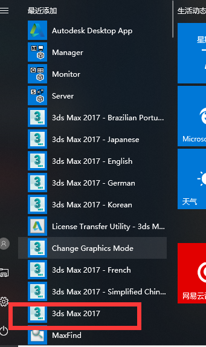
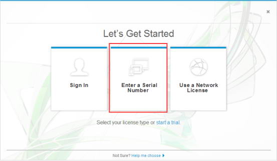
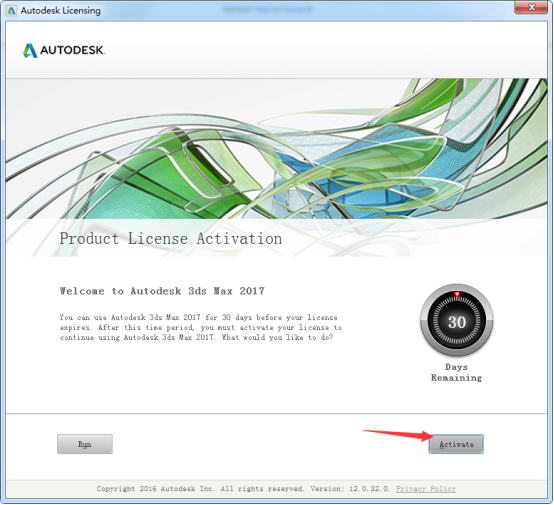
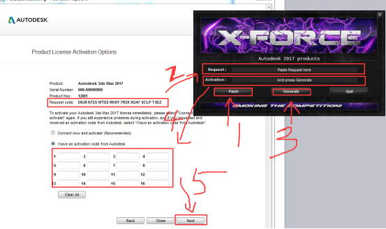

[参考文献](https://www.3d66.com/softhtml/softsetup_350.html)
总操作流程：
- 1、下载安装；
- 2、破解；

***

# 下载安装
[ 3dmax2017含注册机](https://pan.baidu.com/s/1exd-ur8lnKpvhZCH6gIXxg)
# 破解




```
序列号 ：666-69696969, 667-98989898、400-45454545、066-66666666
产品密钥：128I1
```

`
鼠标右击注册机的exe，以管理员身份运行
`
