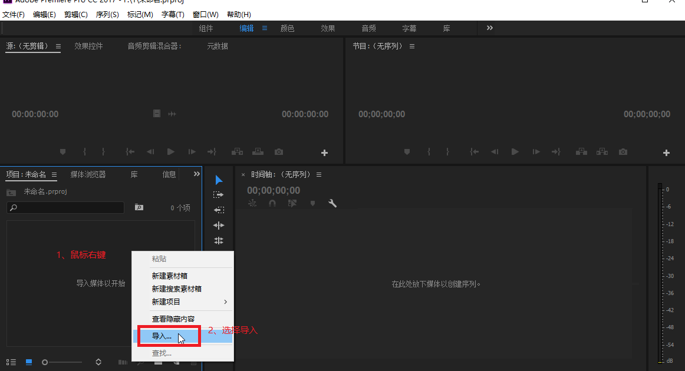
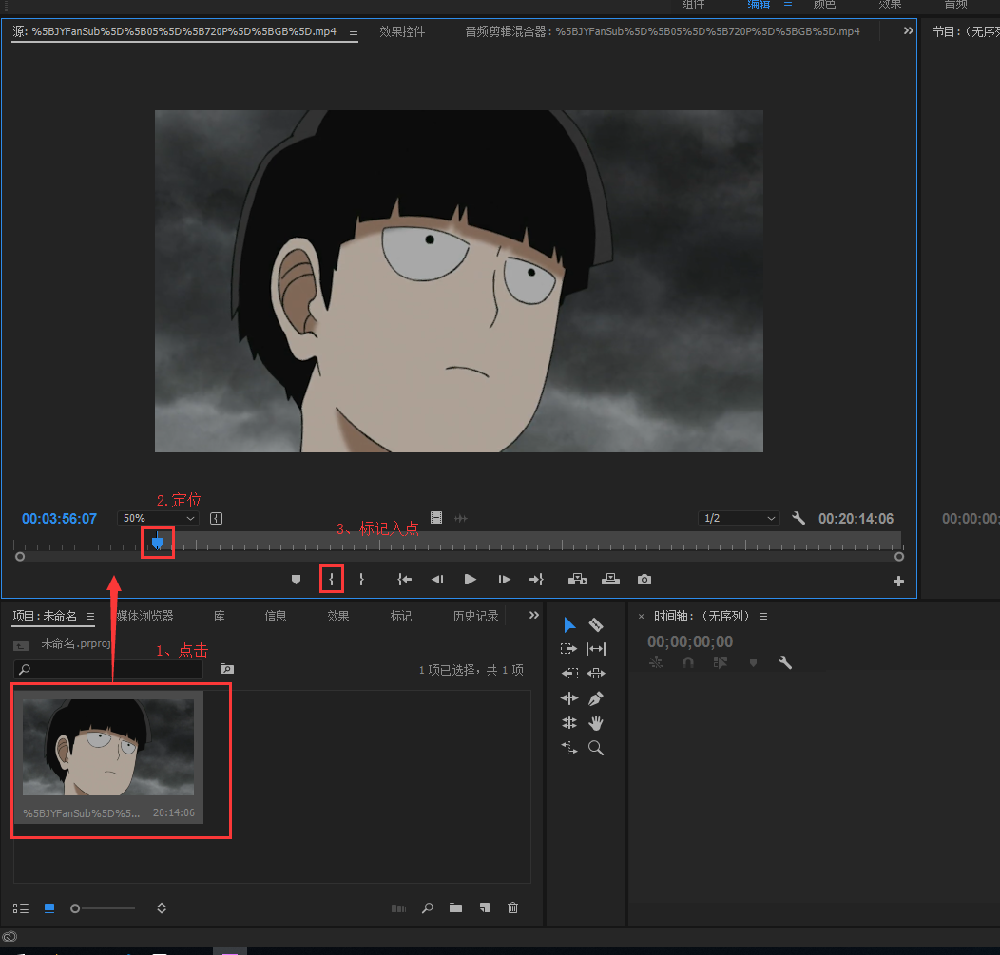
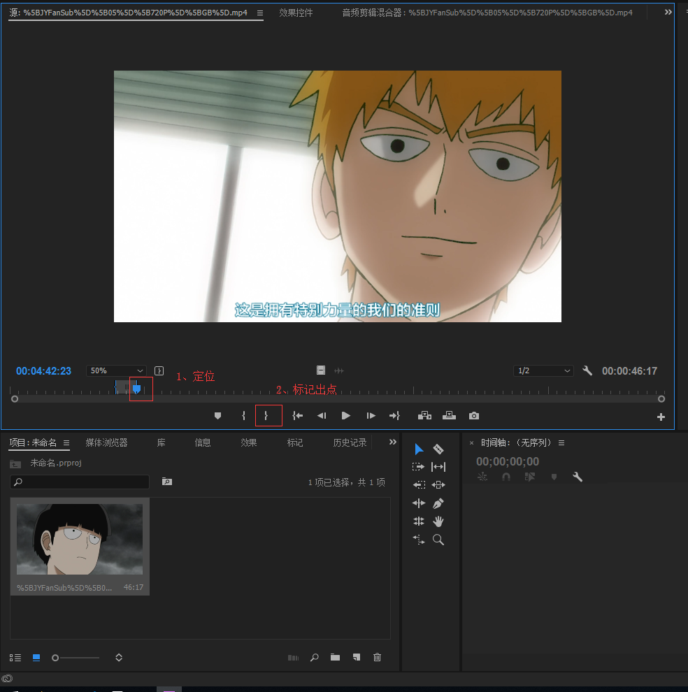
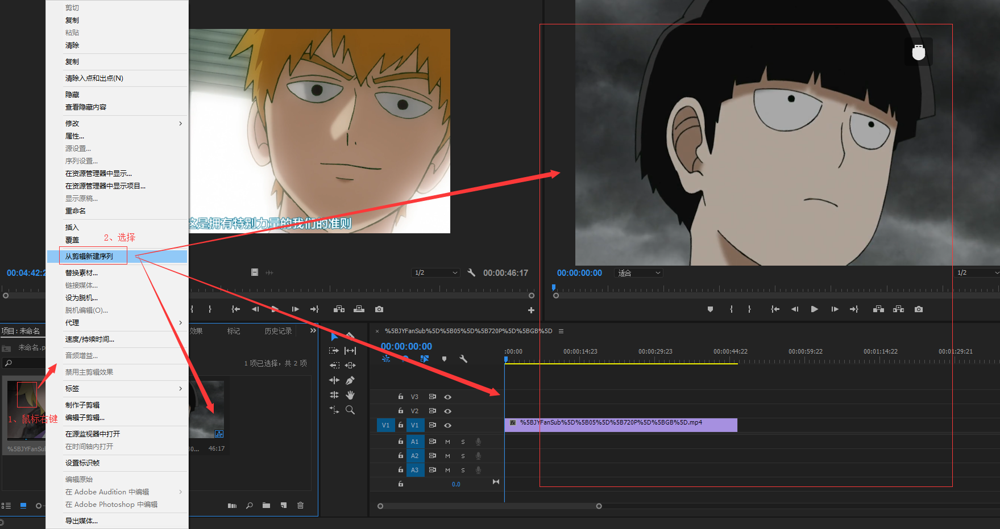
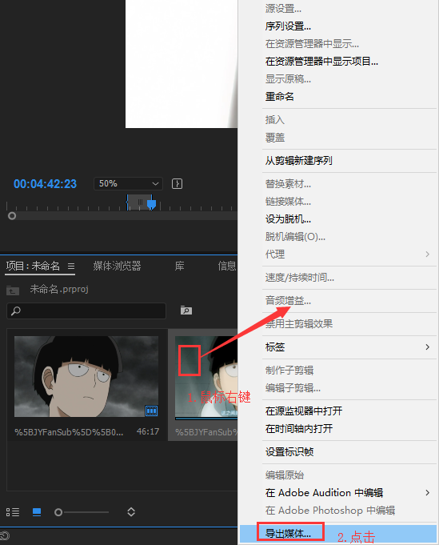
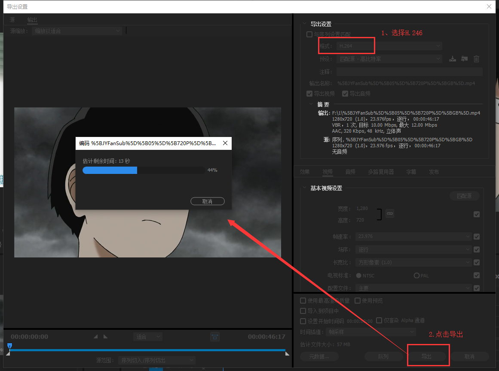

总操作流程：
- 1、[导入avi格式视频](#pr-01)
- 2、[标记入点和出点](#pr-02)
- 3、[剪切](#pr-03)
- 4、[导出](#pr-04)

***

`注意：mp4格式的视频导入，剪切后导出没声音的`

# <a name="pr-01" href="#" >导入avi格式视频</a>

# <a name="pr-02" href="#" >标记入点和出点</a>

>1、标记入点

>2、标记出点

# <a name="pr-03" href="#" >剪切</a>

# <a name="pr-04" href="#" >导出</a>

