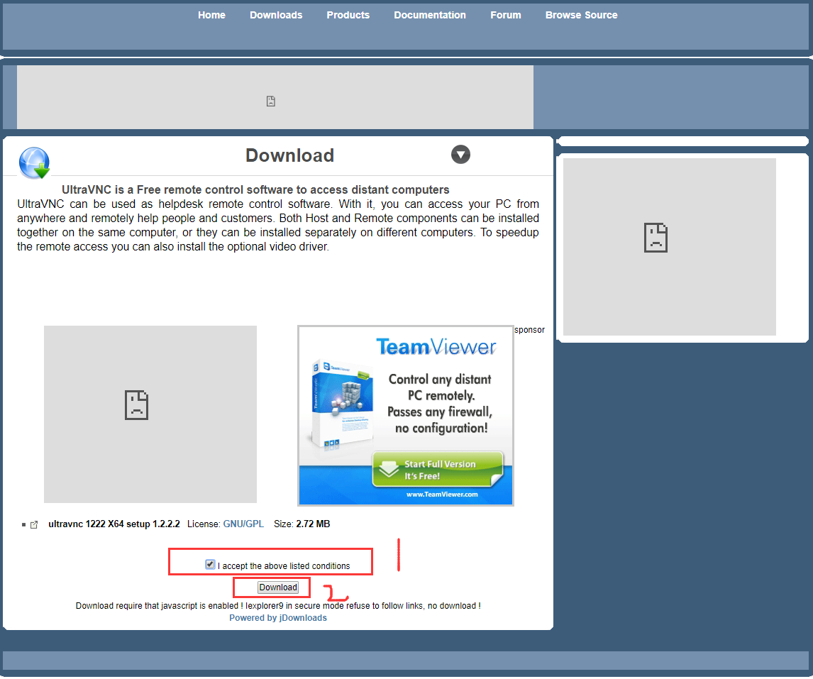

总操作流程：
- 1、[下载安装](#UltraVNC-01)
- 2、[配置](#UltraVNC-02)

***

# <a name="UltraVNC-01" href="#" >下载安装</a>

- 下载

- 安装

# <a name="UltraVNC-02" href="#" >配置</a>

- UltraVNC Server（被别人链接）

- UltraVNC Viewer（链接别人）

