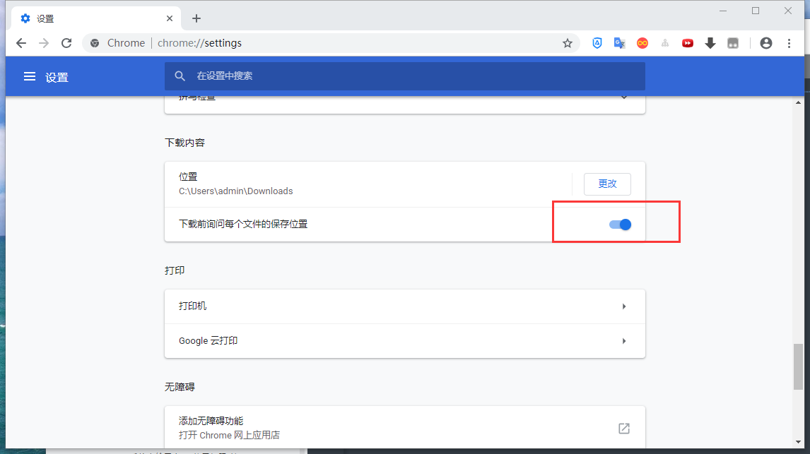

总操作流程：
- 1、[下载安装](#GoogleChrome-01)
- 2、[配置](#GoogleChrome-02)
- 3、[更新](#GoogleChrome-03)

***

# <a name="GoogleChrome-01" href="#" >下载安装</a>

# <a name="GoogleChrome-02" href="#" >配置</a>

# <a name="GoogleChrome-03" href="#" >更新</a>
