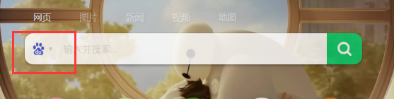

总操作流程：
- 1、[下载安装插件](#GoogleChrome-01)
- 2、[配置插件](#GoogleChrome-02)
- 3、[看效果](#GoogleChrome-03)

***

# <a name="GoogleChrome-01" href="#" >下载安装插件</a>

- 下载

- 安装

# <a name="GoogleChrome-02" href="#" >配置插件</a>

- 註冊登陆

- 添加书签

- 添加搜索引擎

# <a name="GoogleChrome-03" href="#" >看效果</a>

`重启浏览器`