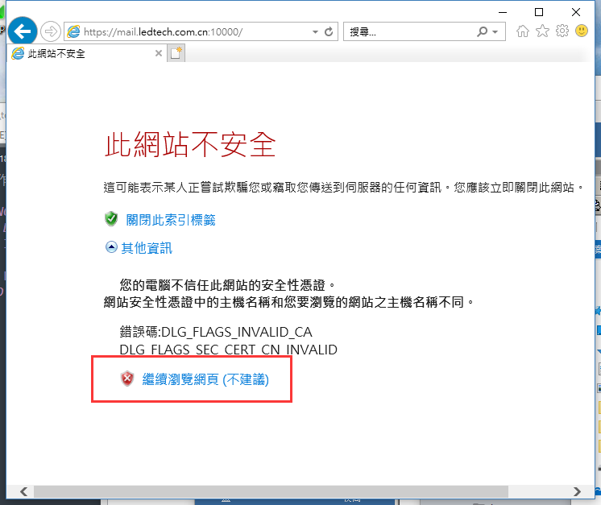
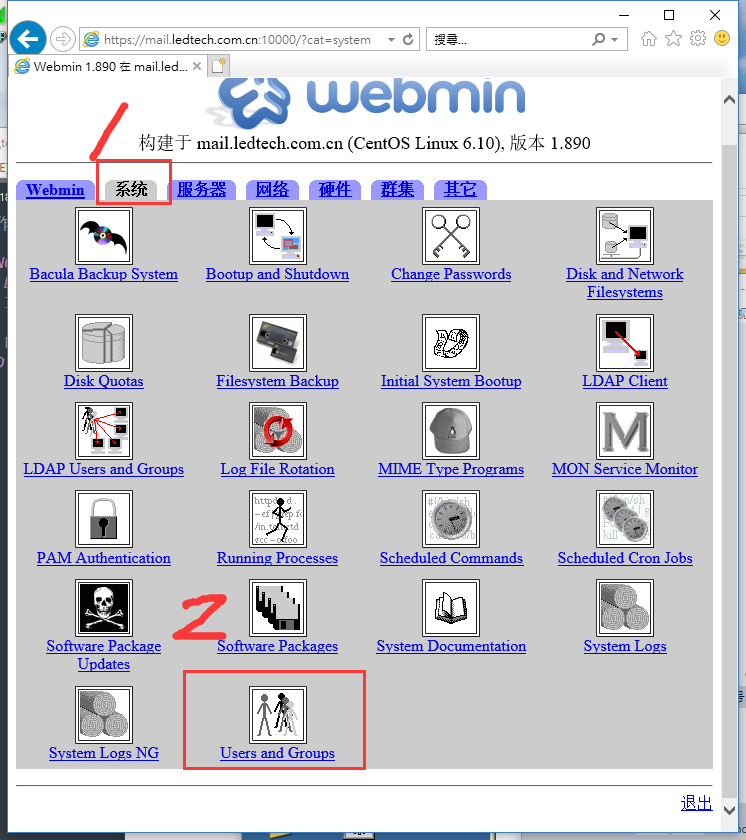
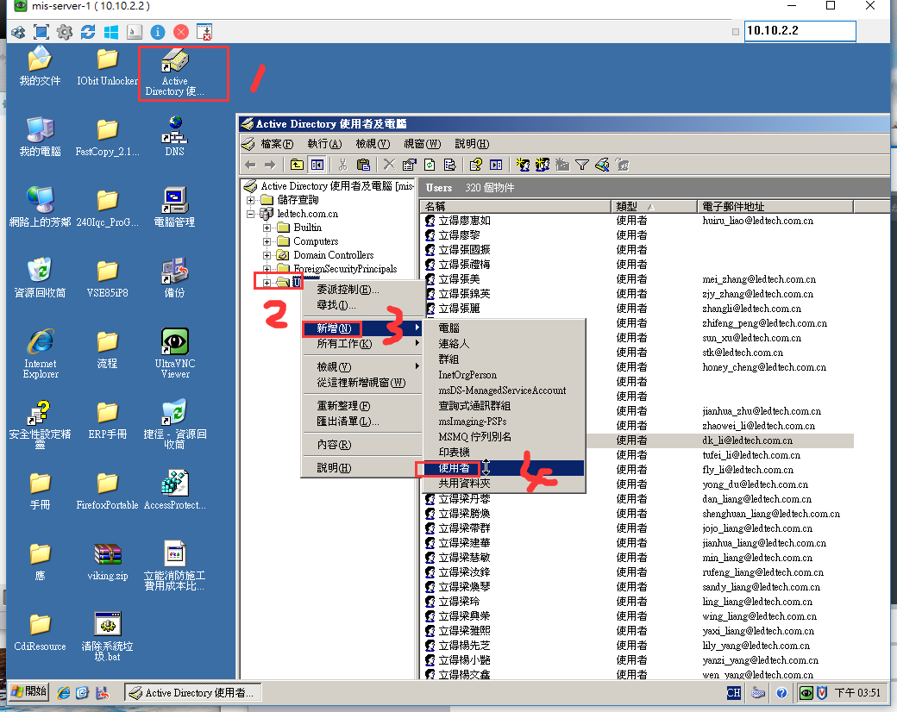
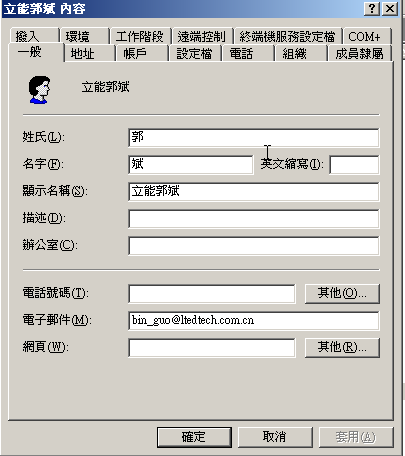
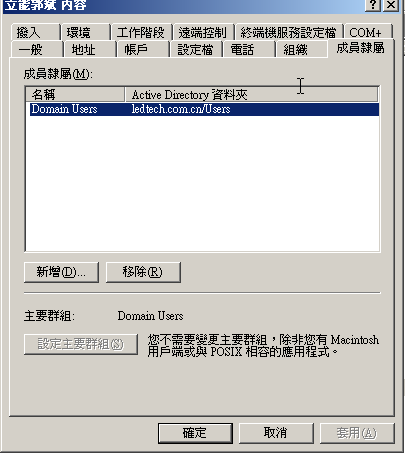

总操作流程：
- 1、登陆erp
- 2、添加用户
- 3、添加Active Directory
- 4、测试

***

# 登陆erp

```
http://10.10.2.5:10000
```




# 添加用户




# 添加Active Directory

`
远程：10.10.2.2

密码：SZLEDTECH
`




`
添加后，找到它，做修改
`





# 测试

`登陆：http：//10.10.2.5 登陆。用户名：bin_guo 密码:18919`

