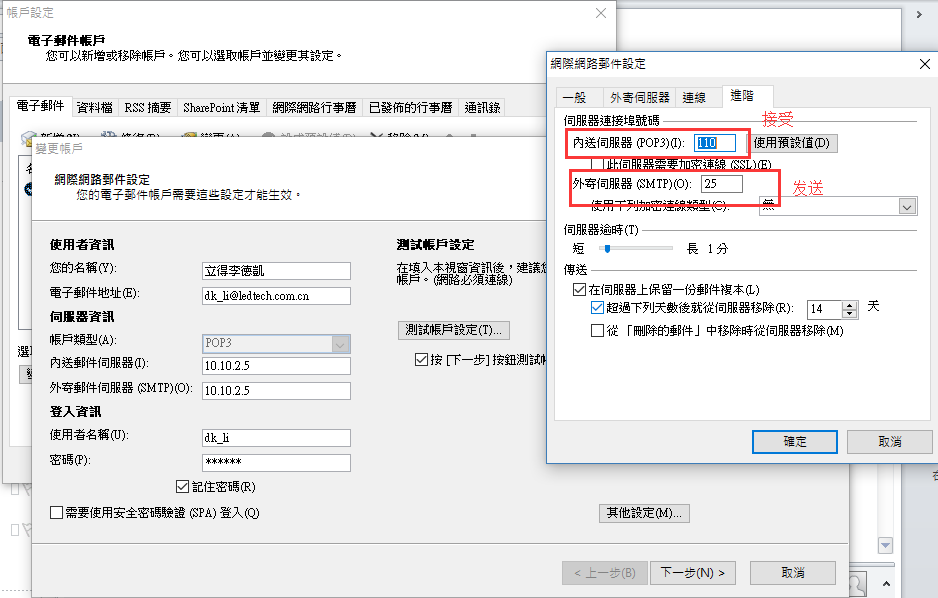
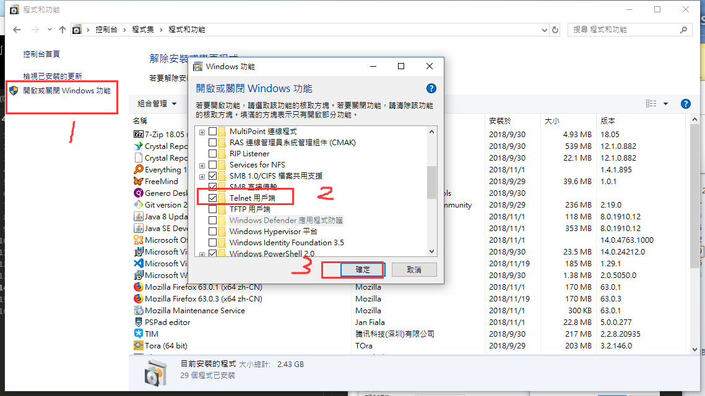

本页目录
- 1、outlook查询伺服器接发预设置
- 2、使用telnet命令查询
- 3、解决

***
# outlook查询伺服器接发预设置



# 使用telnet命令查询

>win10开启telnet


>使用命令
```
telnet 10.10.2.5 110 #查接受
```

`成功标志`


```
telnet 10.10.2.5 25 #查发送
```

`成功标志`


# 解决

> 不通过，系统重启