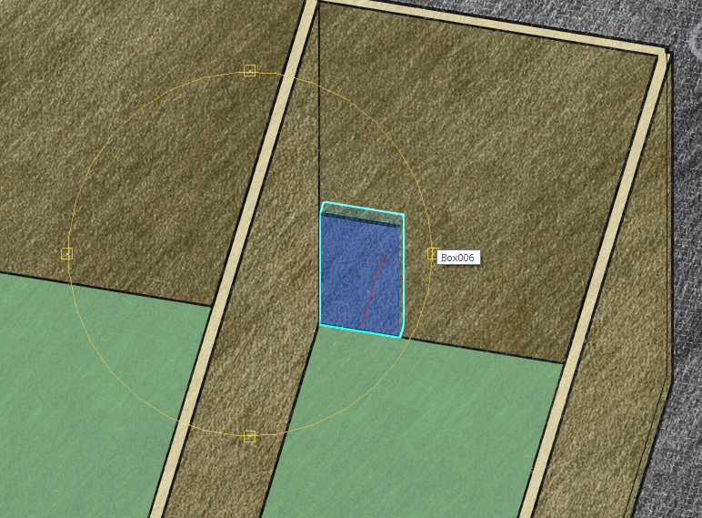
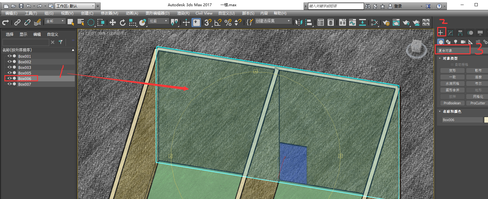
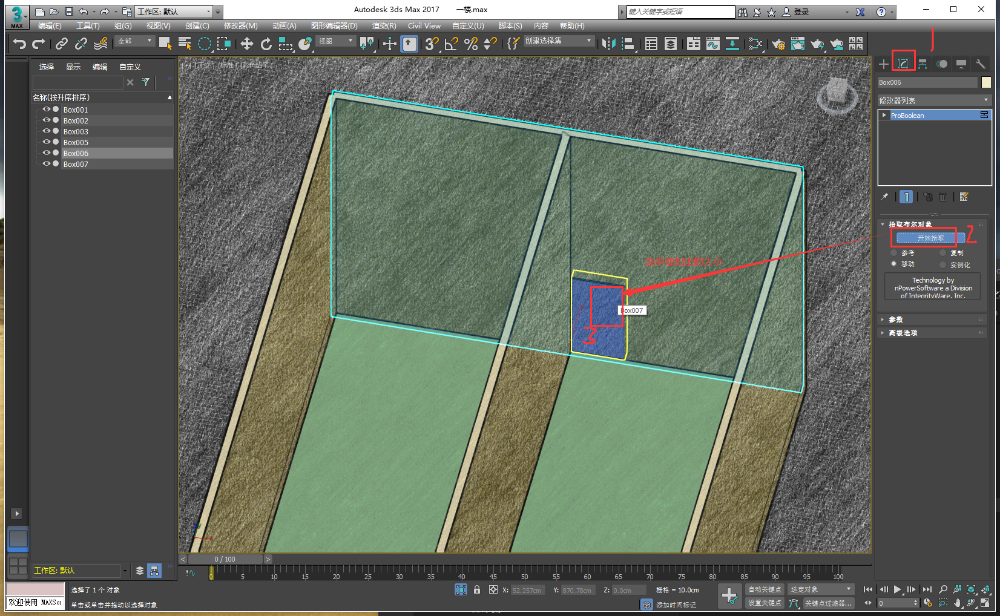
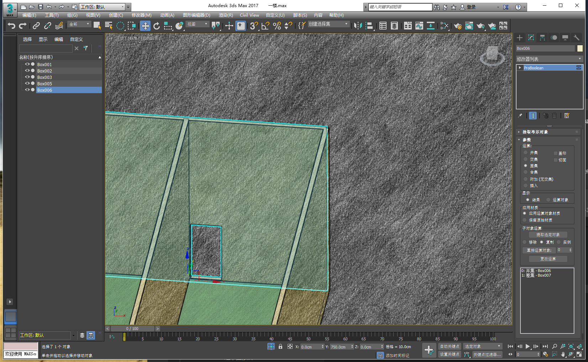

总操作流程；
- 1、[叠加两个立体](#3dmax-2017-01)
- 2、[使用布尔运行扣](#3dmax-2017-02)
- 3、[看效果](#3dmax-2017-03)

> 在墙体扣个门出来

***

# <a name="3dmax-2017-01" href="#" >叠加两个立体</a>

# <a name="3dmax-2017-02" href="#" >使用布尔运行扣</a>

> 选中被扣的对象，并使用布尔运行

> 选择要扣的对象

# <a name="3dmax-2017-03" href="#" >看效果</a>

