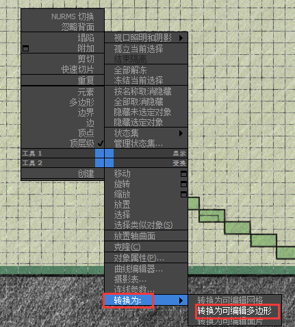
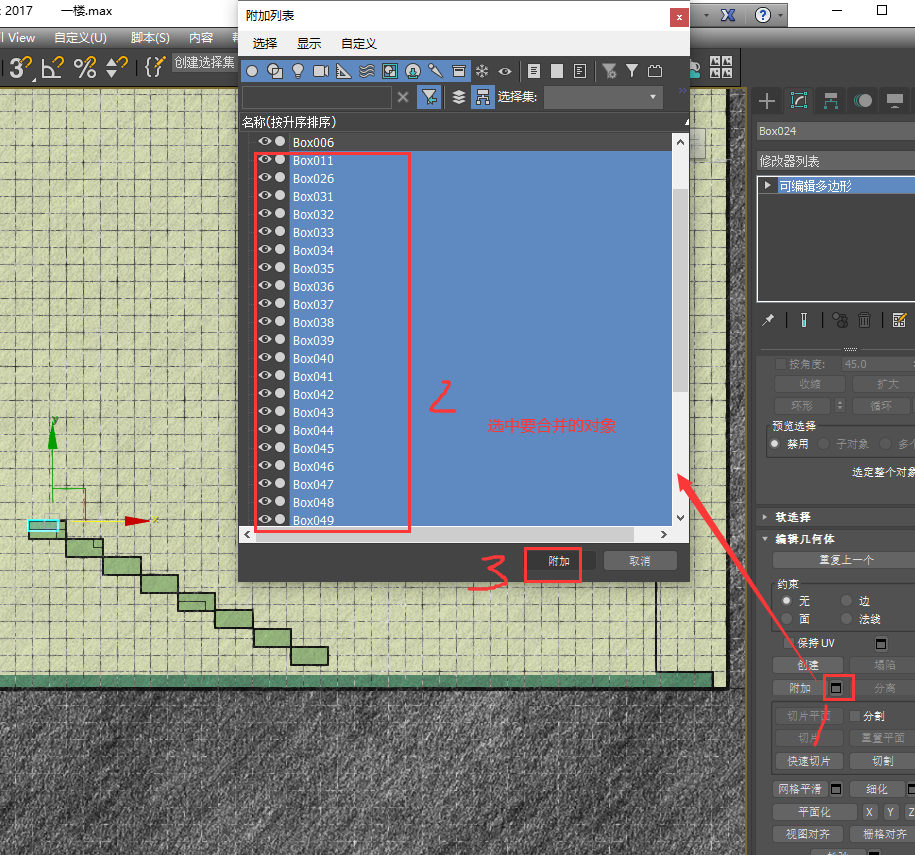
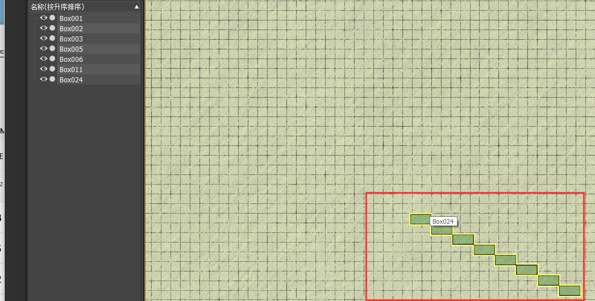

总操作流程；
- 1、[开启编辑多边形](#3dmax-2017-01)
- 2、[使用附加功能](#3dmax-2017-02)
- 3、[看效果](#3dmax-2017-03)

***

# <a name="3dmax-2017-01" href="#" >开启编辑多边形</a>

> 选中物体右键

# <a name="3dmax-2017-02" href="#" >使用附加功能</a>

# <a name="3dmax-2017-03" href="#" >看效果</a>

