总操作流程：
- 1、[下载安装微软u盘启动盘制作工具](#win10-01)
- 2、[下载系统](#win10-02)
- 3、[制作u盘](#win10-03)
- 4、[装系统](#win10-04)
- 5、[激活系統](#win10-05)

***

# <a name="win10-01" href="#" >下载安装微软u盘启动盘制作工具</a>

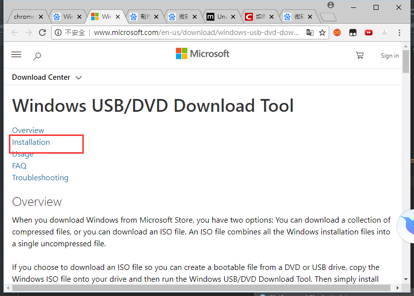

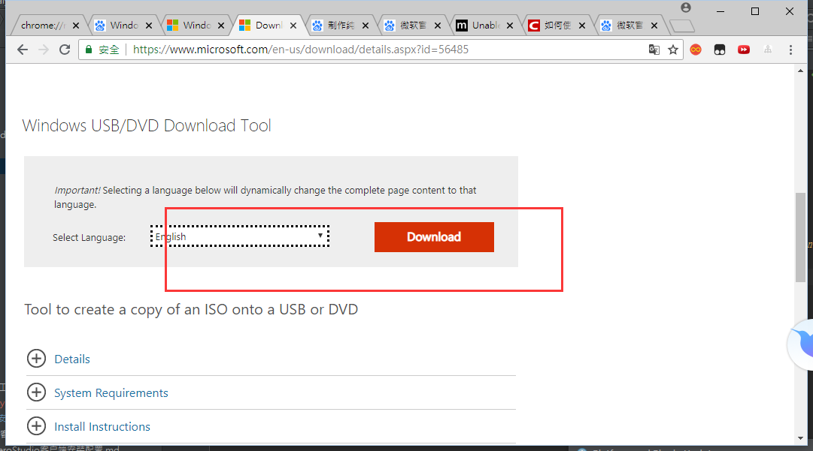

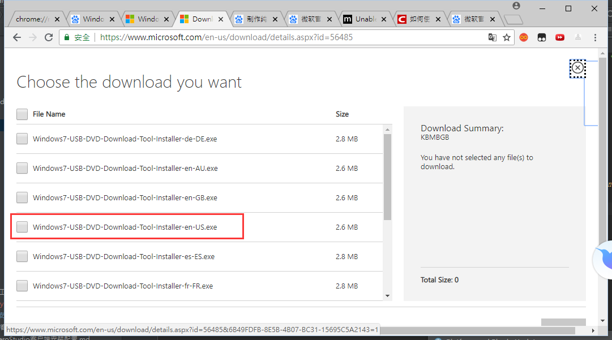

# <a name="win10-02" href="#" >下载系统</a>

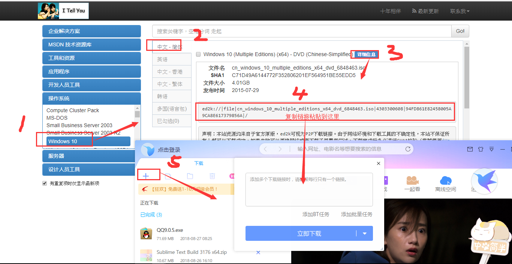

# <a name="win10-03" href="#" >制作u盘</a>

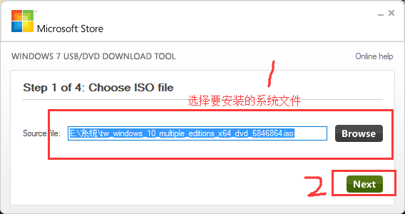

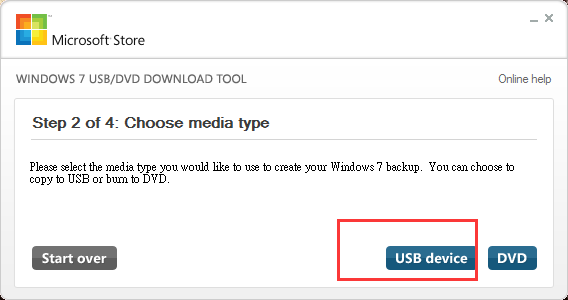

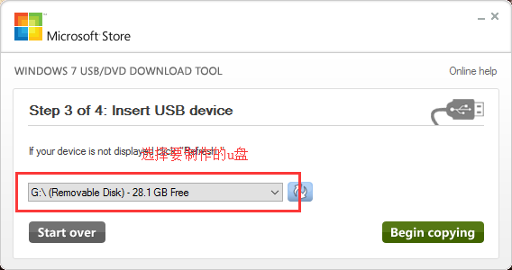

# <a name="win10-04" href="#" >装系统</a>

1、u盘启动.插入U盘启动电脑后按F12或F11或Esc等快捷键弹出启动菜单，选择带有UEFI前缀的U盘启动项，回车。

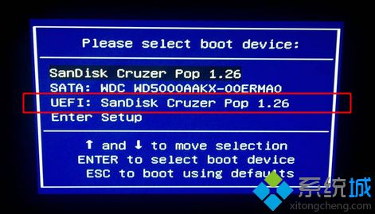

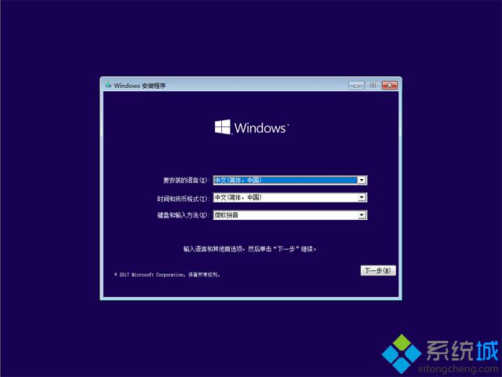

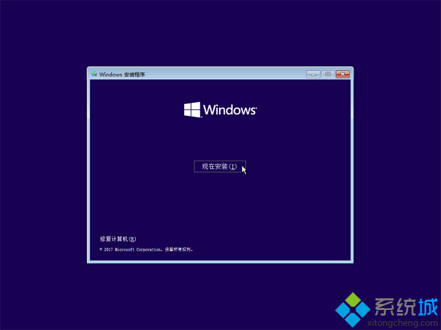

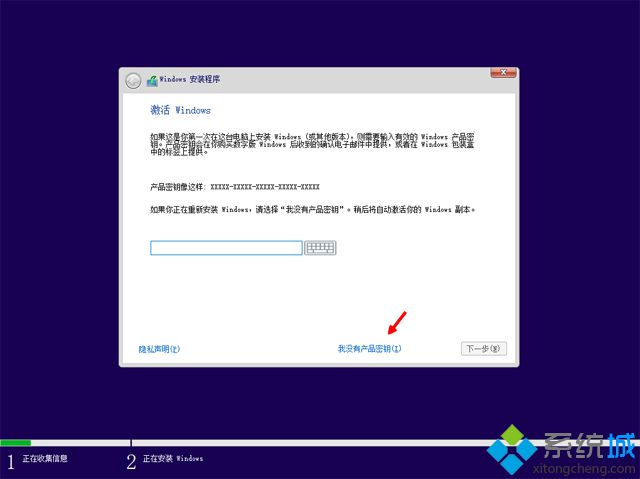

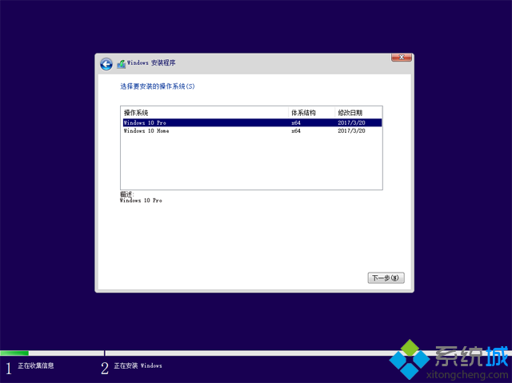

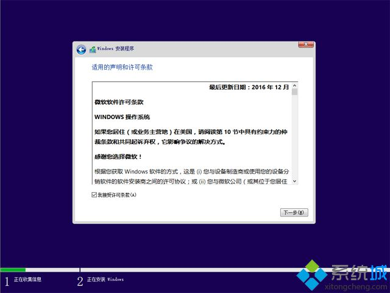

2、分区

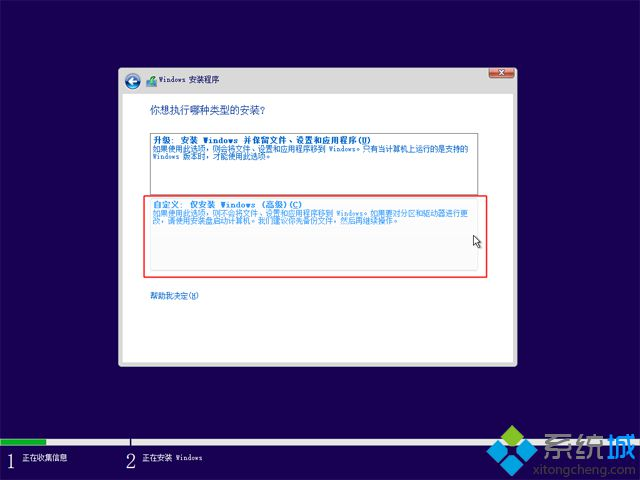

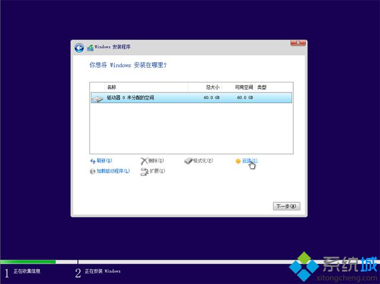

`输入要建立的分区大小，如果固态硬盘容量小，大小直接默认，点击应用，建立一个分区，如果要2个以上分区，就自行设置大小，win10至少50G以上C盘空间，1G=1024MB，点击应用；`

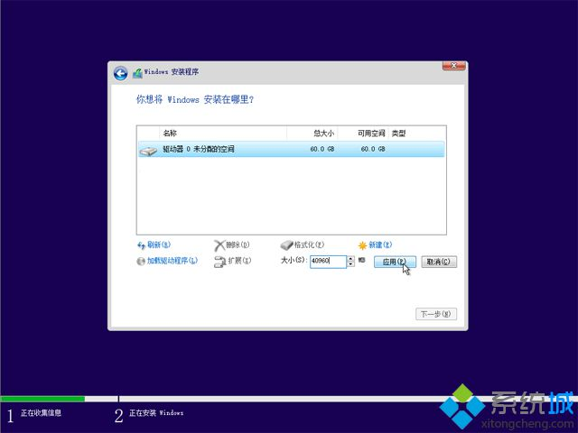

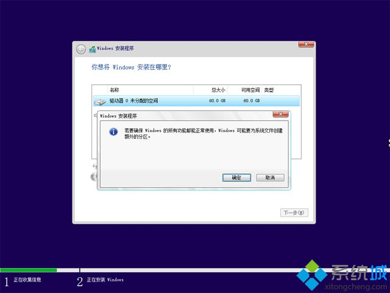

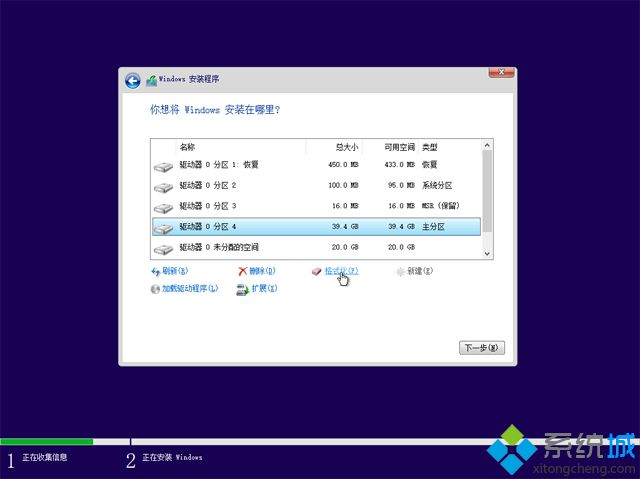

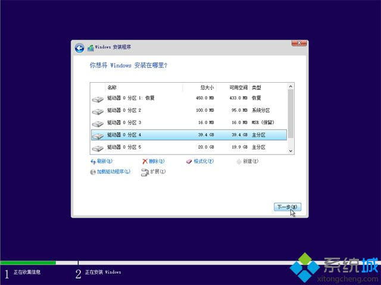

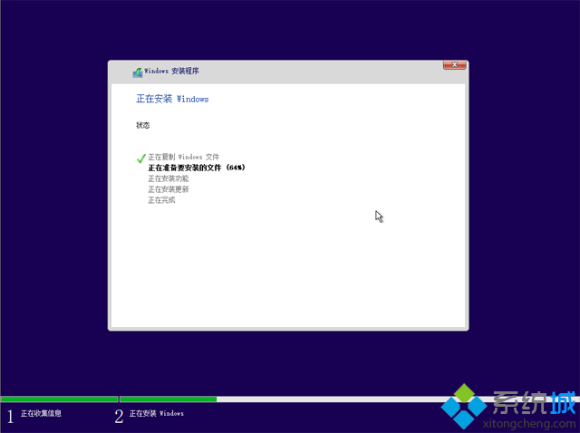

# <a name="win10-05" href="#" >激活系統</a>

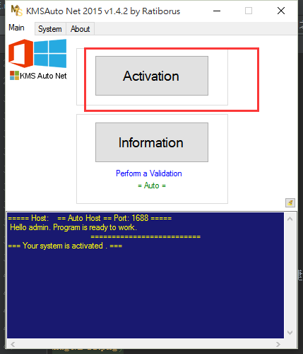

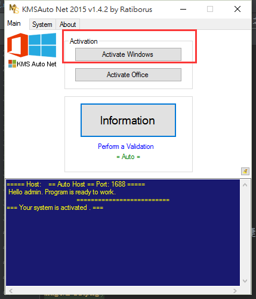