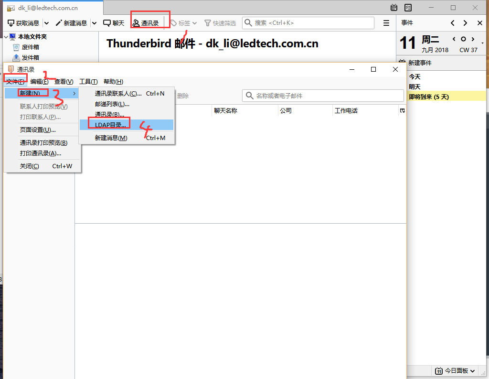
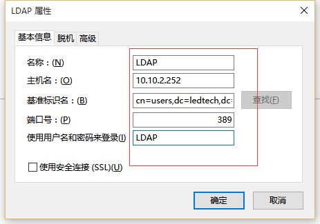
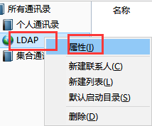
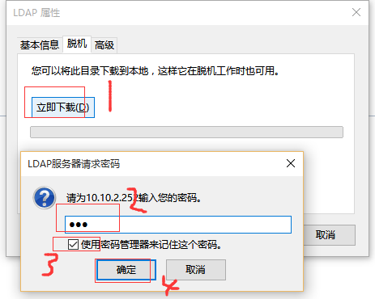
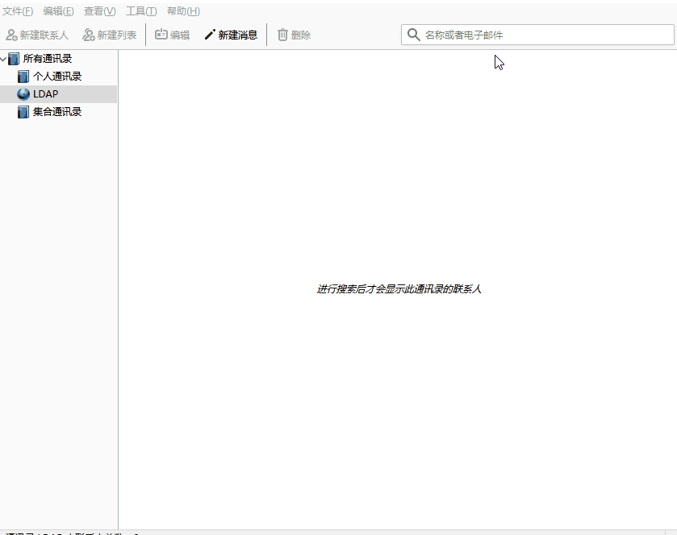

总操作流程：
- 1、[进入设置界面](#Thunderbird-01)
- 2、[配置](#Thunderbird-02)
- 3、[测试](#Thunderbird-03)

***

# <a name="Thunderbird-01" href="#" >进入设置界面</a>



# <a name="Thunderbird-02" href="#" >配置</a>

```
cn=users,dc=ledtech,dc=com,dc=cn
```







# <a name="Thunderbird-03" href="#" >测试</a>


