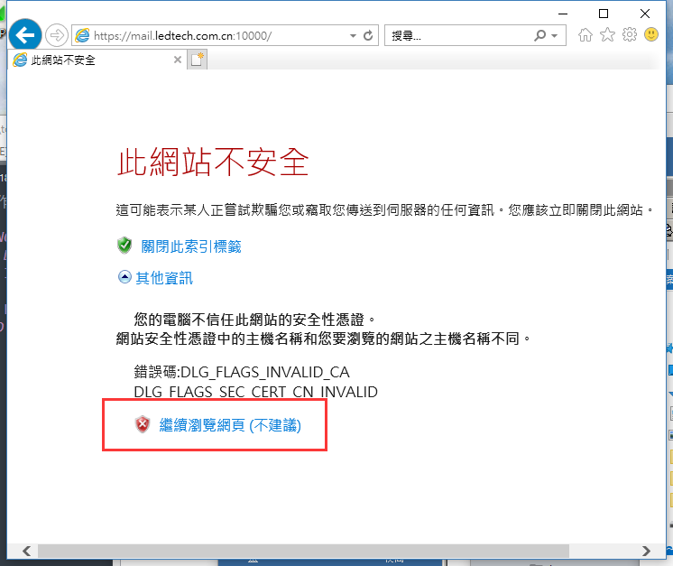
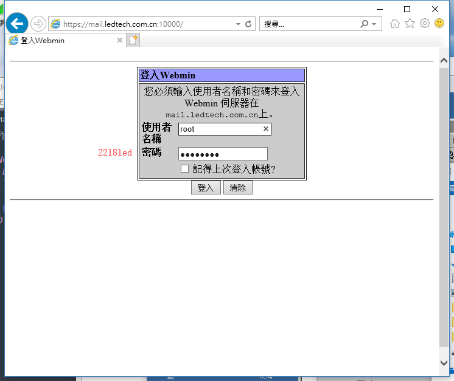
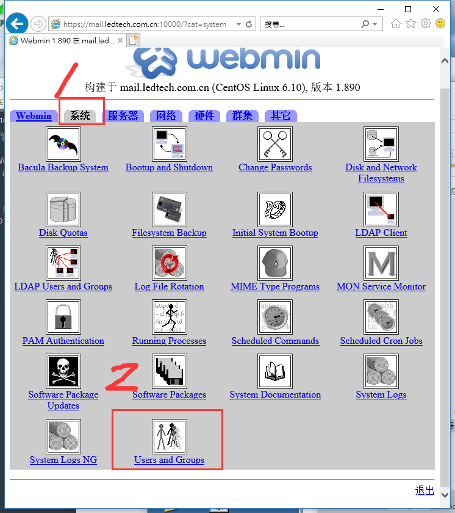
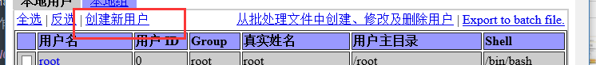
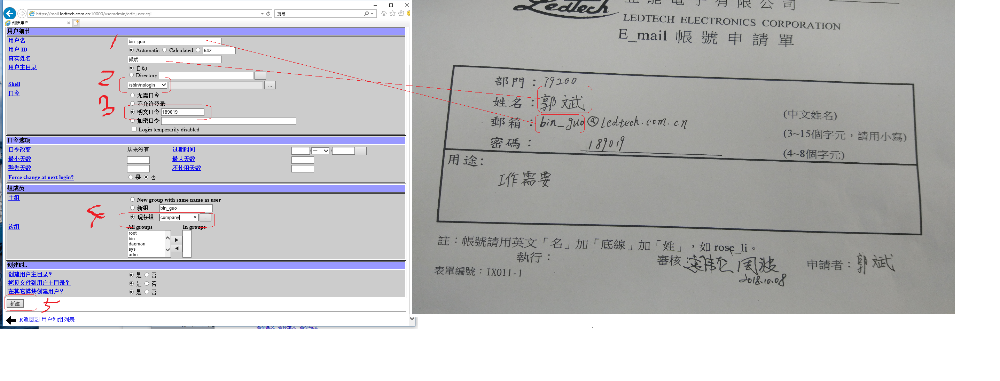
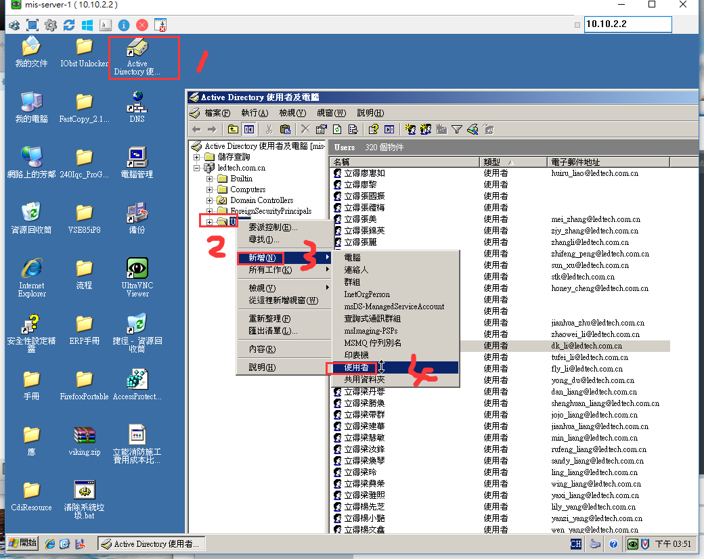
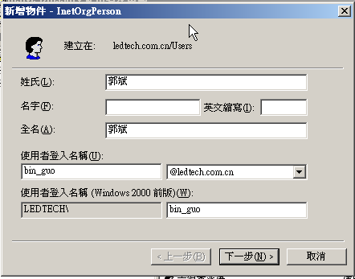
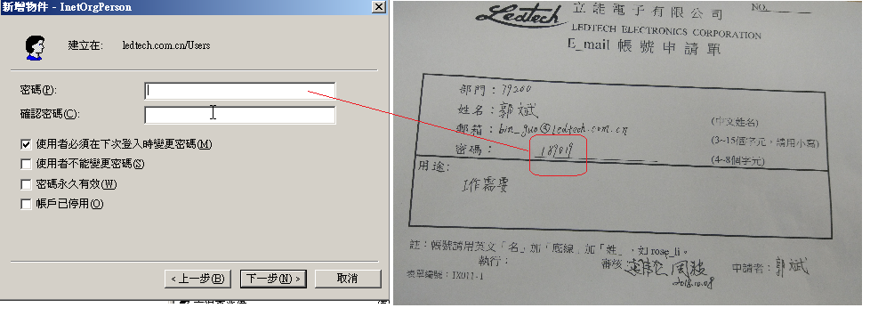
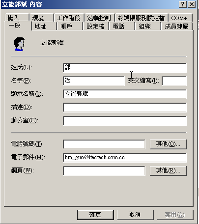
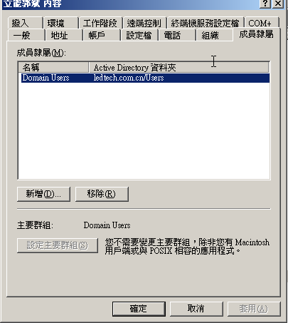

总操作流程：
- 1、[登陆erp](#outlook-01)
- 2、[添加用户](#outlook-02)
- 3、[添加Active Directory](#outlook-03)
- 4、[测试](#outlook-04)

***

# <a name="outlook-01" href="#" >登陆erp</a>

```
http://10.10.2.5:10000
```





# <a name="outlook-02" href="#" >添加用户</a>







# <a name="outlook-03" href="#" >添加Active Directory</a>

`
远程：10.10.2.2

密码：SZLEDTECH
`







`
添加后，找到它，做修改
`





# <a name="outlook-04" href="#" >测试</a>

`登陆：http：//10.10.2.5 登陆。用户名：bin_guo 密码:18919`

