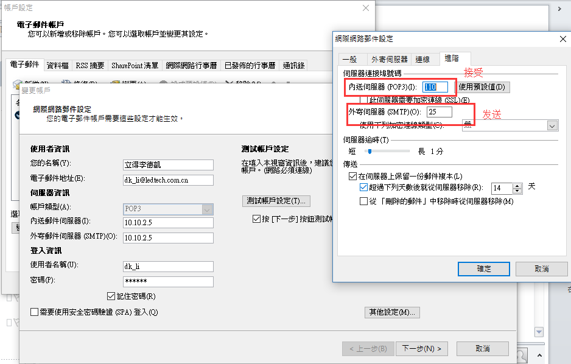
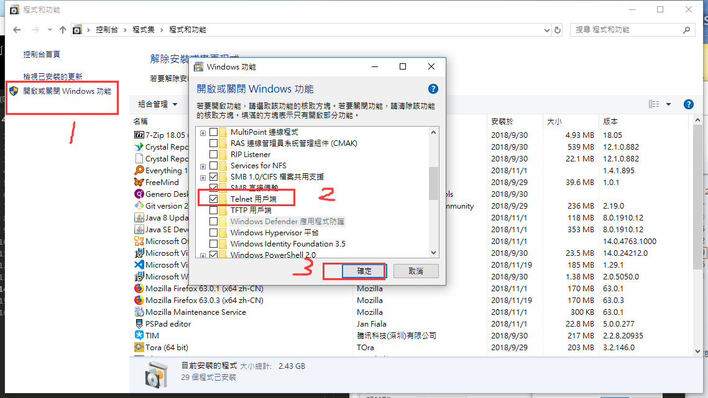
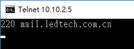

本页目录
- 1、[outlook查询伺服器接发预设置](#outlook-01)
- 2、[使用telnet命令查询](#outlook-02)
- 3、[解决](#outlook-03)

***
# <a name="outlook-01" href="#" >outlook查询伺服器接发预设置</a>



# <a name="outlook-02" href="#" >使用telnet命令查询</a>

>win10开启telnet


>使用命令
```
telnet 10.10.2.5 110 #查接受
```

`成功标志`


```
telnet 10.10.2.5 25 #查发送
```

`成功标志`



# <a name="outlook-03" href="#" >解决</a>

> 不通过，系统重启