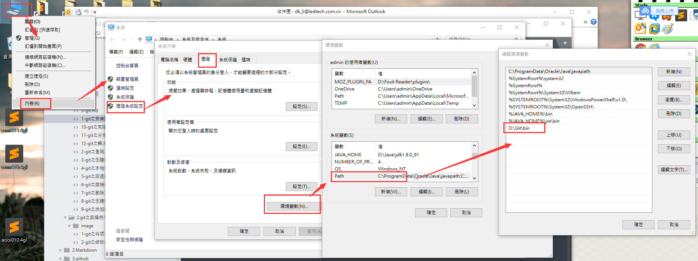
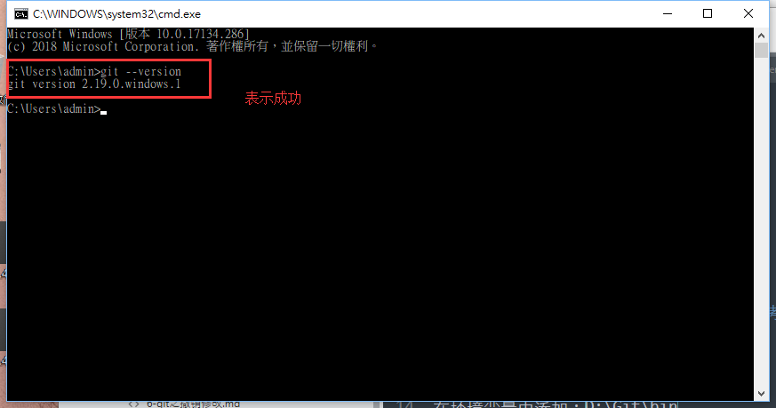

总操作流程：
- 1、[下载安装](#git-01)
- 2、[配置](#git-02)
- 3、[测试](#git-03)

***

# <a name="git-01" href="#" >下载安装</a>

# <a name="git-02" href="#" >配置</a>

在环境变量中添加：D:\Git\bin

# <a name="git-03" href="#" >测试</a>

在cmd中输入：git --version

