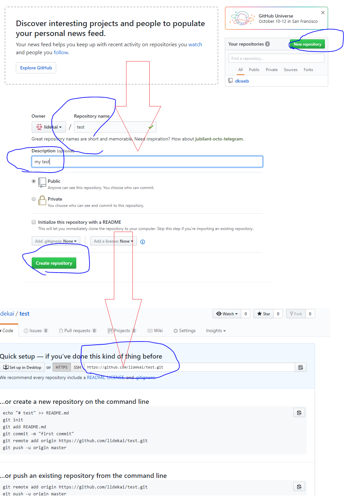
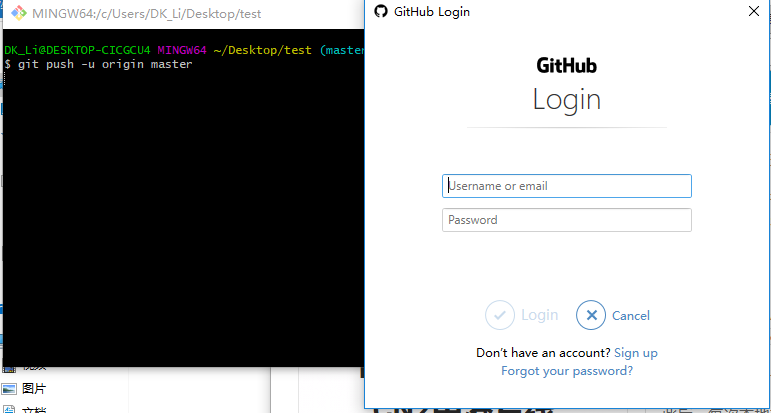
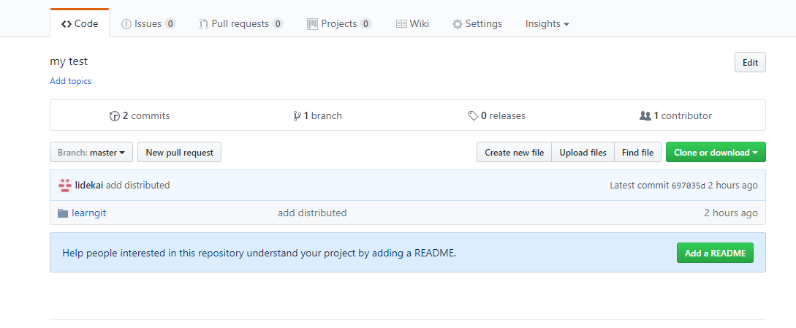

操作总流程：
- 1、[在项目的托管平台创建项目](#git-01)
- 2、[关联远程库](#git-02)
- 3、[推送master分支的所有内容](#git-03)
- 4、[每次本地提交后，推送最新修改](#git-04)

----------

# <a name="git-01" href="#" >在项目的托管平台创建项目</a>

- 操作流程：



# <a name="git-02" href="#" >关联远程库</a>

- 语法：

```shell
git remote add origin https://github.com/lidekai/test.git
```
# <a name="git-03" href="#" >推送master分支的所有内容</a>

- 语法：

```shell
git push -u origin master
```
- 效果展现：



# <a name="git-04" href="#" >每次本地提交后，推送最新修改</a>

- 语法：

```shell
git push origin master
```

- 最后的效果展现：


