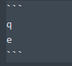
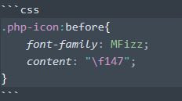
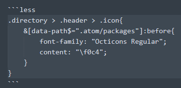
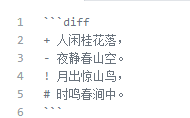

# 本页目录
- 1、[普通代码块](#Markdown-01)
- 2、[语法高亮代码块](#Markdown-02)
- 2、[diff符号](#Markdown-03)


***

# <a name="Markdown-01" href="#" >普通代码块</a>
- 效果展现：
```
q
e
```

- 语法：



# <a name="Markdown-02" href="#" >语法高亮代码块</a>

- 效果展现：
```css
.php-icon:before{
    font-family: MFizz;
    content: "\f147";
}
```

- 语法：



> 三个反引号后面写对应得代号，如



# <a name="Markdown-01" href="#" >diff符号</a>

- 效果展现：

```diff
+ 人闲桂花落，
- 夜静春山空。
! 月出惊山鸟，
# 时鸣春涧中。
```

- 语法：

