总操作流程：
- 1、[谷歌浏览器安装插件](#github-01)
- 2、[开发软件安装markdown插件](#github-02)
- 3、[github创建团队开发项目](#github-03)
- 4、[配置git，github](#github-04)
    - 4.[1、git](#github-04-01)
    - 4.[2、github](#github-04-02)
- 5、[下拉，上传项目](#github-05)
    - 5.[1、下拉](#github-05-01)
    - 5.[2、上传](#github-05-02)
- 6、[看效果](#github-06)

----------

# <a name="github-01" href="#" >谷歌浏览器安装插件</a>

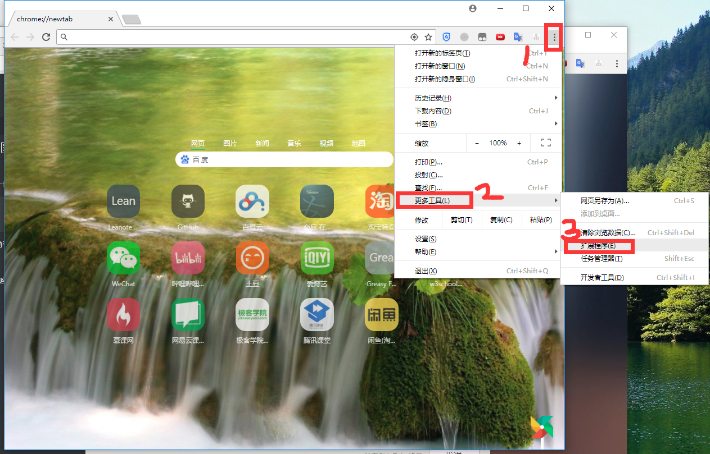

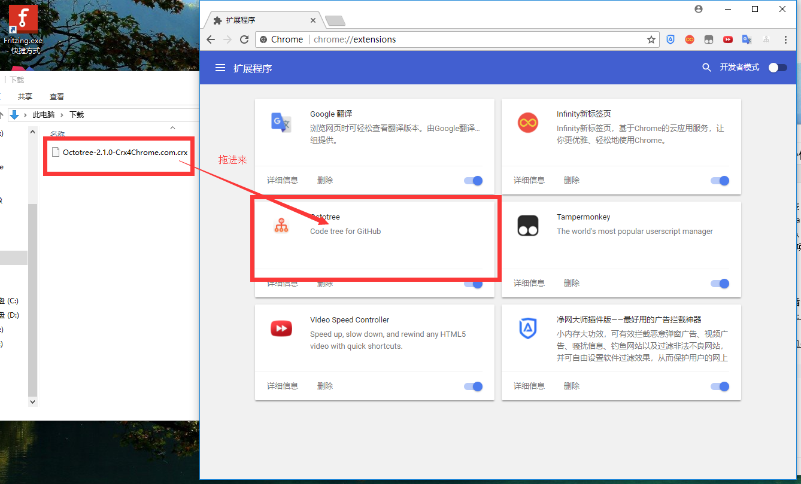

# <a name="github-02" href="#" >开发软件安装markdown插件（WebStorm做例子）</a>

> 建议下载2017.1版本，因为保证可以破解链接能激活

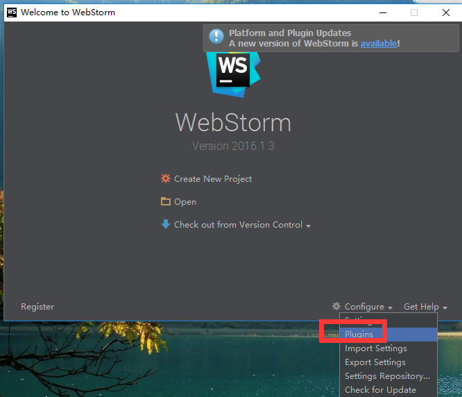

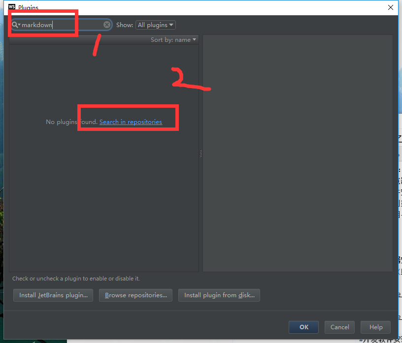

`重启软件`
# <a name="github-03" href="#" >github创建团队开发项目</a>

# <a name="github-04" href="#" >配置git，github</a>

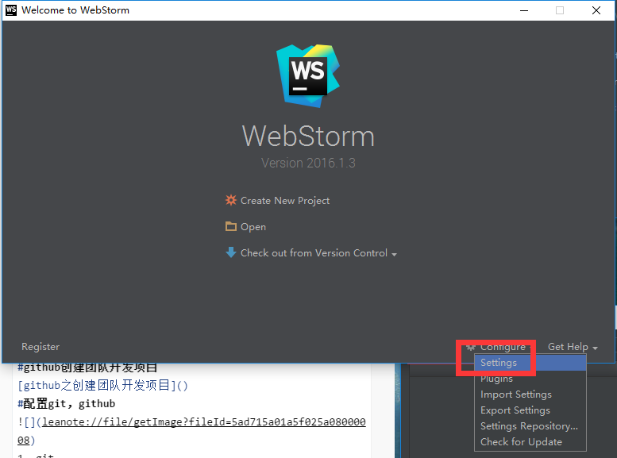

### <a name="github-04-01" href="#" >1、git</a>

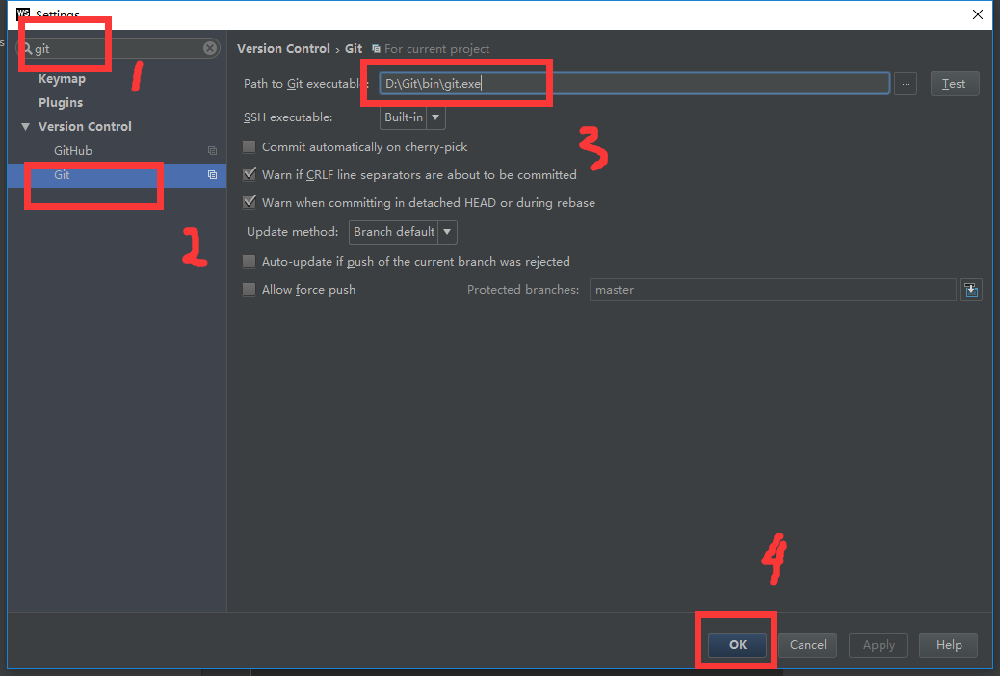

### <a name="github-04-02" href="#" >2、github</a>

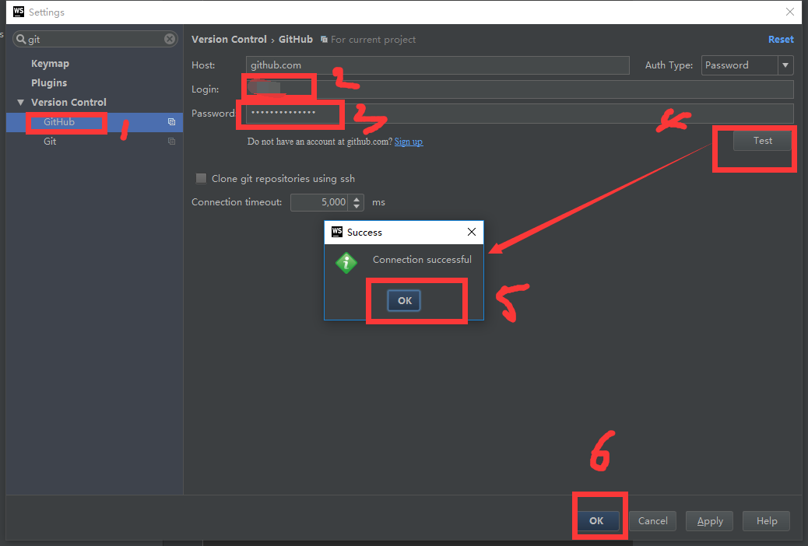

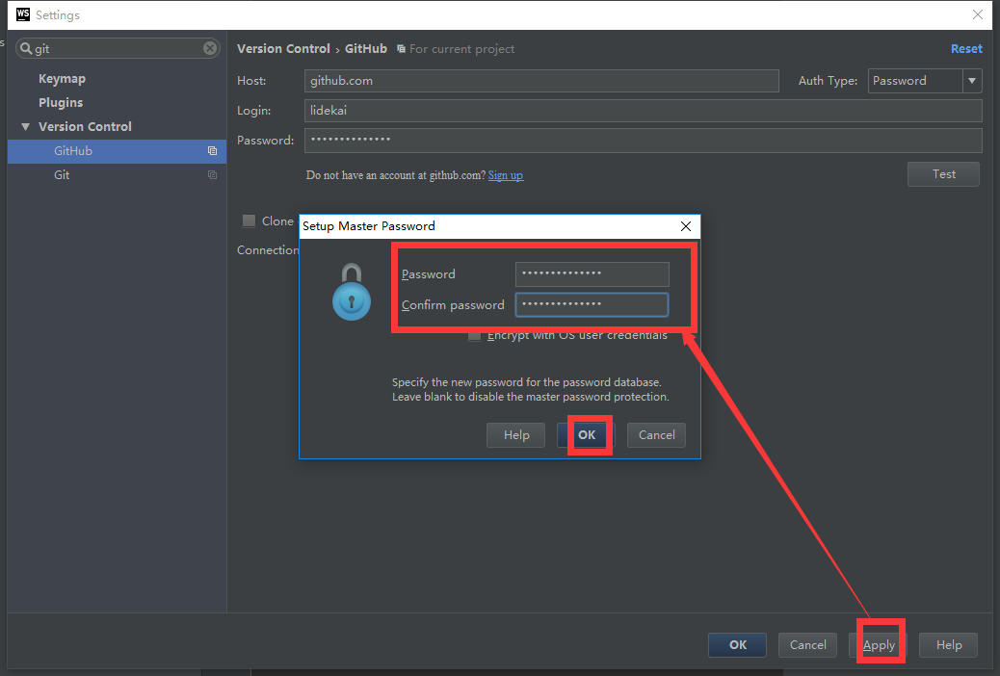

# <a name="github-05" href="#" >下拉，上传项目</a>

### <a name="github-05-01" href="#" >1、下拉</q>

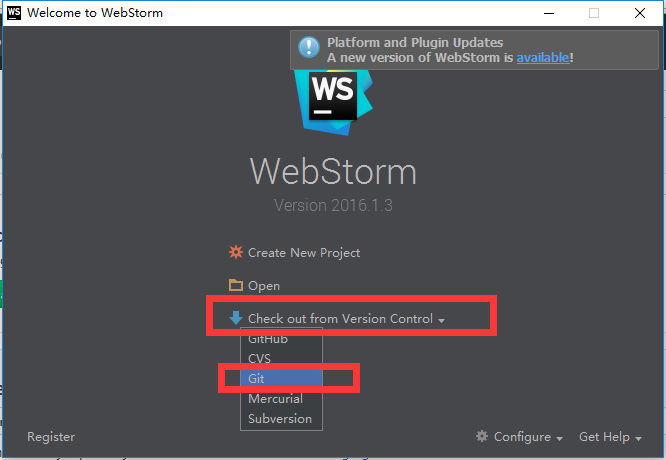

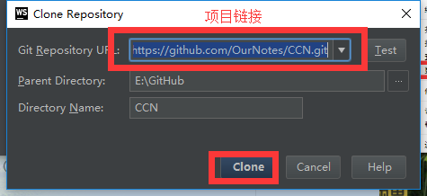

### <a name="github-05-02" href="#" >2、上传</q>

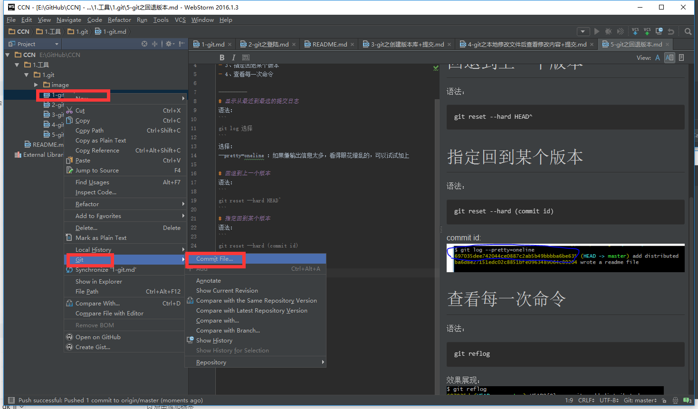

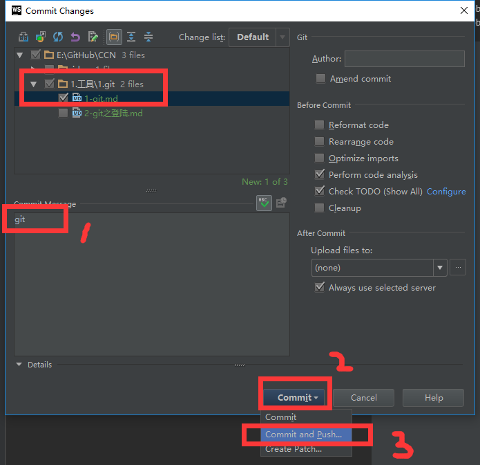

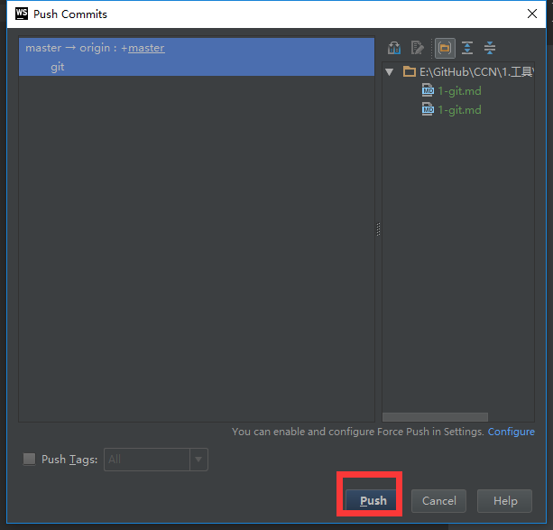

# <a name="github-06" href="#" >看效果</a>

`刷新github`

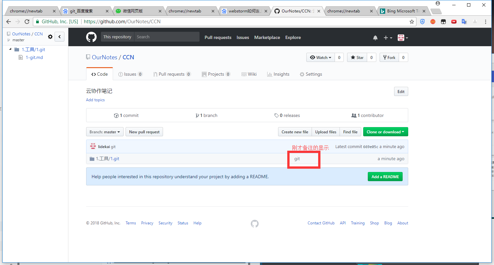

> 再次上传第二个

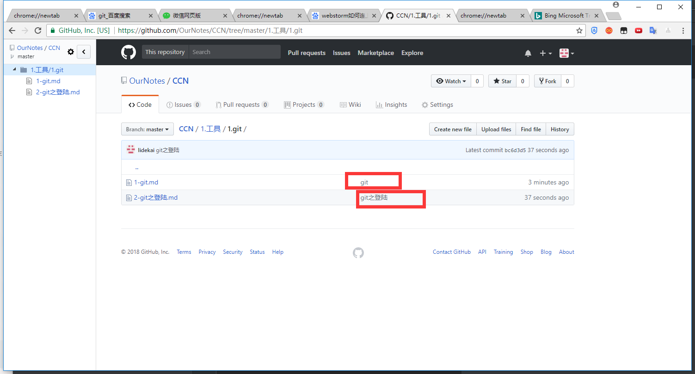

