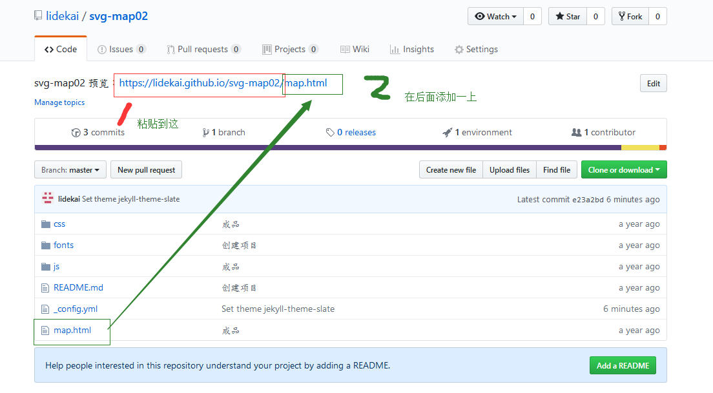

总操作流程：
- 1、[设置GitHub Pages](#github-01)
- 2、[修改项目描述](#github-02)
- 3、[看效果](#github-03)

***

# <a name="github-01" href="#" >设置GitHub Pages</a>

# <a name="github-02" href="#" >修改项目描述</a>

# <a name="github-03" href="#" >看效果</a>

`点击连接可看`