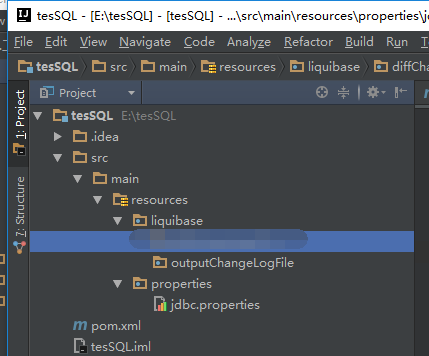
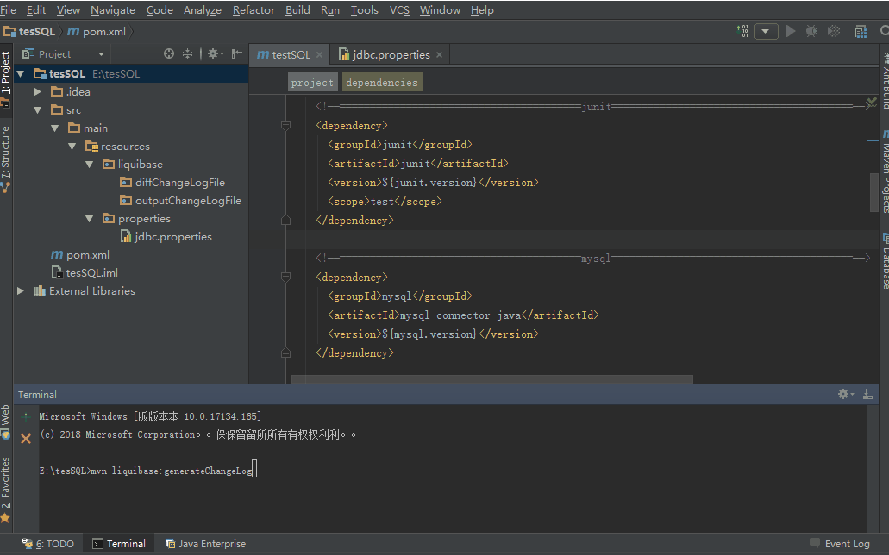

[](http://www.liquibase.org/documentation/maven/)


总操作流程：
- 1、[创建maven项目](#liquibase-01)
- 2、[创建文件夹和文件](#liquibase-02)
    - 2.[1、创建文件夹](#liquibase-02-01)
    - 2.[2、创建文件](#liquibase-02-02)
- 3、[修改pom.xml](#liquibase-03)
    - 3.[1、添加包](#liquibase-03-01)
    - 3.[2、添加liquibase配置](#liquibase-03-02)
- 4、[测试看效果](#liquibase-04)

[](https://github.com/lidekai/tesSQL.git)

***

# <a name="liquibase-01" href="#" >创建maven项目</a>

[](https://github.com/OurNotes/CCN/blob/master/06.%E5%90%8E%E5%8F%B0/01.java/03.Javaweb%E4%B9%8B%E6%95%B4%E5%90%88%E4%BE%8B%E5%AD%90/02.ssm%2Bm%2B%E6%95%B0%E6%8D%AE%E5%BA%93%E7%9A%84%E6%95%B4%E5%90%88/01.ssm%E6%95%B4%E5%90%88%E4%B9%8B%E7%94%A8maven%E5%88%9B%E5%BB%BAweb%E9%A1%B9%E7%9B%AE.md)

# <a name="liquibase-02" href="#" >创建文件夹和文件</a>

- 项目结构



### <a name="liquibase-02-01" href="#" >1、创建文件夹</a>
- resources
    - liquibase
        - outputChangeLogFile

### <a name="liquibase-02-02" href="#" >2、创建文件</a>

<details>
<summary>jdbc.properties</summary>

```properties
# 数据库据连接
driver=com.mysql.jdbc.Driver
url=jdbc:mysql://192.168.57.131:3306/test?useUnicode=true
username=dk
password=DKLi123456!
# 生成文件的路径
outputChangeLogFile=src/main/resources/liquibase/outputChangeLogFile/changelog_original.xml
```

</details>

# <a name="liquibase-03" href="#" >修改pom.xml</a>
### <a name="liquibase-03-01" href="#" >1、添加包</a>

<details>
<summary>xml</summary>

```xml
<properties>
    <junit.version>4.11</junit.version>
    <mysql.version>5.1.46</mysql.version>
    <liquibase.version>3.6.1</liquibase.version>
</properties>

<dependencies>
    <!--========================================junit========================================-->
    <dependency>
      <groupId>junit</groupId>
      <artifactId>junit</artifactId>
      <version>${junit.version}</version>
      <scope>test</scope>
    </dependency>

    <!--========================================mysql========================================-->
    <dependency>
      <groupId>mysql</groupId>
      <artifactId>mysql-connector-java</artifactId>
      <version>${mysql.version}</version>
    </dependency>

    <!--========================================liquibase========================================-->
    <dependency>
      <groupId>org.liquibase</groupId>
      <artifactId>liquibase-core</artifactId>
      <version>${liquibase.version}</version>
    </dependency>
</dependencies>
```

</details>

### <a name="liquibase-03-02" href="#" >2、添加liquibase配置</a>

<details>
<summary>xml</summary>

```xml
       <!--========================================liquibase的配置========================================-->
        <plugin>
          <groupId>org.liquibase</groupId>
          <artifactId>liquibase-maven-plugin</artifactId>
          <version>3.5.3</version>
          <configuration>
            <!--连接数据库的配置文件路径-->
            <propertyFile>${basedir}/src/main/resources/properties/jdbc.properties</propertyFile>
            <!--输出文件的编码 -->
            <outputFileEncoding>UTF-8</outputFileEncoding>
          </configuration>
        </plugin>
```

</details>

# <a name="liquibase-04" href="#" >测试看效果</a>

- 命令：

```
mvn liquibase:generateChangeLog
```

- 成功标志：


