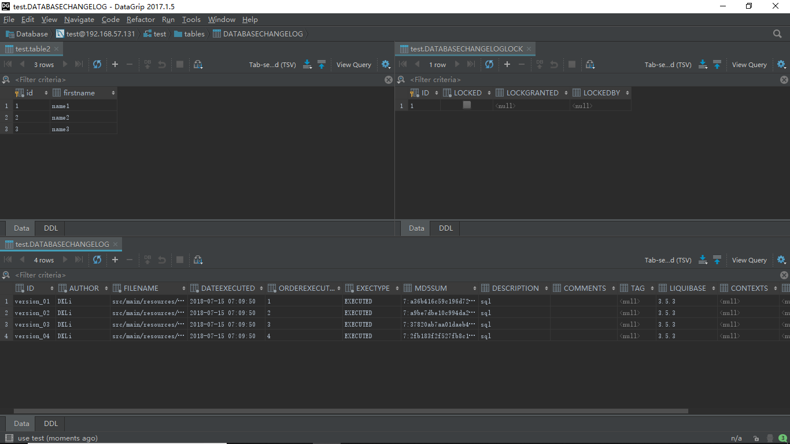
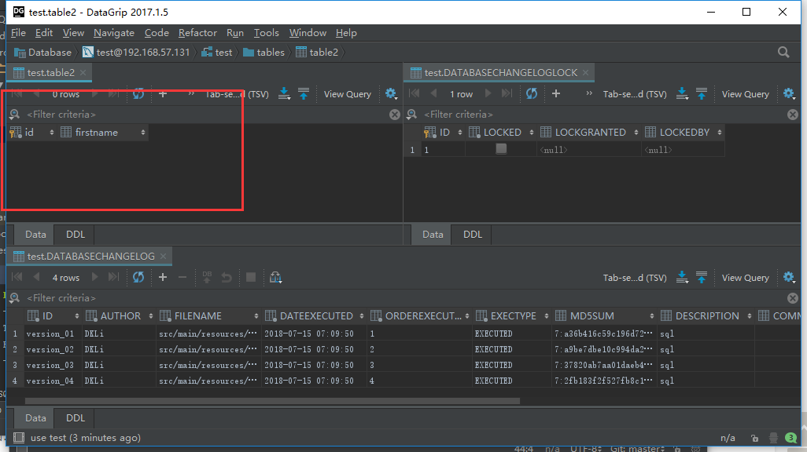
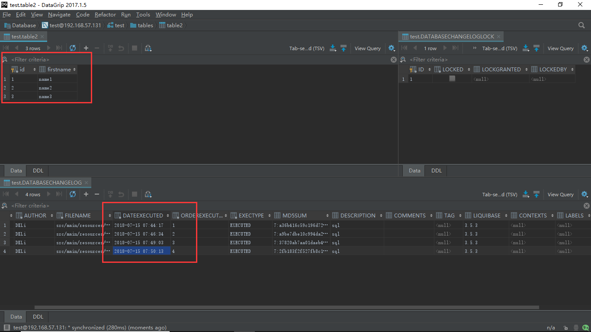
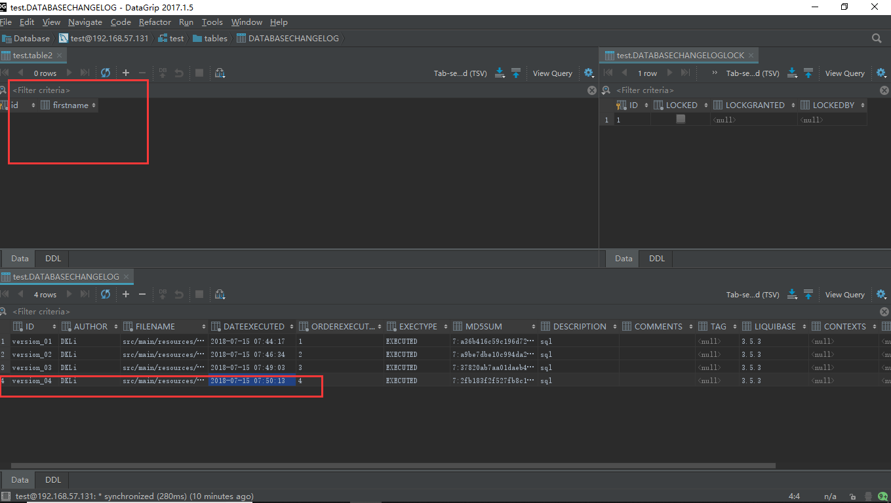
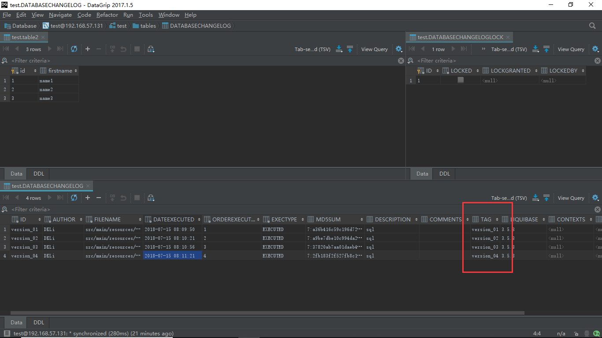
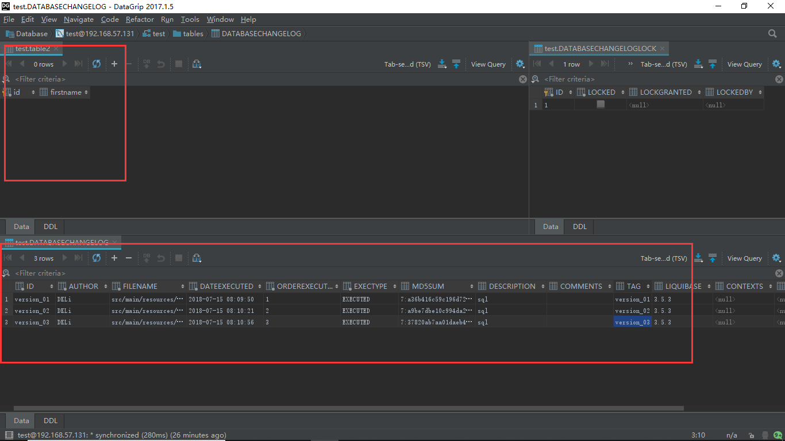

总操作流程：
- 1、[修改sql文件](#liquibase-01)
- 2、[使用rollbackCount方式回退](#liquibase-02)
    - 2.[1、变更数据库](#liquibase-02-01)
    - 2.[2、回退看效果](#liquibase-02-02)
- 3、[使用rollbackDate方式回退](#liquibase-03)
    - 3.[1、变更数据库](#liquibase-03-01)
    - 3.[2、回退看效果](#liquibase-03-02)
- 4、[使用rollbackTag方式回退](#liquibase-04)
    - 3.[1、变更数据库和创建tag](#liquibase-04-01)
    - 3.[2、回退看效果](#liquibase-04-02)

***

# <a name="liquibase-01" href="#" >1、修改sql文件</a>

<details>
<summary>sql</summary>


```sql
--liquibase formatted sql

--changeset DKLi:version_01
CREATE TABLE table2 (
  id int(11) NOT NULL,
  name varchar(255) NOT NULL,
  PRIMARY KEY (id)
) ENGINE=MyISAM;
--rollback drop table table2;

--changeset DKLi:version_02
ALTER TABLE  table2 CHANGE  id  id INT( 11 ) AUTO_INCREMENT;
--rollback ALTER TABLE  table2 CHANGE  id  id INT( 11 ) NOT NULL;

--changeset DKLi:version_03
ALTER TABLE  table2 CHANGE  name  firstname VARCHAR( 255 );
--rollback ALTER TABLE  table2 CHANGE  firstname  name VARCHAR( 255 );

--changeset DKLi:version_04
INSERT INTO table2 (id, firstname) VALUES (NULL, 'name1'),(NULL, 'name2'), (NULL, 'name3');
--rollback DELETE FROM table2 WHERE firstname IN('name1','name2','name3');
```

</details>


# <a name="liquibase-02" href="#" >使用rollbackCount方式回退</a>
### <a name="liquibase-02-01" href="#" >1、变更数据库</a>

```
mvn liquibase:update
```



### <a name="liquibase-02-02" href="#" >2、回退看效果</a>

- 回退1步

```
mvn liquibase:rollback -Dliquibase.rollbackCount=1
```



`注意：回退一步后，再次回退，是在回退一次后的基础上再次回退。`

# <a name="liquibase-03" href="#" >使用rollbackDate方式回退</a>

```
mvn liquibase:dropAll #清空数据重新测试

```

### <a name="liquibase-03-01" href="#" >1、变更数据库</a>

```
mvn liquibase:update
```


### <a name="liquibase-03-02" href="#" >2、回退看效果</a>

- 通过时间指定回退该步

```
mvn liquibase:rollback -Dliquibase.rollbackDate=2018-07-15T07:50:13
```
`注意时间格式是：日期+T+时间``



# <a name="liquibase-04" href="#" >使用rollbackTag方式回退</a>
```
mvn liquibase:dropAll #清空数据重新测试
```

### <a name="liquibase-04-01" href="#" >1、变更数据库和创建tag</a>
```
mvn liquibase:update
```

`注意：每更新一个changeset设置一个tag`

```
mvn liquibase:tag -Dliquibase.tag=[版本号]
如：
mvn liquibase:tag -Dliquibase.tag=version_01
```



### <a name="liquibase-04-02" href="#" >2、回退看效果</a>

- 通过标签指定回退到该步

```
mvn liquibase:rollback -Dliquibase.rollbackTag=version_03
```

