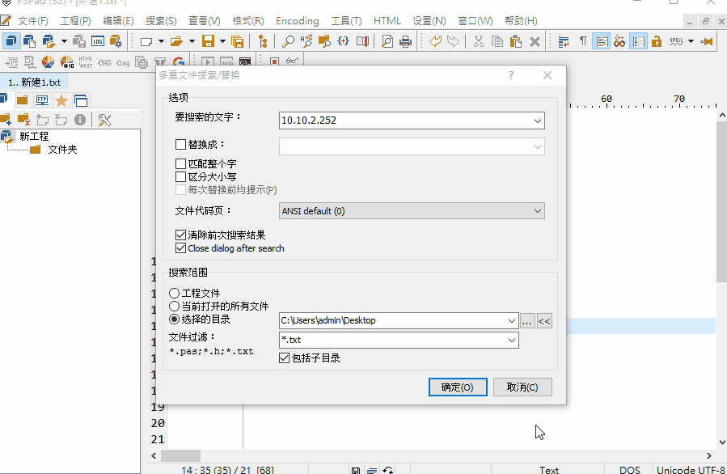
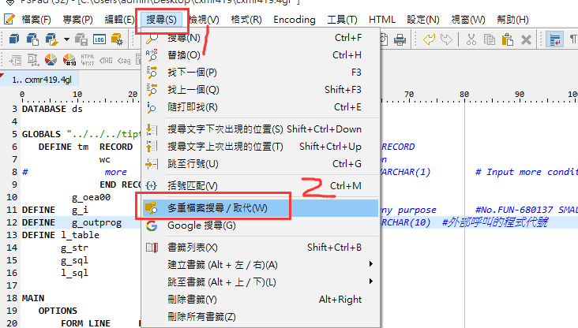
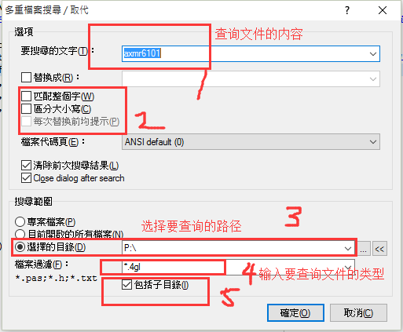
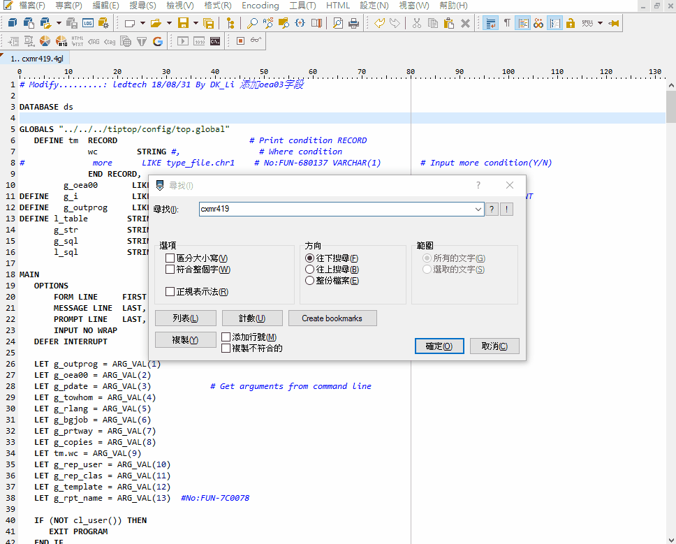
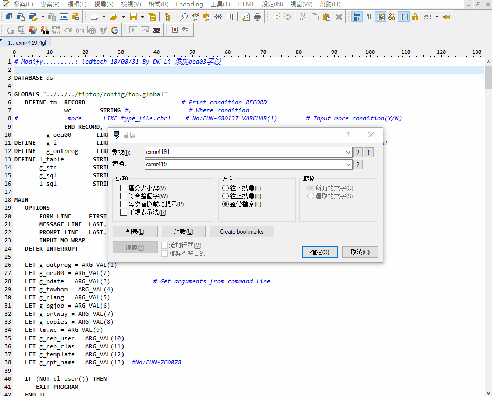

本页目录：
- 1、[在多文件中搜索内容](#PSPad-01)
    - 1.[1、效果](#PSPad-01-01)
    - 1.[2、操作](#PSPad-01-02)
- 2、[在本文件查询内容](#PSPad-02)
    - 2.[1、效果](#PSPad-02-01)
    - 2.[2、操作](#PSPad-02-01)
- 3、[在本文件查询内容+替代内容](#PSPad-03)
    - 2.[1、效果](#PSPad-03-01)
    - 2.[2、操作](#PSPad-03-02)

# <a name="PSPad-01" href="#" >在多文件中搜索内容</a>

### <a name="PSPad-01-01" href="#" >1、效果</a>

### <a name="PSPad-01-02" href="#" >2、操作</a>

# <a name="PSPad-02" href="#" >在本文件查询内容</a>
### <a name="PSPad-02-01" href="#" >1、效果</a>

### <a name="PSPad-02-02" href="#" >2、操作</a>

快捷键：Ctrl+F

# <a name="PSPad-03" href="#" >在本文件查询内容+替代内容</a>
### <a name="PSPad-03-01" href="#" >1、效果</a>

### <a name="PSPad-03-02" href="#" >2、操作</a>

快捷键：Ctrl+H
