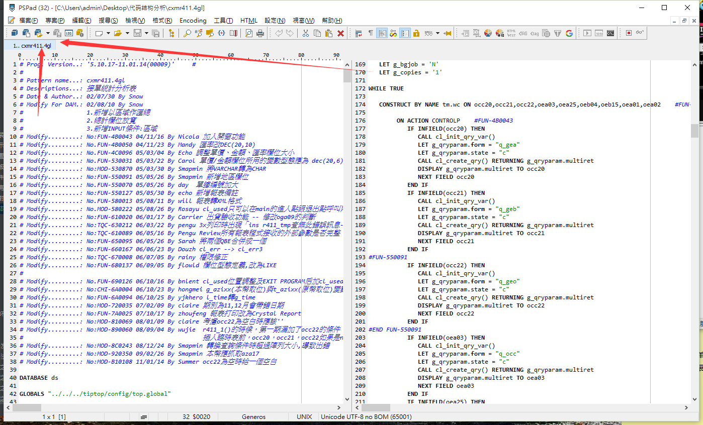
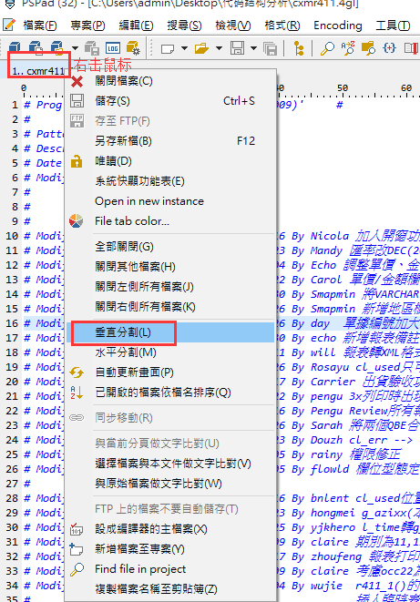
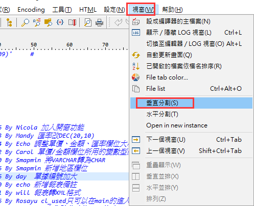
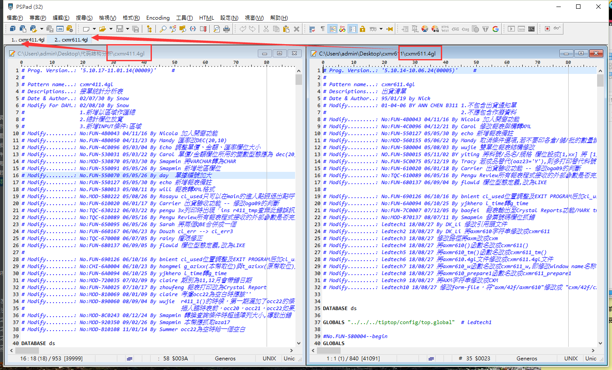
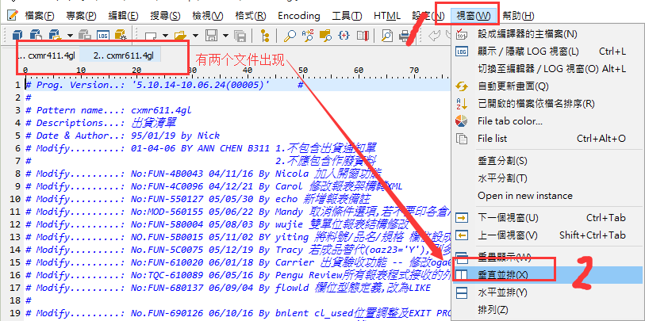
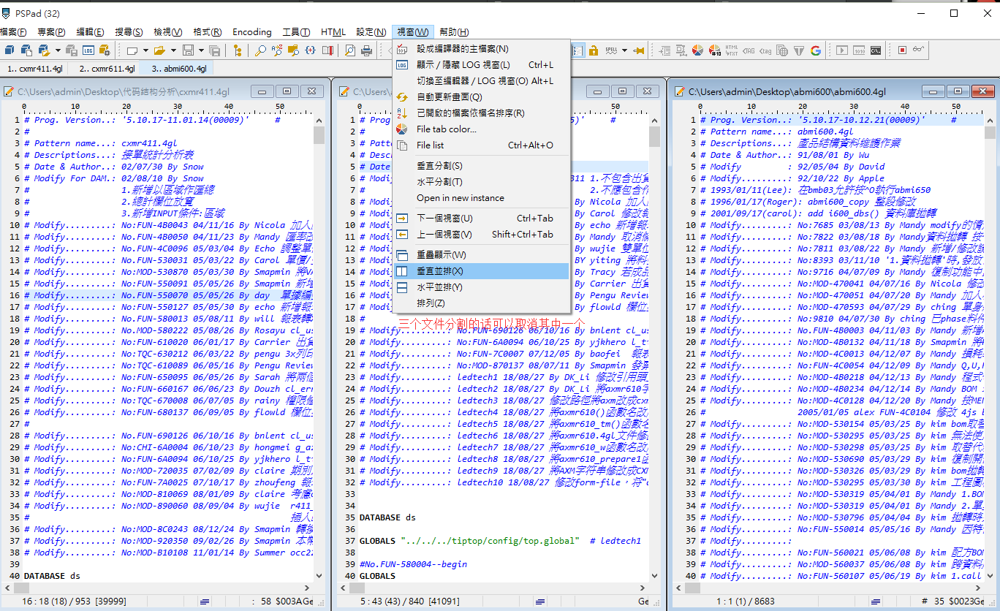

本页目录：
- 1、[两个窗体一个文件](#PSPad-01)
  - 1.[1、效果](#PSPad-01-01)
  - 1.[2、操作](#PSPad-01-02)
- 2、[两个窗体两个文件](#PSPad-02)
  - 2.[1、效果](#PSPad-02-01)
  - 2.[2、操作](#PSPad-02-02)
  
***

#  <a name="PSPad-01" href="#" >两个窗体一个文件</a>
###  <a name="PSPad-01-01" href="#" >1、效果</a>

###  <a name="PSPad-01-02" href="#" >2、操作</a>

# <a name="PSPad-02" href="#" >两个窗体两个文件</a>
###  <a name="PSPad-02-01" href="#" >1、效果</a>

###  <a name="PSPad-02-02" href="#" >2、操作</a>

