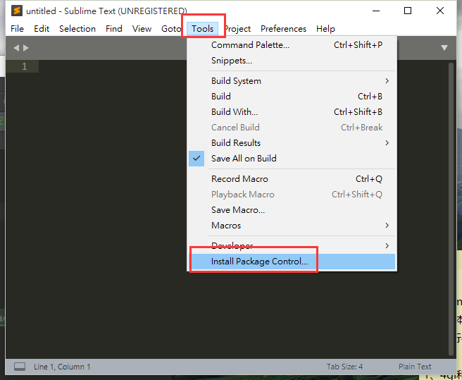
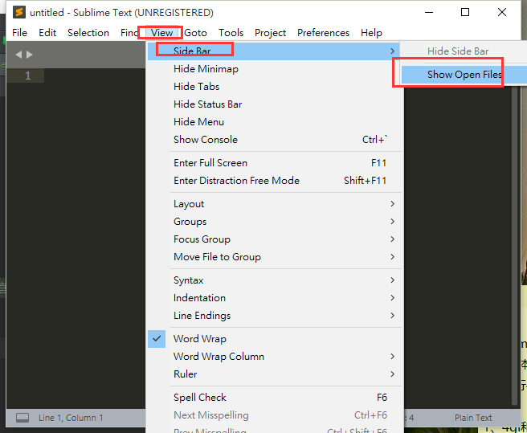
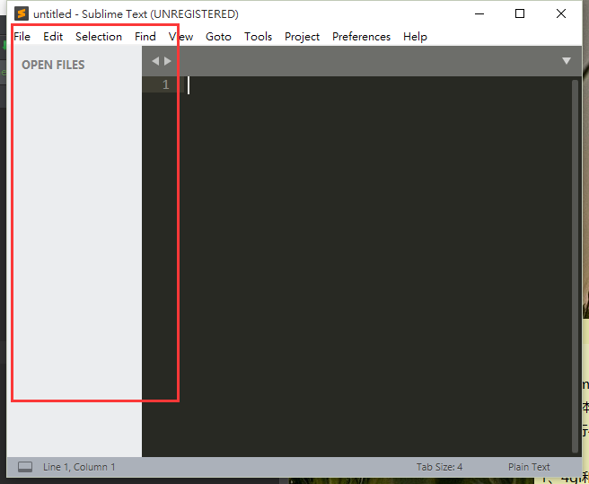
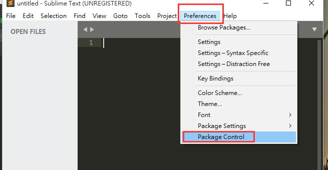

总操作流程：
- 1、[下载安装](#Sublime-01)
- 2、[配置](#Sublime-02)
- 3、[看效果](#Sublime-03)

***

# <a name="Sublime-01" href="#" >下载安装</a>

# <a name="Sublime-02" href="#" >配置</a>

- 开启插件安装控制台

-  开启左边菜单栏

# <a name="Sublime-03" href="#" >看效果</a>

-  菜单栏效果

- 控制台效果

