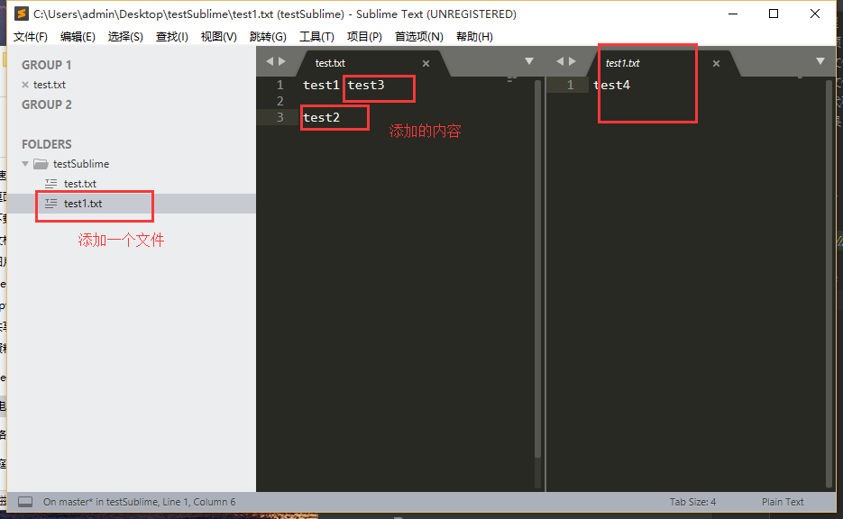
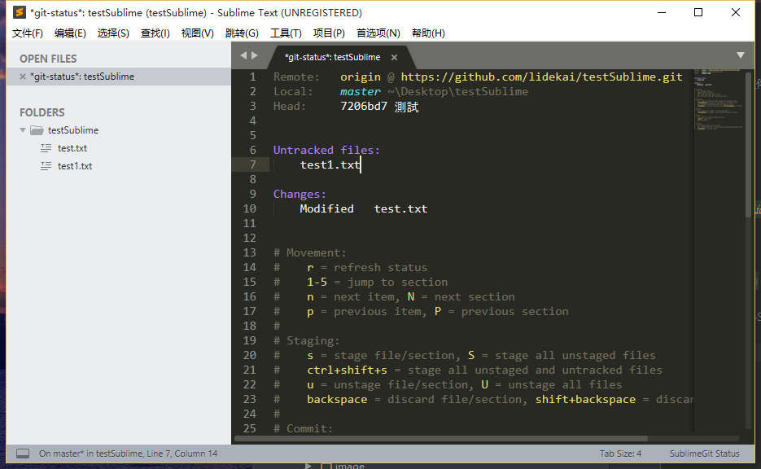
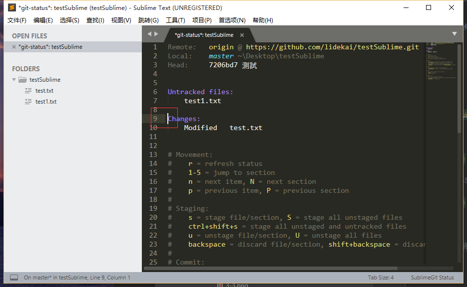
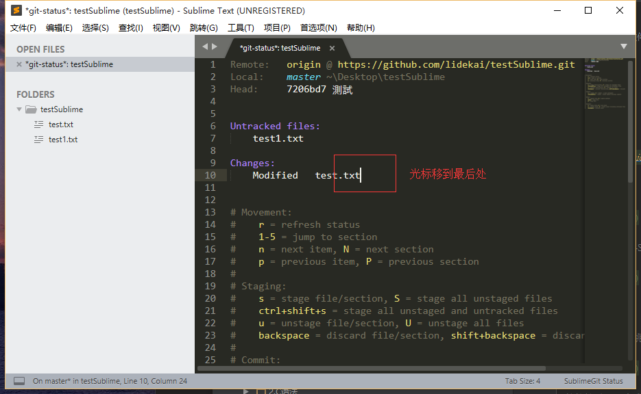
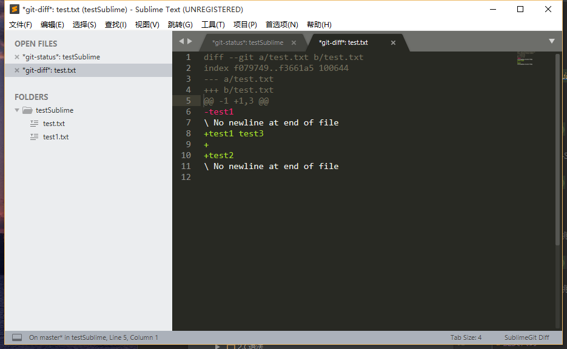
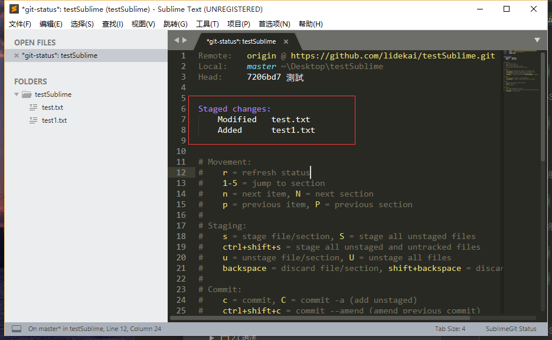
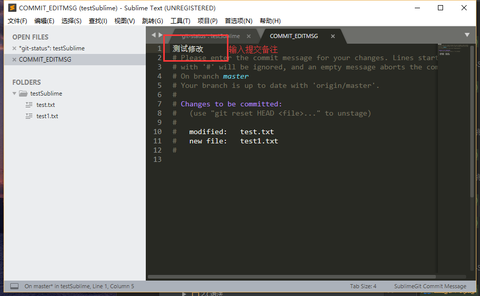
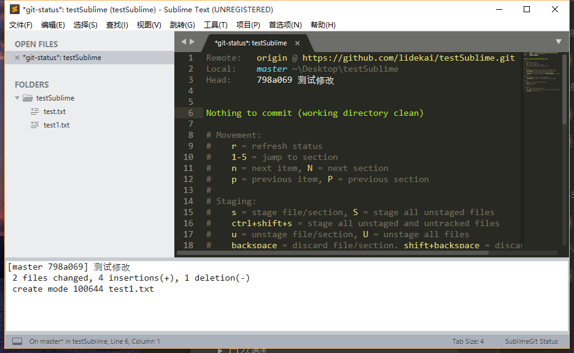
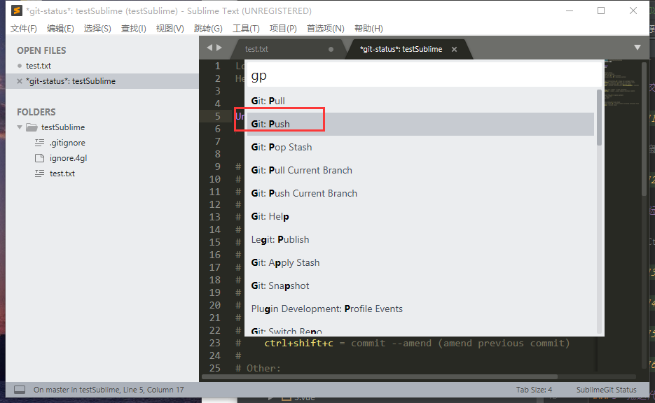
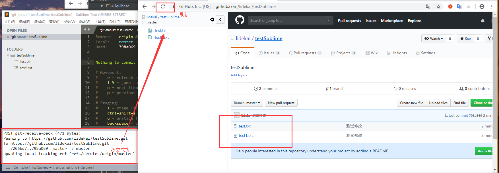

总操作流程：
- 1、[下拉项目](#SublimeGit-01)
- 2、[修改文件](#SublimeGit-02)
    - 2.[1、对比文件](#SublimeGit-02-01)
- 3、[提交代码](#SublimeGit-03)
- 4、[看效果](#SublimeGit-04)

***

# <a name="SublimeGit-01" href="#" >下拉项目</a>

# <a name="SublimeGit-02" href="#" >修改文件</a>

`按快捷键：Ctrl+Shift+P,输入：gs`

### <a name="SublimeGit-02-01" href="#" >1、对比文件</a>

`按快捷键：2 会跳到修改的文件处`

`按快捷键：d 会跳到具体修改内容界面`

# <a name="SublimeGit-03" href="#" >提交代码</a>

`按快捷键：Ctrl+Shift+s`

`按快捷键：c 进入提交备注界面`

`关闭提交备注界面`

`按快捷键：Ctrl+Shift+P,输入：gp 进行提交代码`

# <a name="SublimeGit-04" href="#" >看效果</a>

