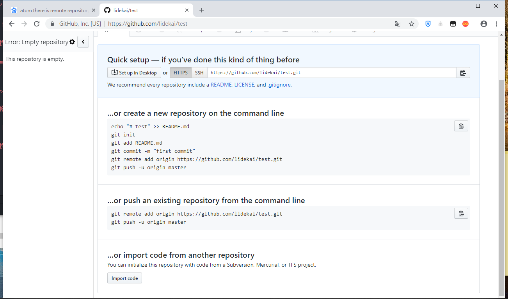
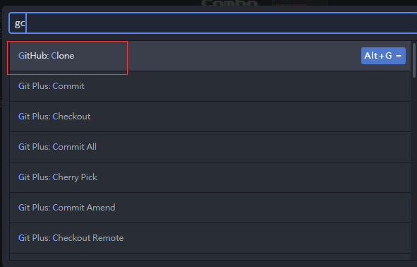
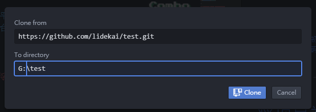
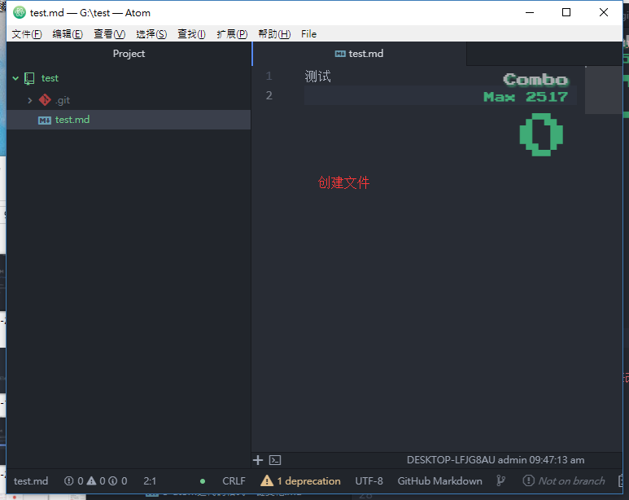
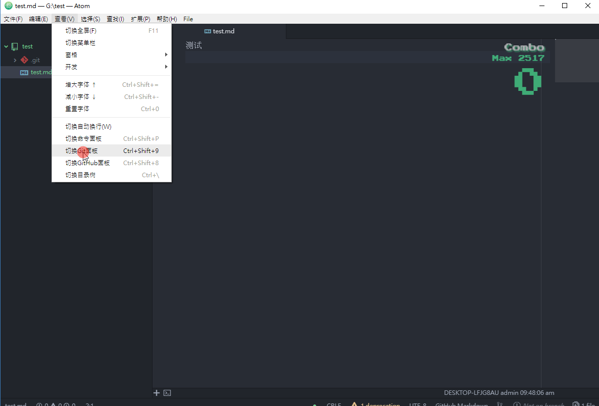
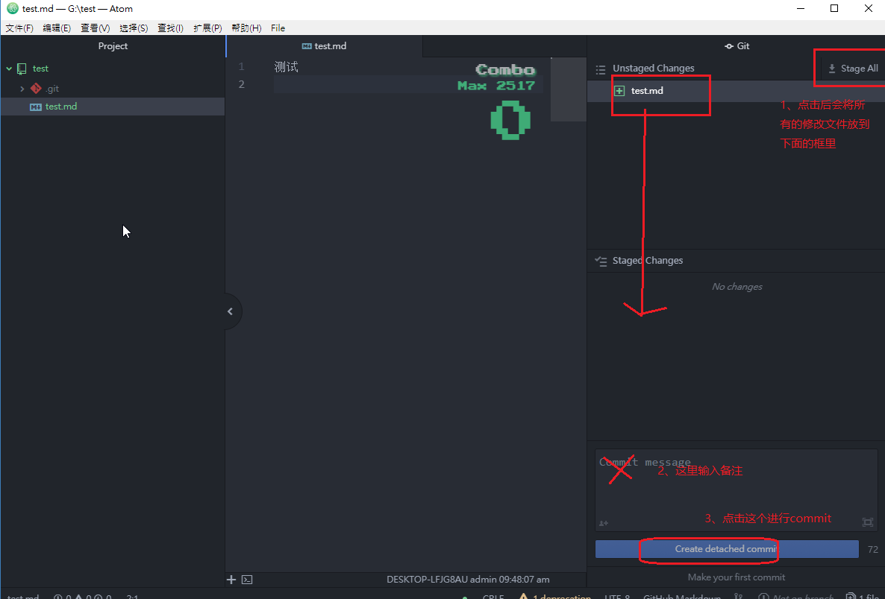
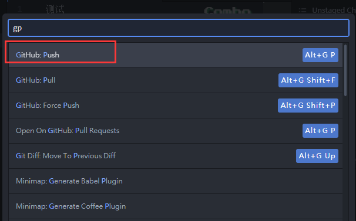
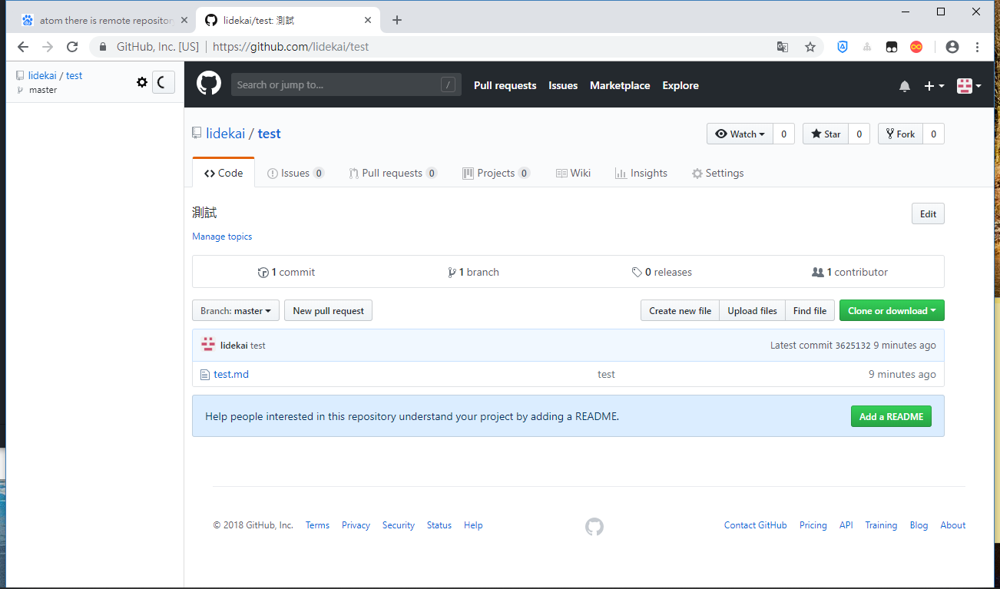

本页目录：
- 1、[在github创建项目](#atom-01)
- 2、[克隆下来项目](#atom-02)
- 3、[提交修改项目到github](#atom-03)

***

# <a name="atom-01" href="#" >在github创建项目</a>

# <a name="atom-02" href="#" >克隆下来项目</a>

> 按快捷键：Ctrl+Shift+P，输入gc

> 注意：建議還是使用git克隆項目，大項目用atom會很慢

# <a name="atom-03" href="#" >提交修改项目到github</a>

- 添加文件

- commit修改项目

- 提交项目

`按快捷键：Ctrl+Shift+P，输入gp`

