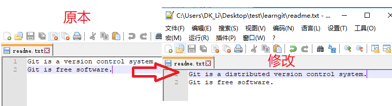
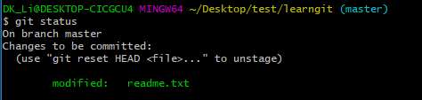
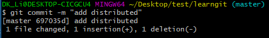
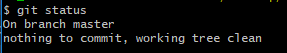

操作总流程：
- 1、[修改readme.txt文件内容](#git-01)
- 2、[git status命令看仓库当前的状态](#git-02)
- 3、[git diff命令看修改了什么内容](#git-03)
- 4、[git add命令提交修改文件](#git-04)
- 5、[git status看当前仓库的状态](#git-05)
- 6、[git commit命令提交](#git-06)
- 7、[git status看当前仓库的状态](#git-07)

----------

`注：要进入文件存放文件夹里进行命令`

# <a name="git-01" href="#" >修改readme.txt文件内容</a>
### 操作过程：



- 改前：
```shell
Git is a version control system.
Git is free software.
```

- 改后：
```shell
Git is a distributed version control system.
Git is free software.
```
# <a name="git-02" href="#" >git status命令看仓库当前的状态</a>

- 效果展现：


- 语法：
```shell
git status
```

# <a name="git-03" href="#" >git diff命令看修改了什么内容</a>
- 效果展现：


- 语法：
```shell
git diff readme.txt
```

# <a name="git-04" href="#" >git add命令提交修改文件</a>

- 语法：
```shell
git add readme.txt
```

# <a name="git-05" href="#" >git status看当前仓库的状态</a>
- 效果展现：



- 语法：
```shell
git status
```

# <a name="git-06" href="#" >git commit命令提交</a>
- 效果展现：



- 语法：
```shell
git commit -m "add distributed"
```

# <a name="git-07" href="#" >git status看当前仓库的状态</a>
- 效果展现：



- 语法：
```shell
git status
```