<!--
 * @Descripttion: 
 * @version: 0.1
 * @Author: DK_Li
 * @Date: 2019-12-15 00:41:54
 * @LastEditors: DK_Li
 * @LastEditTime: 2020-06-09 11:51:01
--> 
总操做流程：
- 1、[购买](#vultr-01)
- 2、[创建服务器](#vultr-02)
- 3、[看效果](#vultr-03)

***

# <a name="vultr-01" href="#" >购买</a>

> 1、进入登录界面

[](https://www.vultr.com/promo/try50/?service=try50)


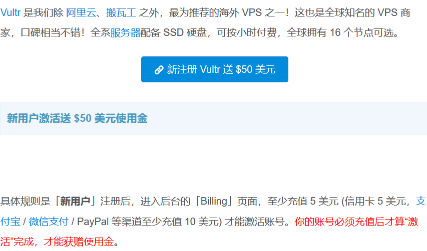


> 2、创建账号充值


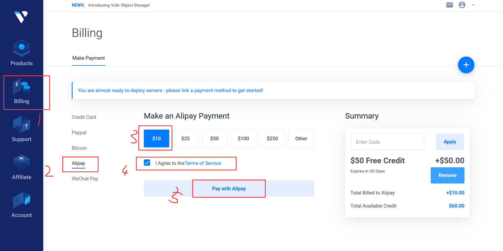

- 新用户充值后有50美元送，一个月用不完自动清掉，第二个月才开始消耗充值的，一般10美元能用三个月。

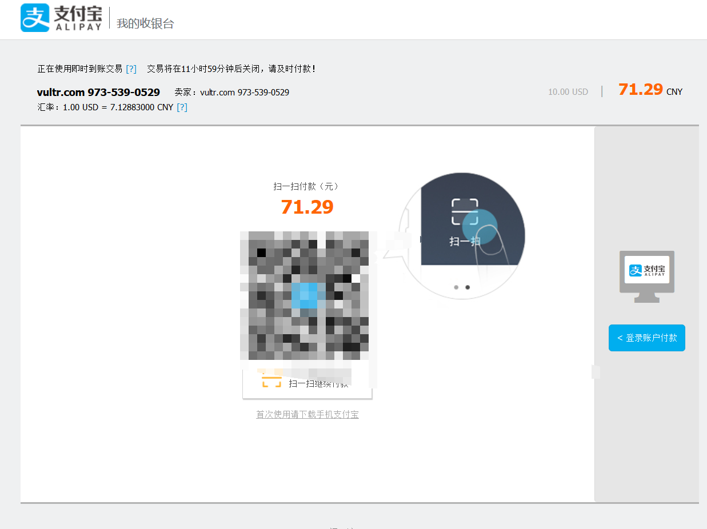

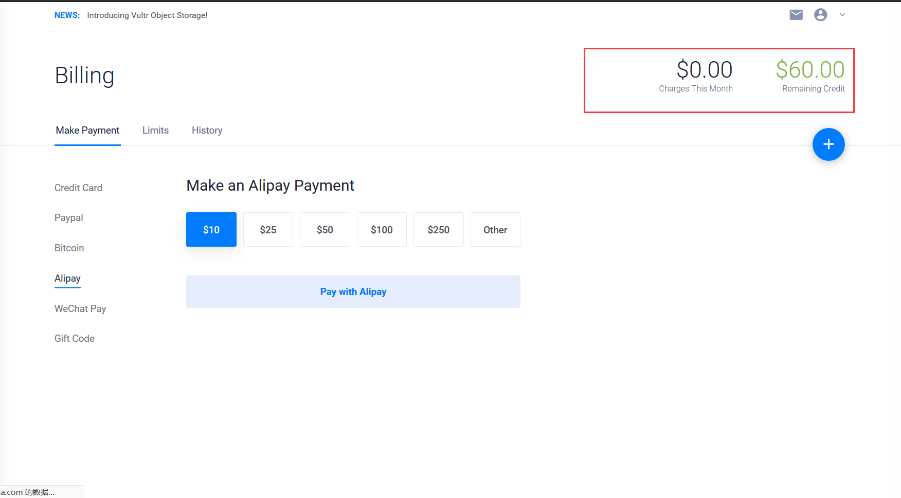

# <a name="vultr-02" href="#" >创建服务器</a>

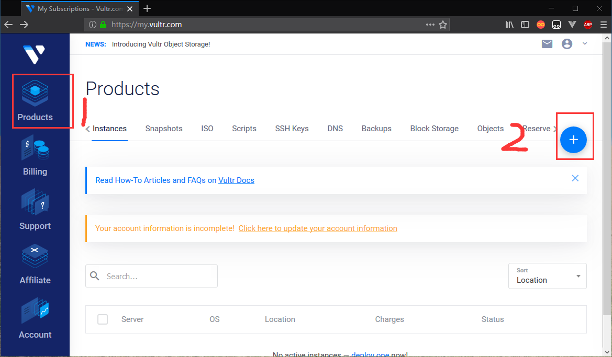

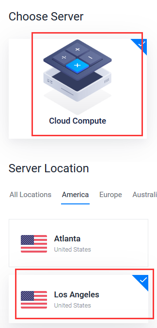

> 机房的选择建议

- 移动用户选择建议：

```
移动用户可选择Vultr的日本节点，或者新加坡节点。
```

- 联通用户选择建议：

```
联通用户可选择Vultr的新加坡节点，也可以尝试Vultr的杉矶机房、硅谷机房和西雅图机房，这几个机房对于联通用户来说速度都很不错。
```

- 电信用户选择建议：（`这里选洛杉矶机房为例`）

```
电信用户可选择Vultr的洛杉矶机房、硅谷机房和西雅图机房，不推荐日本和新加坡节点。
```

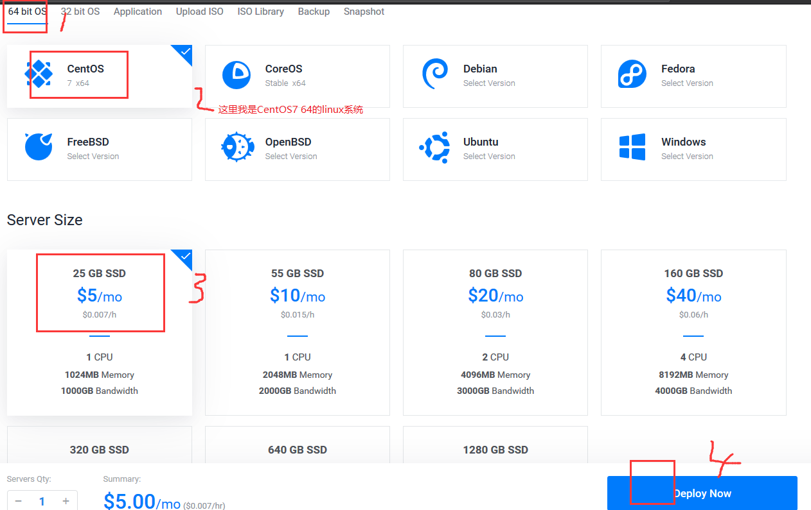

- 最新的信息

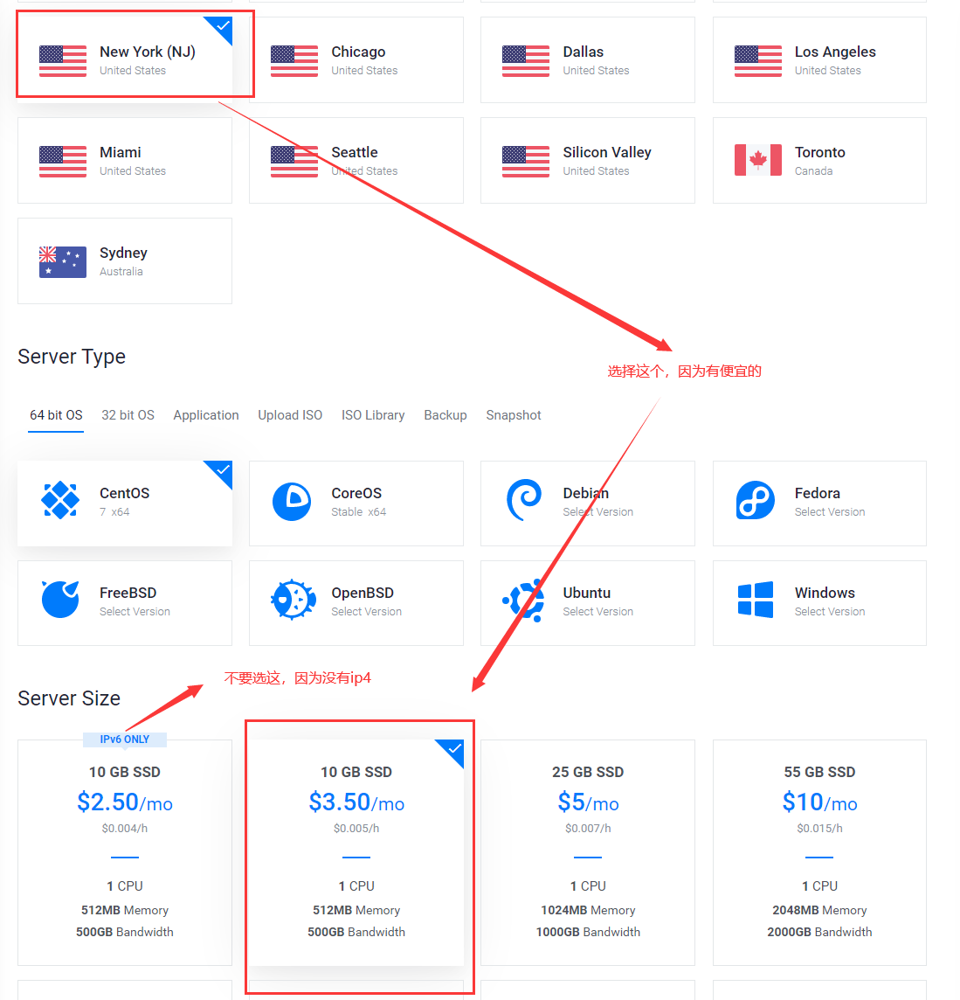


> 云服务的操作系统我选择linux系统的centOS7 64位的，选择其他系统的后面的安装v2ray命令自行百度。


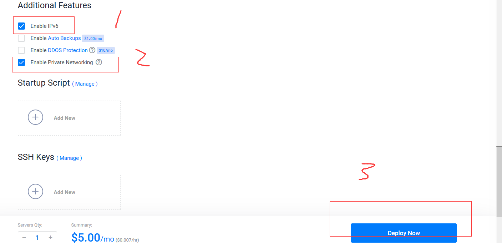


# <a name="vultr-03" href="#" >看效果</a>

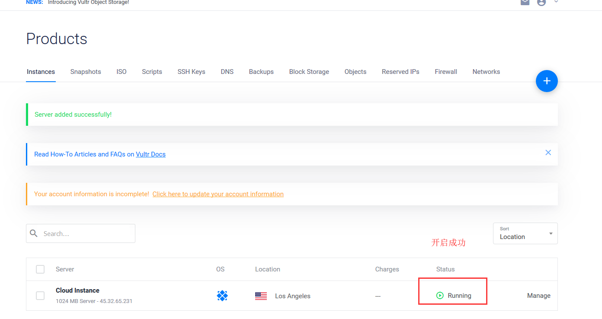

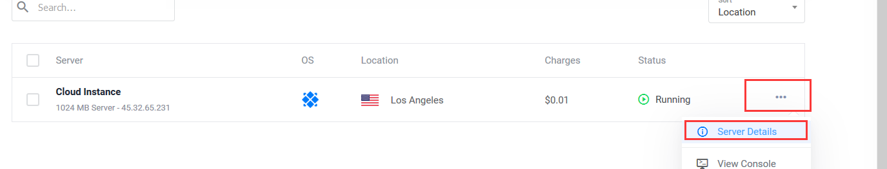

- 记住ip、账号和密码

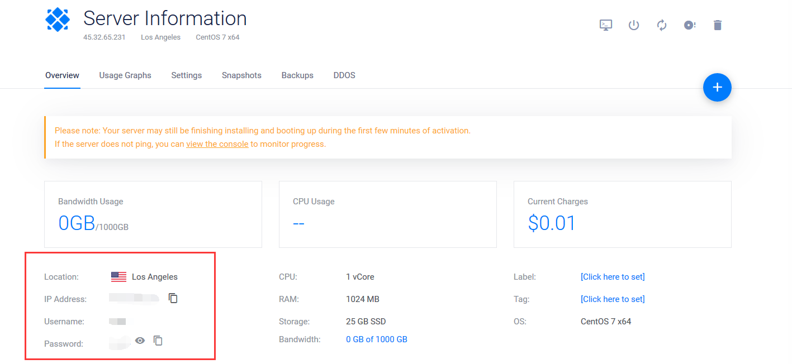

- 使用Xshell远程连接上centOS7

[](https://pan.baidu.com/s/13BdHO9Eev2-15rmthagHJw)

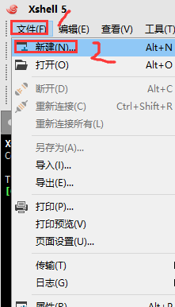

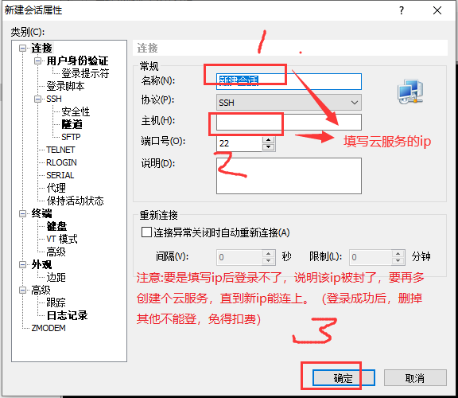

- 点击确定后，后面再填写云服务的账号和密码