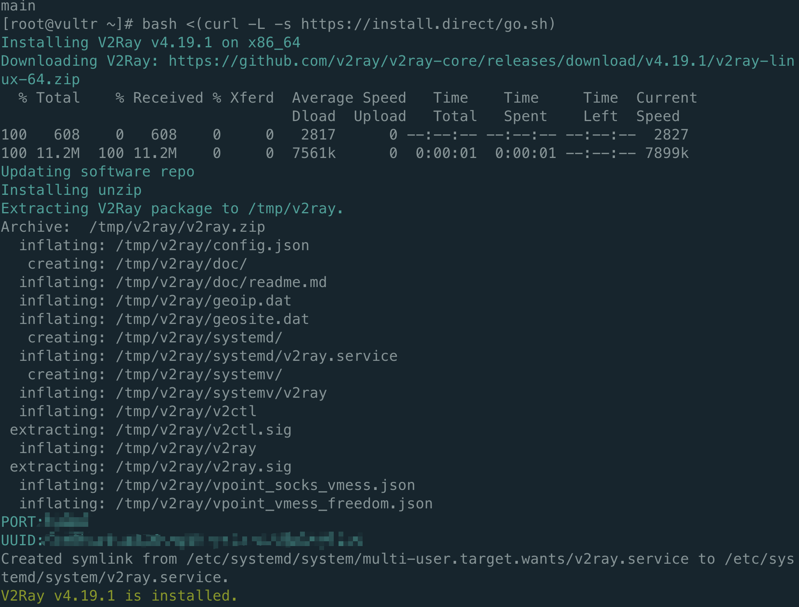
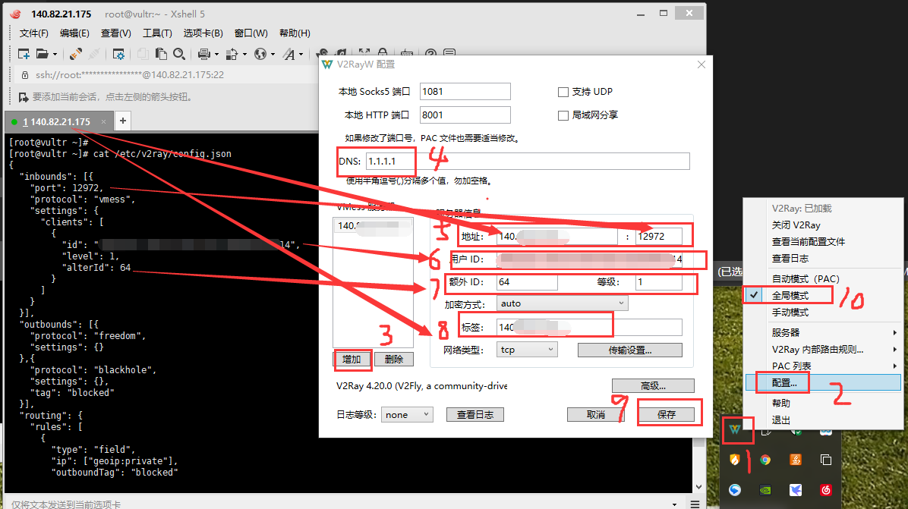

总操作流程：
- 1、[下载安装](#vultr-01)
- 2、[配置](#vultr-02)
- 3、[测试](#vultr-03)

***

> xshell连上远程的centos7后输入命令

# <a name="vultr-01" href="#" >下载安装</a>

> centso7 安装v2ray

```shell
bash <(curl -L -s https://install.direct/go.sh)

service v2ray start

systemctl daemon-reload
systemctl enable v2ray
systemctl restart v2ray
```



> 2、锐速安装

```shell
wget --no-check-certificate -O rskernel.sh https://raw.githubusercontent.com/hombo125/doubi/master/rskernel.sh && bash rskernel.sh
```
- 系统自动重启后(安装时全部默认，一切按回车)

```shell
yum install net-tools -y && wget --no-check-certificate -O appex.sh https://raw.githubusercontent.com/0oVicero0/serverSpeeder_Install/master/appex.sh && bash appex.sh install
```

> 3、开放防火墙

```shell
# xshell输入命令查看搭建好的v2ray配置，port是端口，要对该端口值开发防火墙
cat /etc/v2ray/config.json
```

```shell

firewall-cmd --permanent --zone=public --add-port=28068/tcp
firewall-cmd --reload
firewall-cmd --zone=public --query-port=28068/tcp
```

# <a name="vultr-02" href="#" >配置</a>

> windows的客户端配置

- windows(根据自己电脑系统位数下载对应版本)

[](https://github.com/Cenmrev/V2RayW/releases)

`下载v2ray-core，解压后改名字：v2ray-core，放到与V2RayW.exe同目录下`

[](https://github.com/v2ray/v2ray-core/releases/tag/v4.20.0)


```shell
# xshell输入命令查看搭建好的v2ray配置
cat /etc/v2ray/config.json
```

- 双击V2RayW.exe，鼠标右键配置



> 安卓的客户端

- 安卓(因为版权问题，只能百度云只能私发，加我；yiyiyqyq，要么自行百度BifrostV安装包)

[](https://pan.baidu.com/s/1x3VgIs54ip0q1KsJvSuKPg)

- 客户端的配置

| 项目 | 值 |
| :- | :- |  
| 主机/服务器/地址 | 服务器ip |
| 端口 port | config.json图中的port |
| 用户ID | config.json图中的id |
| 额外ID AlterId | 64 |
| 加密方式 security | auto |
| 用户等级 | 1 |
| 网络/传输协议 network | tcp |
| 加密方式 | none |
| Mux | 开启 |
| 远程路由/DNS (可选) | 1.1.1.1 |
| 路由 | BifrsotV:绕过局域网和中国大陆地址与网站;V2RayN:参数设置-绕过中国大陆地址和ip(这一步的目的是直连国内网站，降低延迟) |


# <a name="vultr-03" href="#" >测试</a>

> 使用浏览器进入YouTube，看是否正常访问

https://www.youtube.com

- windows双击V2RayW.exe运行，使用浏览器输入地址

- 安卓要启动BifrostV，再使用浏览器输入地址
