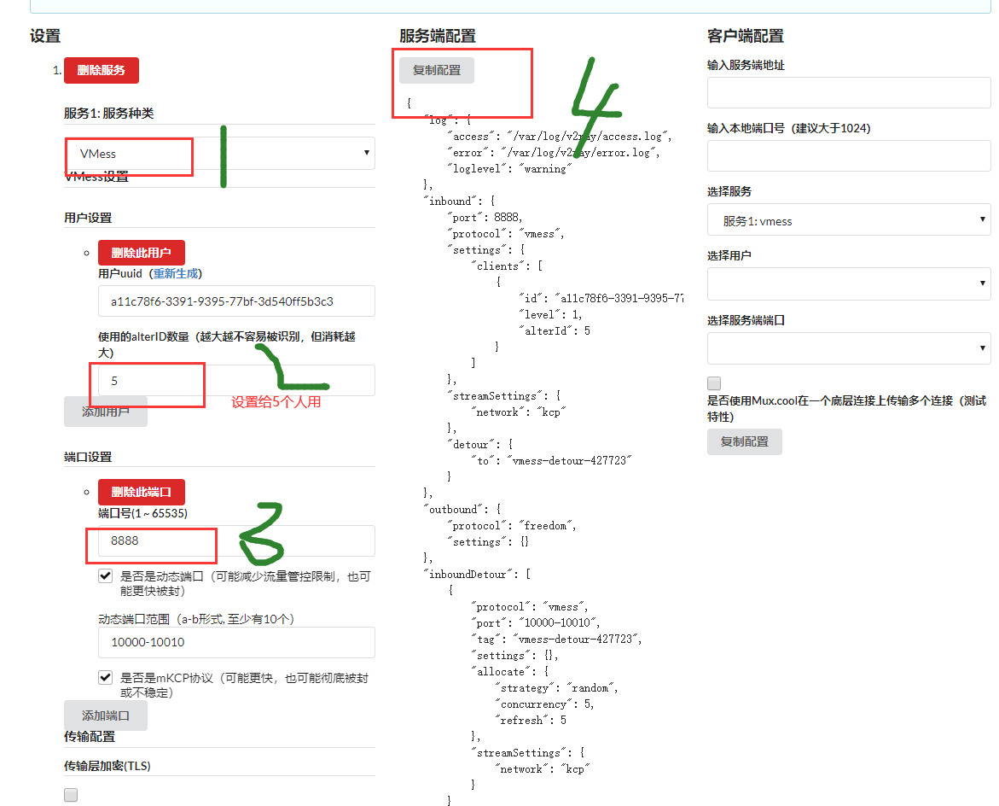
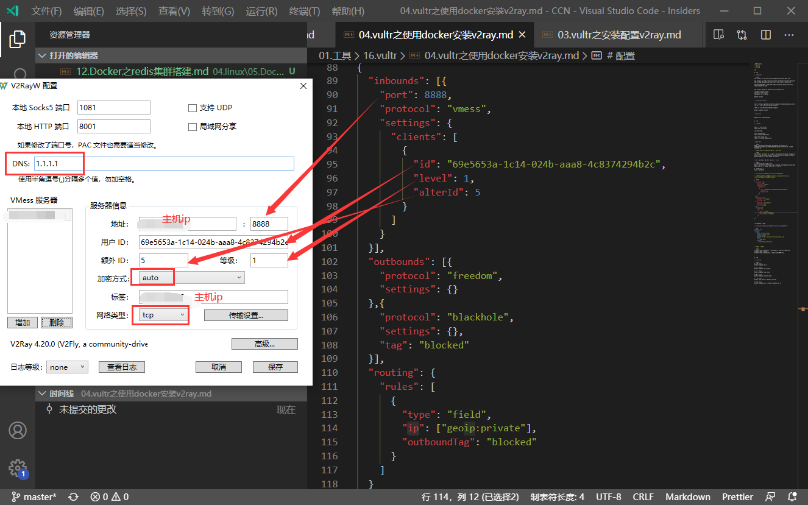

总操作流程：
- 1、[安装](#vultr-01)
- 2、[配置](#vultr-02)
- 3、[测试](#vultr-03)

***

> 注意：该教程是centos7系统64位

# <a name="vultr-01" href="#" >安装</a>

> 安装docker

```shell
yum install -y yum-utils device-mapper-persistent-data lvm2

yum-config-manager --add-repo https://download.docker.com/linux/centos/docker-ce.repo

yum install -y https://mirrors.aliyun.com/docker-ce/linux/centos/7/x86_64/edge/Packages/containerd.io-1.2.13-3.1.el7.x86_64.rpm

yum install docker-ce docker-ce-cli containerd.io

systemctl daemon-reload
systemctl start docker
systemctl enable docker

docker version
```

> 安装docker-compose 

```
curl -L https://github.com/docker/compose/releases/download/1.23.2/run.sh > /usr/local/bin/docker-compose

chmod +x /usr/local/bin/docker-compose

docker-compose version 
```

> 下拉v2ray

```
docker pull v2ray/official
```

# <a name="vultr-02" href="#" >配置</a>


> 创建文件

```
mkdir -p /etc/v2ray/
mkdir -p /var/log/v2ray
chmod 777 /etc/v2ray
chmod 777 /var/log/v2ray

cd /var/log/v2ray/
touch error.log
touch access.log
chmod 777 error.log
chmod 777 access.log

cd /etc/v2ray
touch config.json
touch docker-compose.yml
chmod 777 config.json
chmod 777 docker-compose.yml
```

- config.json
	- 注意可以到[V2Ray配置生成器](https://intmainreturn0.com/v2ray-config-gen/)重新生成用户uuid

```json
{
    "log": {
        "access": "/var/log/v2ray/access.log",
        "error": "/var/log/v2ray/error.log",
        "loglevel": "warning"
    },
    "inbound": {
        "port": 8888,
        "protocol": "vmess",
        "settings": {
            "clients": [
                {
                    "id": "85821393-099f-d34d-bb72-a825175fd4ea",
                    "level": 1,
                    "alterId": 5
                }
            ]
        },
        "streamSettings": {
            "network": "tcp"
        }
    },
    "outbound": {
        "protocol": "freedom",
        "settings": {}
    },
    "inboundDetour": [],
    "outboundDetour": [
        {
            "protocol": "blackhole",
            "settings": {},
            "tag": "blocked"
        }
    ],
    "routing": {
        "strategy": "rules",
        "settings": {
            "rules": [
                {
                    "type": "field",
                    "ip": [
                        "0.0.0.0/8",
                        "10.0.0.0/8",
                        "100.64.0.0/10",
                        "127.0.0.0/8",
                        "169.254.0.0/16",
                        "172.16.0.0/12",
                        "192.0.0.0/24",
                        "192.0.2.0/24",
                        "192.168.0.0/16",
                        "198.18.0.0/15",
                        "198.51.100.0/24",
                        "203.0.113.0/24",
                        "::1/128",
                        "fc00::/7",
                        "fe80::/10"
                    ],
                    "outboundTag": "blocked"
                }
            ]
        }
    }
}

```



- docker-compose.yml

```yml
version: "3"
services:
  v2ray:
    image: v2ray/official
    container_name: v2ray
    restart: always
    command: v2ray -config=/etc/v2ray/config.json
    ports:
      - "8888:8888"
    volumes:
      - /etc/v2ray:/etc/v2ray
```


> 防火墙开发端口

```shell
firewall-cmd --permanent --zone=public --add-port=8888/tcp
firewall-cmd --reload
firewall-cmd --zone=public --query-port=8888/tcp
```


# <a name="vultr-03" href="#" >测试</a>

> 启动v2ray

```shell
# 部署 v2ray
docker-compose up -d

# 启动 v2ray
docker-compose start v2ray

# 停止 v2ray
docker-compose stop v2ray

# 重启 v2ray
docker-compose restart v2ray

# 删除 v2ray
docker stop v2ray && docker rm v2ray

# 更新 v2ray
docker-compose pull && docker-compose up -d
```

> 电脑客户端的连接

- windows(根据自己电脑系统位数下载对应版本)

[](https://github.com/Cenmrev/V2RayW/releases)

`下载v2ray-core，解压后改名字：v2ray-core，放到与V2RayW.exe同目录下`

[](https://github.com/v2ray/v2ray-core/releases/tag/v4.20.0)




> 安卓客户端的连接

- 安卓(因为版权问题，只能百度云只能私发，加我；yiyiyqyq，要么自行百度BifrostV安装包)

[](https://pan.baidu.com/s/1x3VgIs54ip0q1KsJvSuKPg)

<details>
<summary>客户端的配置(点击显示)</summary>

| 项目 | 值 |
| :- | :- |  
| 主机/服务器/地址 | 服务器ip |
| 端口 port | config.json的port |
| 用户ID | config.json的id |
| 额外ID AlterId | config.json的alterId |
| 加密方式 security | auto |
| 用户等级 | 1 |
| 网络/传输协议 network | tcp |
| 加密方式 | none |
| Mux | 开启 |
| 远程路由/DNS (可选) | 1.1.1.1 |
| 路由 | BifrsotV:绕过局域网和中国大陆地址与网站;V2RayN:参数设置-绕过中国大陆地址和ip(这一步的目的是直连国内网站，降低延迟) |

</details>