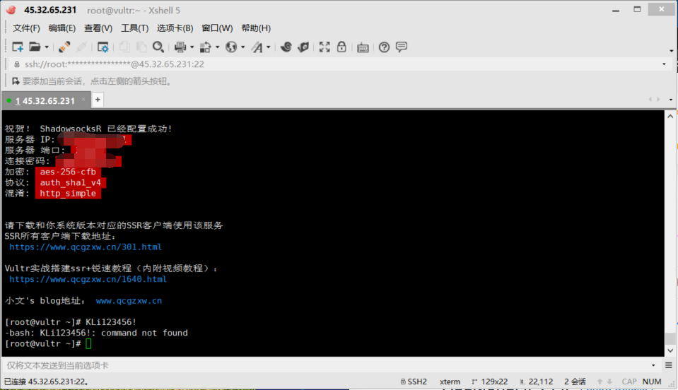
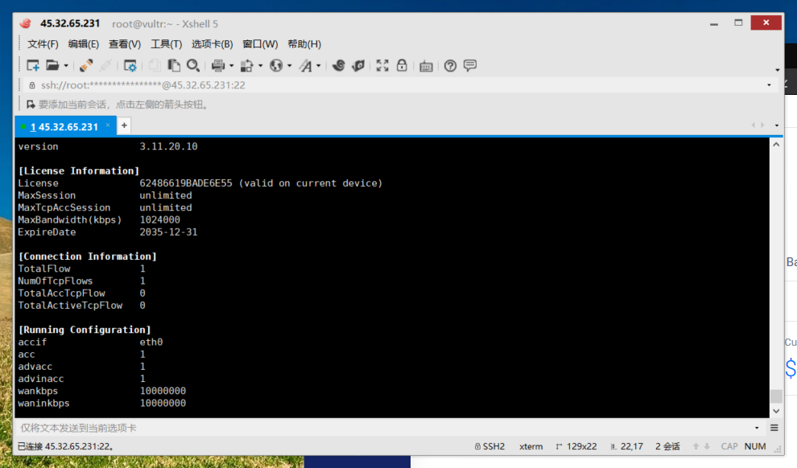
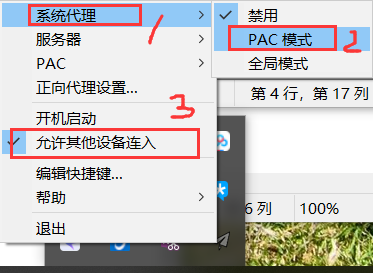

总操作流程：
- 1、[登录安装](#vultr-01)
- 2、[配置](#vultr-02)
- 3、[测试](#vultr-03)

***
# <a name="vultr-01" href="#" >登录安装</a>

> 1、使用ssh远程登录gp
> 2、安装shadowsocksR
```
wget --no-check-certificate https://freed.ga/github/shadowsocksR.sh; bash shadowsocksR.sh

设置密码后自动下载安装
```



>3、锐速安装

```
wget --no-check-certificate -O rskernel.sh https://raw.githubusercontent.com/hombo125/doubi/master/rskernel.sh && bash rskernel.sh
```

- 自动重启后(安装时全部默认，一切按回车)

```
yum install net-tools -y && wget --no-check-certificate -O appex.sh https://raw.githubusercontent.com/0oVicero0/serverSpeeder_Install/master/appex.sh && bash appex.sh install
```
- 成功标志




> 5、对端口开启防护墙

```
firewall-cmd --permanent --zone=public --add-port=1698/tcp
firewall-cmd --reload
firewall-cmd --zone=public --query-port=1698/tcp
```


# <a name="vultr-03" href="#" >测试</a>

> 1、下载安装Shadowsocks客户端：windons

[](https://github.com/shadowsocks/shadowsocks-windows/releases)



> 2、下载安装Shadowsocks客户端：android

[](https://github.com/shadowsocks/shadowsocks-android/releases)
