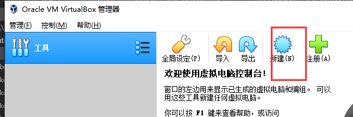
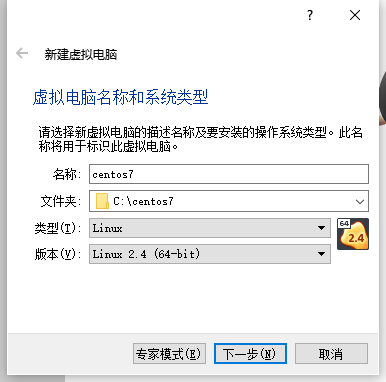
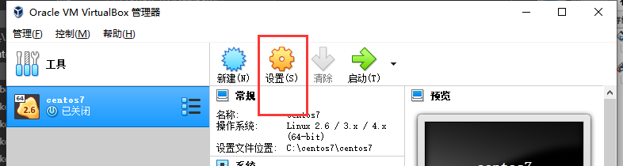
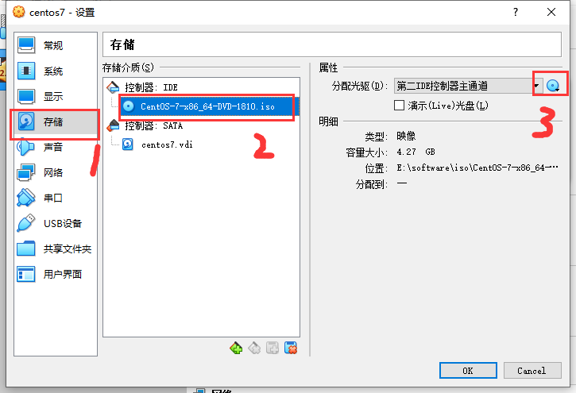
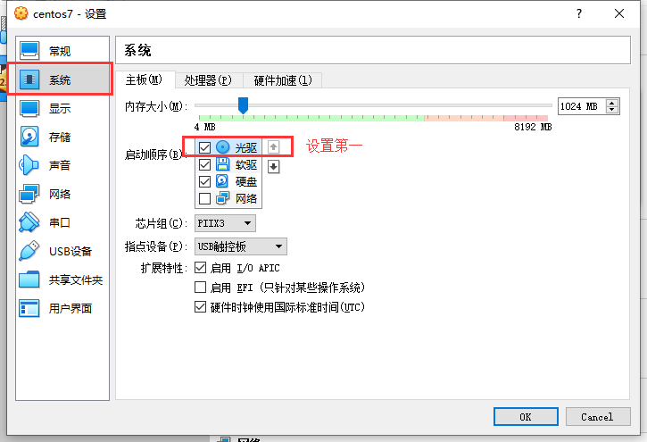
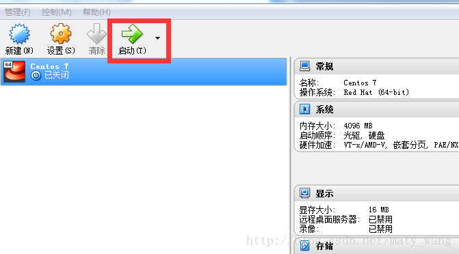

总操作流程：
- 1、[新建虚拟机](#VirtualBox-01)
- 2、[将centos7的镜像文件关联到虚拟机](#VirtualBox-02)
- 3、[安装centos7](#VirtualBox-03)

***

# <a name="VirtualBox-01" href="#" >新建虚拟机</a>

# <a name="VirtualBox-02" href="#" >将centos7的镜像文件关联到虚拟机</a>

# <a name="VirtualBox-03" href="#" >安装centos7</a>

