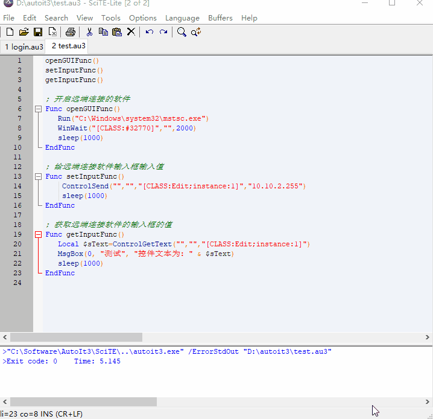
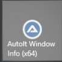
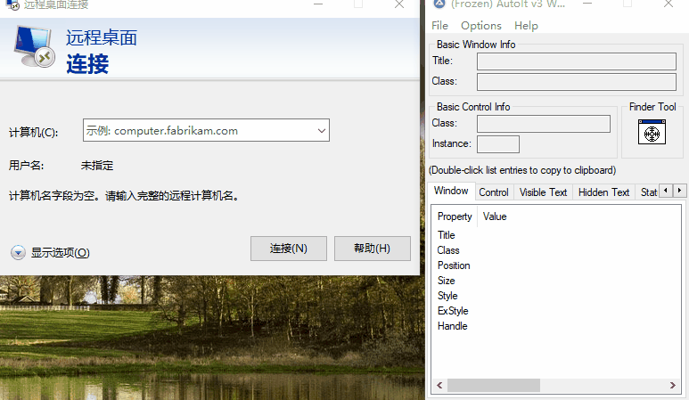

# 效果



# 操作

> 打开编辑器


> 抓取远端连接软件的输入框的控制id





> 代码

<details>
<summary>代码</summary>


```java

openGUIFunc()
setInputFunc()
getInputFunc()

; 开启远端连接的软件
Func openGUIFunc()
   Run("C:\Windows\system32\mstsc.exe")
   WinWait("[CLASS:#32770]","",2000)
   sleep(1000)
EndFunc

; 给远端连接软件输入框输入值
Func setInputFunc()
    ControlSend("","","[CLASS:Edit;instance:1]","10.10.2.255")
	sleep(1000)
EndFunc

; 获取远端连接软件的输入框的值
Func getInputFunc()
   Local $sText=ControlGetText("","","[CLASS:Edit;instance:1]")
   MsgBox(0, "测试", "控件文本为: " & $sText)
   sleep(1000)
EndFunc
```

</details>

> 运行

