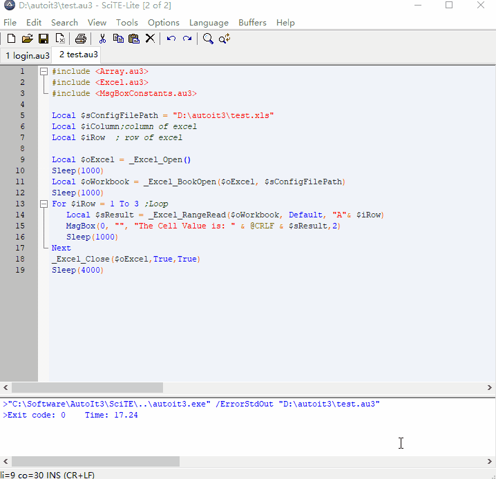
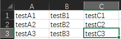
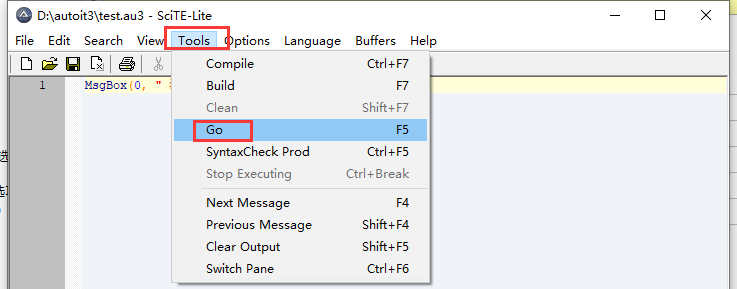

# 效果



# 操作

> 打开编辑器


> test.xls的数据



> 代码

<details>
<summary>代码</summary>


```java

#include <Array.au3>
#include <Excel.au3>
#include <MsgBoxConstants.au3>

Local $sConfigFilePath = "D:\autoit3\test.xls"
Local $iColumn;column of excel
Local $iRow  ; row of excel

Local $oExcel = _Excel_Open()
Sleep(1000)
Local $oWorkbook = _Excel_BookOpen($oExcel, $sConfigFilePath)
Sleep(1000)
For $iRow = 1 To 3 ;Loop
   ;~读取
   Local $sResult = _Excel_RangeRead($oWorkbook, Default, "A"& $iRow)
   MsgBox(0, "", "The Cell Value is: " & @CRLF & $sResult,2)
   Sleep(1000)
   ;~写入
   _Excel_RangeWrite($oWorkbook,$oWorkbook.Activesheet ,"完成"& $iRow, "D"& $iRow)
Next
_Excel_Close($oExcel,True,True)
Sleep(4000)
```

</details>

> 运行

