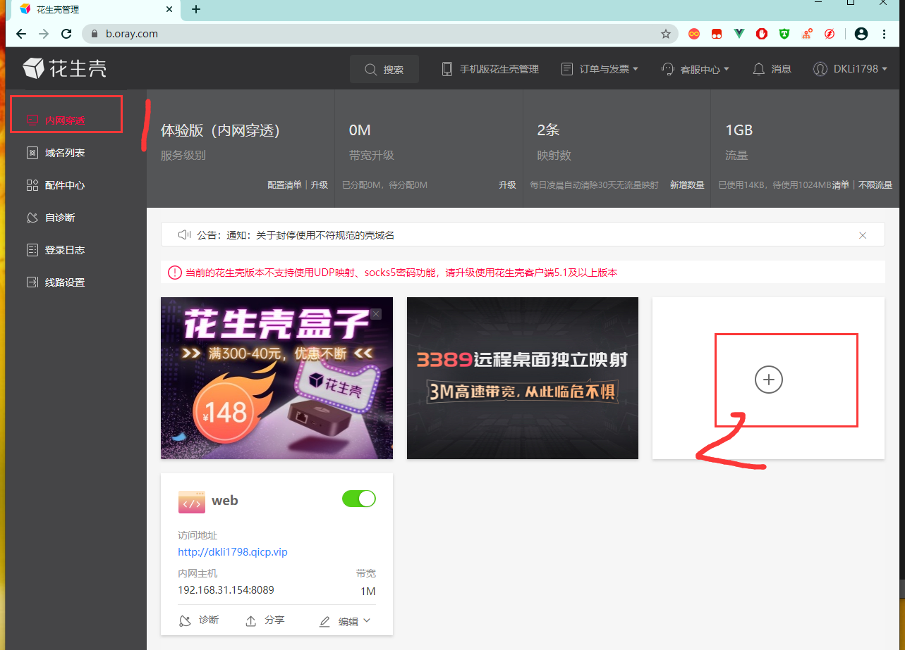
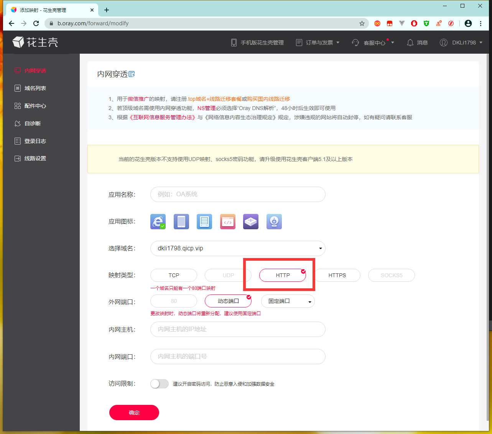
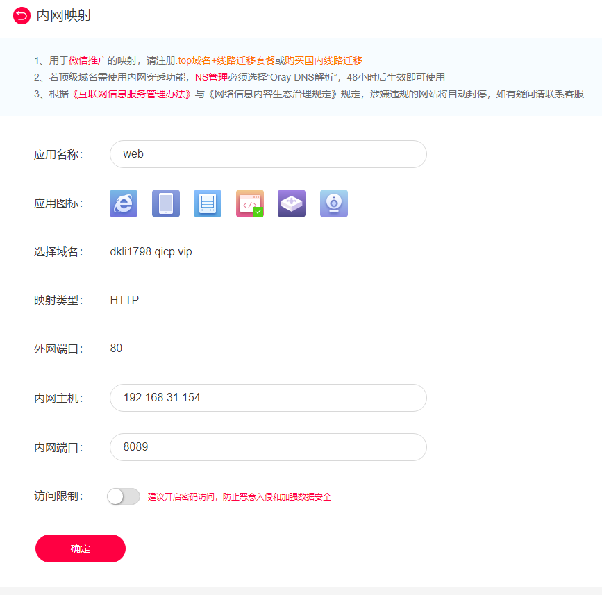

总操流程：
- 1、设置内网穿透
- 2、配置nginx
- 3、看效果

***

# 设置内网穿透

- 进入配置：http://b.oray.com







# 配置nginx

- 下拉
```
docker pull nginx:latest
```

- 开发防火墙

```shell
firewall-cmd --permanent --zone=public --add-port=8089/tcp
firewall-cmd --reload
```

- 修改配置

```shell
docker run --name nginx -p 8089:80 -d nginx

docker cp nginx:/etc/nginx/conf.d/default.conf /

# 修改
vim /default.conf
```

```json
server {
    listen       80;
    server_name dkli1798.qicp.vip;

    #charset koi8-r;
    #access_log  /var/log/nginx/host.access.log  main;

    location / {
        root   /usr/share/nginx/html;
        index  index.html index.htm;
        add_header Access-Control-Allow-Origin *;
        add_header Access-Control-Allow-Methods 'GET, POST, OPTIONS';
        add_header Access-Control-Allow-Headers 'DNT,X-Mx-ReqToken,Keep-Alive,User-Agent,X-Requested-With,If-Modified-Since,Cache-Control,Content-Type,Authorization';

        if ($request_method = 'OPTIONS') {
           return 204;
        }
    }
    error_page   500 502 503 504  /50x.html;
    location = /50x.html {
        root   /usr/share/nginx/html;
    }
}
```

```
# 将修改好的配置文件复制回去
docker cp /default.conf nginx:/etc/nginx/conf.d
docker stop nginx
docker start nginx
```

# 看效果

- 浏览器输入地址：http://dkli1798.qicp.vip/
