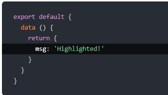
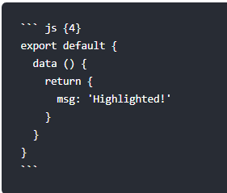
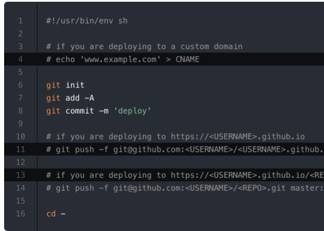

本页目录：
- 1、[代码块中高亮](#VuePress-01)
- 2、[代码块中行号](#VuePress-02)

***

# <a name="VuePress-01" href="#" >代码块中高亮</a>

> 效果



> 语法



# <a name="VuePress-02" href="#" >代码块中行号</a>

> 效果



> 语法

- .vuepress\config.js配置
```js
module.exports = {
    markdown: {
        lineNumbers: true
    }
}
```

