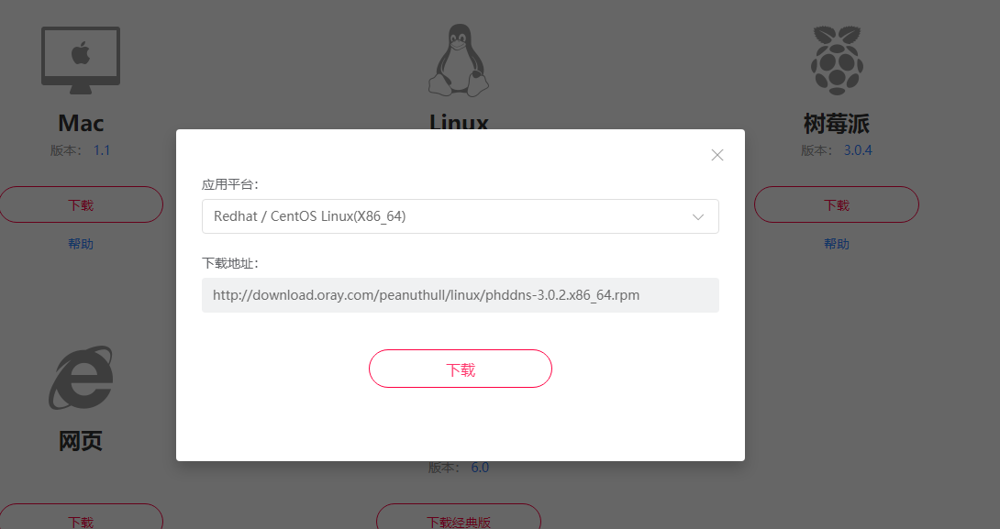
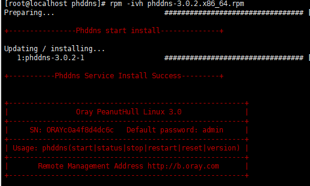

总操作流程：
- 1、下载安装
- 2、配置
- 3、测试

***

# 下载安装

> 下载

[](https://hsk.oray.com/download/)



> 安装

```shell
mkdir -p /usr/local/phddns
chmod 0777 /usr/local/phddns

# 上传下载的文件
cd /usr/local/phddns
rpm -ivh phddns-*
phddns start
```

# 配置

> 查看端口

```shell
ps -ef | grep phddns*
```

> 防火墙开发端口

```
firewall-cmd --permanent --zone=public --add-port=3817/tcp
firewall-cmd --reload
firewall-cmd --zone=public --query-port=3817/tcp
```

# 测试

> 浏览器输入地址：http://b.oray.com 账号密码市安装时的显示




···shell
# 看SN码
phddns status
···