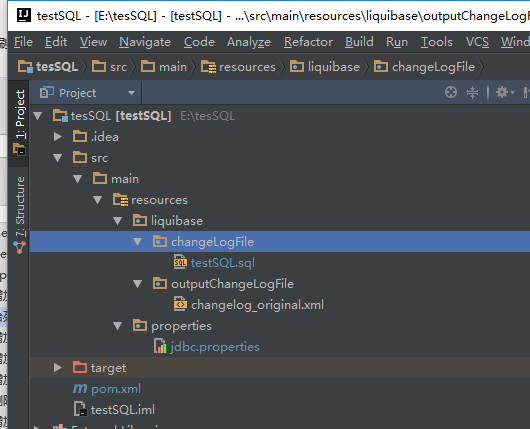
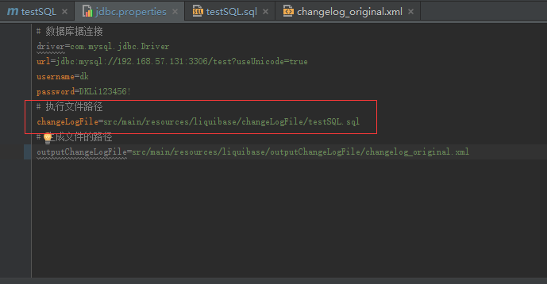

[](http://www.liquibase.org/documentation/sql_format.html)


总操作流程：
- 1、[创建文件夹，修改文件和文件](#liquibase-01)
    - 1.[1、创建文件夹](#liquibase-01-01)
    - 1.[2、修改文件](#liquibase-01-02)
    - 1.[3、创建文件](#liquibase-01-03)
- 2、[测试看效果](#liquibase-01)

***

# <a name="liquibase-01" href="#" >创建文件夹，修改文件和文件</a>
- 项目结构



### <a name="liquibase-01-01" href="#" >1、创建文件夹</a>
- resources
    - liquibase
        - changeLogFile
### <a name="liquibase-01-02]" href="#" >2、修改文件</a>
- jdbc.properties



```
# 执行文件路径
changeLogFile=src/main/resources/liquibase/changeLogFile/testSQL.sql
```
### <a name="liquibase-01-03" href="#" >3、创建文件</a>
- testSQL.sql
```
--liquibase formatted sql

--changeset DKLi:version_01
CREATE TABLE table2 (
  id int(11) NOT NULL,
  name varchar(255) NOT NULL,
  PRIMARY KEY (id)
) ENGINE=MyISAM;
```
# <a name="liquibase-02" href="#" >测试看效果</a>
- 命令：
```
mvn liquibase:update
```
- 效果:

