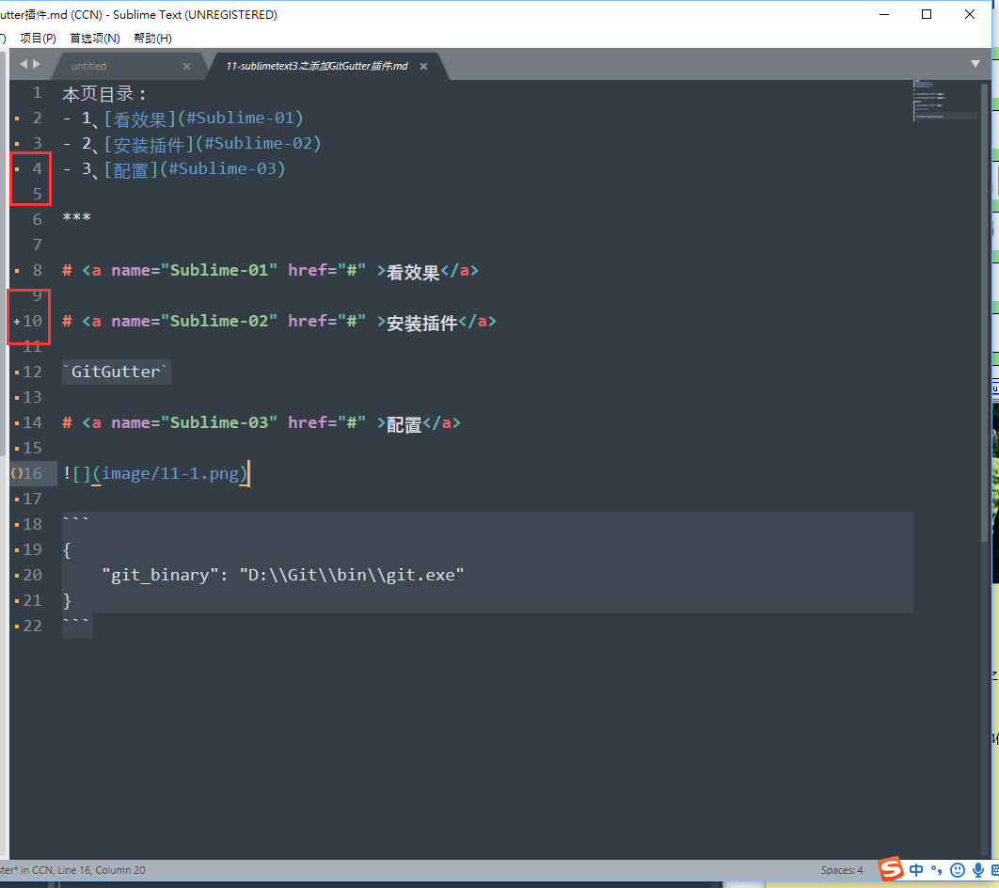
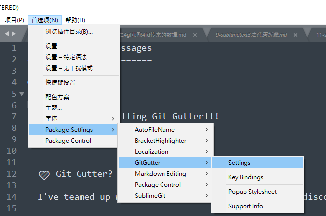

本页目录：
- 1、[看效果](#Sublime-01)
- 2、[安装插件](#Sublime-02)
- 3、[配置](#Sublime-03)

***

# <a name="Sublime-01" href="#" >看效果</a>



# <a name="Sublime-02" href="#" >安装插件</a>

`GitGutter`

# <a name="Sublime-03" href="#" >配置</a>



```
{
    "git_binary": "D:\\Git\\bin\\git.exe"
}
```