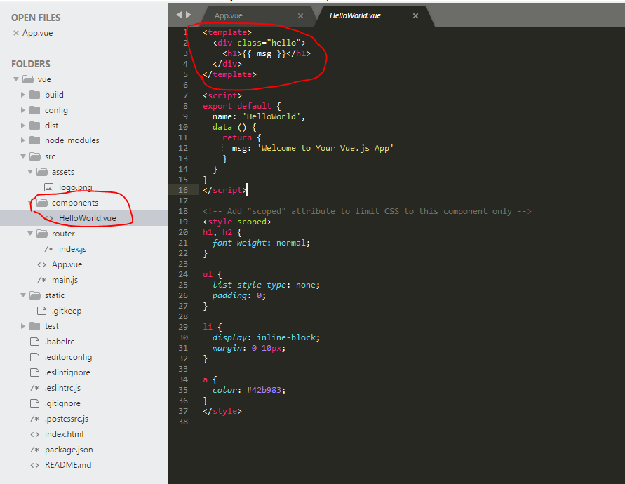
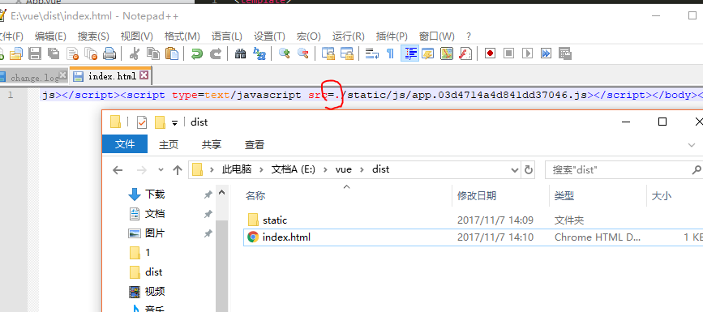

总操作流程：
- 1、[修改vue文件](#vue.js-01)
- 2、[打包](#vue.js-02)
- 3、[修改inde.html文件](#vue.js-03)

[](https://github.com/lidekai/vue.git)

----------
# <a name="vue.js-01" href="#" >1、修改vue文件</a>


# <a name="vue.js-02" href="#" >2、打包</a>
```shell
cnpm run build
```
# <a name="vue.js-03" href="#" >3、修改inde.html文件</a>
`在四个/state  前面都加个.`

