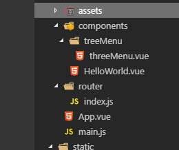

总操作流程;
- 1、[写代码](#vue.js-01)
- 2、[测试](#vue.js-02)

***

- 项目目录结构



# <a name="vue.js-01" href="#" >写代码</a>

> 1、json

<details>
<summary>static\json\menu.json</summary>

```json
{
  "code": "OK",
  "msg": "成功",
  "rows": [{
      "menuID": 1,
      "menuParent": 0,
      "menuName": "资源搜索",
      "menuUrl": "1",
      "menuIcon": "el-icon-star-on",
      "menuIs": 1,
      "menuCode": "bt"
    },
    {
      "menuID": 2,
      "menuParent": 0,
      "menuName": "网盘搜索",
      "menuUrl": "2",
      "menuIcon": "el-icon-star-off",
      "menuIs": 1,
      "menuCode": "wp"
    },
    {
      "menuID": 3,
      "menuParent": 1,
      "menuName": "磁力搜索",
      "menuUrl": "http://www.btmovi.space",
      "menuIcon": "el-icon-star-off",
      "menuIs": 2,
      "menuCode": "bt1"
    },
    {
      "menuID": 4,
      "menuParent": 1,
      "menuName": "磁力狗",
      "menuUrl": "http://ciligou0.com",
      "menuIcon": "el-icon-star-on",
      "menuIs": 2,
      "menuCode": "bt2"
    },
    {
      "menuID": 5,
      "menuParent": 1,
      "menuName": "btdad",
      "menuUrl": "http://www.btdad.site",
      "menuIcon": "el-icon-star-on",
      "menuIs": 2,
      "menuCode": "bt3"
    },
    {
      "menuID": 6,
      "menuParent": 1,
      "menuName": "磁力管家",
      "menuUrl": "http://www.ciliguanjia.buzz",
      "menuIcon": "el-icon-star-on",
      "menuIs": 2,
      "menuCode": "bt4"
    },
    {
      "menuID": 7,
      "menuParent": 1,
      "menuName": "AI Search",
      "menuUrl": "https://www.aiosearch.com",
      "menuIcon": "el-icon-star-on",
      "menuIs": 2,
      "menuCode": "bt5"
    },
    {
      "menuID": 8,
      "menuParent": 1,
      "menuName": "SOBT",
      "menuUrl": "http://sobt0.net",
      "menuIcon": "el-icon-star-on",
      "menuIs": 2,
      "menuCode": "bt6"
    },
    {
      "menuID": 9,
      "menuParent": 2,
      "menuName": "小白盘",
      "menuUrl": "https://www.xiaobaipan.com",
      "menuIcon": "el-icon-star-on",
      "menuIs": 2,
      "menuCode": "wp1"
    },
    {
      "menuID": 10,
      "menuParent": 2,
      "menuName": "文件搜",
      "menuUrl": "http://wjsou.com",
      "menuIcon": "el-icon-star-on",
      "menuIs": 2,
      "menuCode": "wp2"
    },
    {
      "menuID": 11,
      "menuParent": 2,
      "menuName": "史莱姆导航",
      "menuUrl": "http://www.slimego.cn",
      "menuIcon": "el-icon-star-on",
      "menuIs": 2,
      "menuCode": "wp3"
    },
    {
      "menuID": 12,
      "menuParent": 2,
      "menuName": "西林街搜索",
      "menuUrl": "https://xilinjie.cc",
      "menuIcon": "el-icon-star-on",
      "menuIs": 2,
      "menuCode": "wp4"
    }
  ]
}

```

</details>

> 2、vue引用

<details>
<summary>引用</summary>


```html
<ThreeMenu :menu="menu" @three="three"></ThreeMenu>
```

```js
import ThreeMenu from '@/components/ThreeMenu.vue'

```

</details>

<details>
<summary>函数</summary>
	
```js
data() {
  return {
     menu:null
  }
},
components: {
      ThreeMenu,
    },
mounted: function () {
     this.getJson()
    },
    methods: {
	three(val) { //左边点击切换内容
        console.log(val);
      },
      getJson() { //获取后台json数据
        const that = this;
//        this.axios({
//            method: "get",
//            headers: {
//              'Content-Type': 'application/json'
//            },
//            url: 'http://localhost:8089/menu/getMenu'
//          })
this.axios.get('static/json/menu.json')
          .then((response) => {
            let dataJson = that.treeData(response.data.rows, 'menuID', 'menuParent', 'children');
            that.menu = dataJson;
          }).catch((response) => {
            console.log(response);
          })
      },
      treeData(source, id, parentId, children) {
        let cloneData = JSON.parse(JSON.stringify(source))
        return cloneData.filter(father => {
          let branchArr = cloneData.filter(child => father[id] == child[parentId]);
          branchArr.length > 0 ? father[children] = branchArr : ''
          return father[parentId] == 0
        })
      }
    }

    
```

</details>


>3、vue的递归方式的组件

<details>
<summary>ThreeMenu.vue</summary>


```html
<template>
    <el-menu class="el-menu-vertical-demo" default-active="1" unique-opened @select="handleSelect">
      <template v-for="list in menu">
        <!--主目录-->
        <el-submenu v-if="list.children" :index="String(list.menuID)" :key="list.menuID">
          <template slot="title">
            <span v-for="mi in list.menuIs" v-if="list.menuIs !=1">
              &nbsp;&nbsp;
            </span>
            <i :class="list.menuIcon"></i>
            <span>{{list.menuName}}</span>
          </template>
          <el-menu-item-group>
            <ThreeMenu :menu="list.children" v-if="list.children" @three="(menuUrl)=>$emit('three',menuUrl)"></ThreeMenu>
          </el-menu-item-group>
        </el-submenu>

        <!--子目录-->
        <el-menu-item v-else :index="String(list.menuUrl)" :key="list.menuID">
          <span v-for="mi in list.menuIs" v-if="list.menuIs !=1">
            &nbsp;&nbsp;
          </span>
          <i :class="list.menuIcon"></i>
          <span>{{list.menuName}}</span>
        </el-menu-item>
      </template>
    </el-menu>
</template>


<script>
  export default {
    name: 'ThreeMenu',
    props: {
      menu: null
    },
    data() {
      return {
        menuUrl: ''
      }
    },
    methods: {
      handleSelect(key, keyPath) {
        this.$emit('three', key);
      }

    }
  }

</script>

<style>


</style>

```

</details>

# <a name="vue.js-02" href="#" >测试</a>

运行测试


