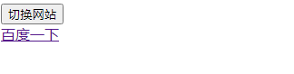

# 效果显示



# 代码

```vue
<template>
  <div class="hello">
    <button @click="onChangeHtml">切换网站</button>
    <div id="subView" v-html="content"></div>
  </div>
</template>

<script>
  export default {
    name: 'HelloWorld',
    data() {
      return {
        content: '<a href=""> 百度一下 <a/>'
      }
    },
    methods: {
      onChangeHtml() {
        this.content='<a href="http://www.sogou.com/"> 搜狗搜索 <a/>'
      }
    }
  }

</script>

<!-- Add "scoped" attribute to limit CSS to this component only -->
<style scoped>
</style>

```