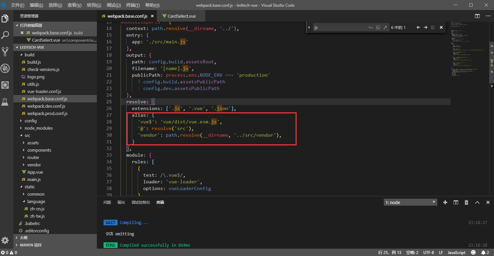

总操作流程:
- 1、[下载安装](#vue.js-01)
- 2、[写代码](#vue.js-02)
- 3、[测试](#vue.js-03)

***

>注意：这种导出的方式是js获取数据源，js对数据进行处理再导出的

# <a name="vue.js-01" href="#" >下载安装</a>

```js
cnpm install --save xlsx 
cnpm install --save file-saver 
cnpm install --save script-loader
```

# <a name="vue.js-02" href="#" >写代码</a>


>1、引用js，整个文件夹放到src下
[](https://pan.baidu.com/s/151Gnqi7mRl6qlwUWxYZtVg)

密钥：j41u

>2、修改build\webpack.base.conf.js配置文件



```
'vendor': path.resolve(__dirname, '../static/export_excel'),
```

> 3、写js

<details>
<summary>代码</summary>

```js
  import XLSX from 'xlsx';
  import FileSaver from 'file-saver'
  import ScriptLoader from 'script-loader'
  export default {
    data() {
      return {
        testTable: []
      }
    },
    created() {
      this.getJson();
    },
    methods: {
      getJson() {
        this.axios.get('static/json/test.json')
          .then((response) => {
            this.testTable = response.data.rows;
          }).catch((response) => {
            console.log(response);
          })
      },
      downloadOut() {
        this.export2Excel();
      },

      export2Excel() {
        require.ensure([], () => {
          const {
            export_json_to_excel
          } = require('../../../static/export_excel/Export2Excel');
          const tHeader = ['测试一', '测试二']; //导出数据源的头名称
          const filterVal = ['test1', 'test2']; //json数据源的key
          const list = this.testTable; //json数据源
          const data = this.formatJson(filterVal, list);
          export_json_to_excel(tHeader, data, '测试'); //导出文件名称
        })
      },
      formatJson(filterVal, jsonData) {
        return jsonData.map(v => filterVal.map(j => v[j]))
      }

    }
  }

```

</details>

> 4、写html

```html
  <div>
    <el-button type="primary" @click="downloadOut">主要按钮
    </el-button>
  </div>
```

# <a name="vue.js-03" href="#" >测试</a>

运行测试