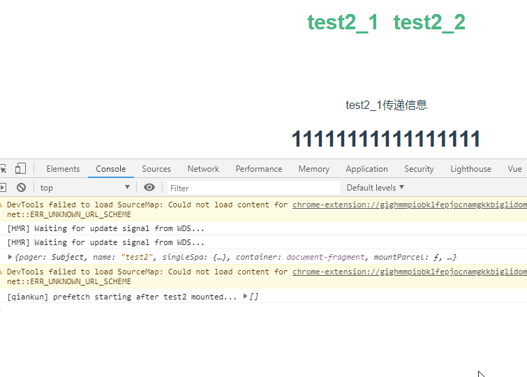

总操作流程：
- 1、[下载安装](#qiankun-01)
- 1、[配置](#qiankun-02)
- 2、[测试](#qiankun-03)

> 本教程基于：qiankun之构建微前端主应用与子应用

***

# <a name="qiankun-01" href="#" >下载安装</a>

> test1安装rxjs

```
cd test1

cnpm i rxjs --save
# 或者
yarn add rxjs
```

- 要是rxjs报错，修改package.json对rxjs版本修改

> 创建文件

- test1\src\util\pager\index.js

```js
import {
  Subject
} from "rxjs";

const pager = new Subject();

export default pager;

```

# <a name="qiankun-02" href="#" >配置</a>

> 修改：test1\src\main.js

```diff
+ import pager from "./util/pager"

+ pager.subscribe(v => {
+  console.log("test1:", v.from, v.token)
+ })

+ let msg = {
+   pager // 从主应用下发应用间通信呼机
+ }
//注册微应用
registerMicroApps([{
  name: 'test2',
  entry: '//localhost:8081',
  container: '#container',
  activeRule: '/test',
+  props: msg,
}]);
```

> 修改：test2\src\main.js

```diff
! export async function bootstrap({pager}) 
{
+  pager.subscribe(v => {
+    console.log("test2:", v.from, v.token)
+  })
+  Vue.prototype.$pager = pager;
}
```

> 修改: test2\src\views\Test2_1.vue

```diff
<template>
  <div class="test2_1">
+    <div @click="callParentChange">test2_1传递信息</div>
    <h1>{{ msg }}</h1>
  </div>
</template>

<script>
  export default {
    name: 'Test2_1',
    data() {
      return {
        msg: '11111111111111111'
      }
    },
+    methods: {
+      callParentChange() { // 在某个应用里调用.next方法更新数据，并传播给其他应用
+        this.$pager.next({
+          from: "test2_1",
+          token: "1111111111111111"
+        });
+      }
+    }
  }

</script>

<style scoped>

</style>
```


> 修改: test2\src\views\Test2_2.vue

```diff
<template>
  <div class="test2_1">
+    <div @click="callParentChange">test2_2传递信息</div>
    <h1>{{ msg }}</h1>
  </div>
</template>

<script>
  export default {
    name: 'Test2_1',
    data() {
      return {
        msg: '11111111111111111'
      }
    },
+    methods: {
+      callParentChange() { // 在某个应用里调用.next方法更新数据，并传播给其他应用
+        this.$pager.next({
+          from: "test2_2",
+          token: "2222222222222222222"
+        });
+      }
+    }
  }

</script>

<style scoped>

</style>
```

# <a name="qiankun-03" href="#" >测试</a>

> 运行主项目和子项目

> 看效果

