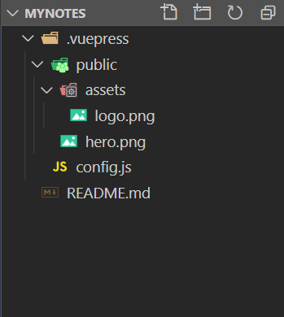

总操作流程：
- 1、[写配置](#VuePress-01)
- 2、[看效果](#VuePress-02)

***

# <a name="VuePress-01" href="#" >写配置</a>

- 项目目录



> .vuepress\config.js写配置

```js
module.exports = {
    //左上角和页面的标题
    title: 'Hello VuePress',
    description: 'Just playing around',
    themeConfig: {
        //左上角的logo图标
        logo: '/assets/logo.png',
        //禁用导航栏
        //navbar: false,
        nav: [{
                text: 'github',
                link: 'https://github.com',
                target: '_self',
                rel: ''
            },
            {
                text: 'Languages',
                ariaLabel: 'Language Menu',
                //下拉列表
                items: [{
                        text: 'Chinese',
                        link: '/language/chinese/'
                    },
                    {
                        text: 'Japanese',
                        link: '/language/japanese/'
                    }
                ]
            }
        ]
    }
}
```


# <a name="VuePress-02" href="#" >测试</a>

> 运行

```shell
# 开始写作
vuepress dev .
```

> 看效果：http://localhost:8080/