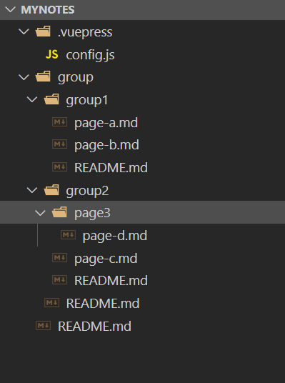

总操作流程：
- 1、[写配置](#VuePress-01)
- 2、[看效果](#VuePress-02)

***

# <a name="VuePress-01" href="#" >写配置</a>

- 项目目录



> README.md写配置

```md

---
title: home
---

# home
```

> group\README.md写配置

```md

---
title: guide
---

# group
```

> group\group1\README.md写配置

```md

---
title: guide1
---

# group1
```

> group\group1\page-a.md写配置

```md
---
title: page-a
---

# test page-a
```

> group\group1\page-b.md写配置

```md
---
title: page-b
---

# test page-b

```

> group\group2\README.md写配置

```md
---
title: guide2
---

# group2
```

> group\group2\page-c.md写配置

```md
---
title: page-c
---

# test page-c
```

> group\group2\page3\page-d.md写配置

```md
---
title: page-d
---

# test page-d
```

> .vuepress\config.js写配置

```js
module.exports = {
    themeConfig: {
        nav: [{
            text: 'home',
            link: '/',
        }, {
            "text": "group",
            "items": [{
                "text": "group1",
                "link": "/group/group1/"
            }, {
                "text": "group2",
                "link": "/group/group2/"
            }]
        }],
        sidebar: {
            '/group/group1/': [
                ['', '说明'],
                ['page-a', 'a'],
                ['page-b', 'b']
            ],

            '/group/group2/': [
                ['', '说明'],
                ['page-c', 'c'],
                {
                    title: 'page3',
                    collapsable: true,
                    children: [
                        ['/group/group2/page3/page-d', 'd'],
                    ]
                }
            ]
        }
    },
}
```


# <a name="VuePress-02" href="#" >测试</a>

> 运行

```shell
# 开始写作
vuepress dev .
```

> 看效果：http://localhost:8080/