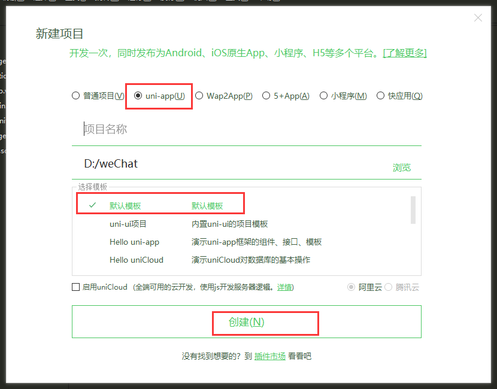
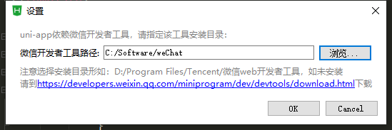

总操作流程：
- 1、[下载安装](#uniApp-01)
- 2、[配置](#uniApp-02)
- 3、[测试](#uniApp-03)

***

# <a name="uniApp-01" href="#" >下载安装</a>
 
> 下载HBuilderX

> HBuilderX创建项目

# <a name="uniApp-02" href="#" >配置</a>

> 获取小程序ID

> HBuilderX项目填写小程序ID

# <a name="uniApp-03" href="#" >测试</a>

> 运行

> 效果

