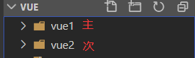

总操作流程：
- 1、创建项目
- 2、配置
- 3、测试

***

# 创建项目

> 创建两个vue项目

- 主vue项目
- 子vue项目



# 配置

> 主vue项目：vue1

- 下载安装插件

```shell
cd vue1

cnpm install single-spa --save
```

- 修改app.vue 文件 添加

```html
<div id="vue"></div>
```

- 创建single-spa-config.js

```js

// single-spa-config.js
import * as singleSpa from 'single-spa' // 导入single-spa

/* runScript：一个promise同步方法。可以代替创建一个script标签，然后加载服务 */
const runScript = async (url) => {
  return new Promise((resolve, reject) => {
    const script = document.createElement('script')
    script.src = url
    script.onload = resolve
    script.onerror = reject
    const firstScript = document.getElementsByTagName('script')[0]
    firstScript.parentNode.insertBefore(script, firstScript)
  })
}
singleSpa.registerApplication( // 注册微前端服务
  'singleDemo',
  async () => {
    await runScript('http://127.0.0.1:3000/js/chunk-vendors.js')
    await runScript('http://127.0.0.1:3000/js/app.js')
    return window.singleVue
  },
  location => location.pathname.startsWith('/test') // 配置微前端模块前缀
)
singleSpa.start() // 启动
```

- Main.js 引入配置文件

```js
import './single-spa-config.js'
```

> 次vue项目：vue2

- 下载安装插件

```shell

cd ..

cd vue2

cnpm install single-spa-vue --save
```

- 创建vue.config.js

```js
/*
 * @Descripttion:
 * @version: 0.1
 * @Author: DK_Li
 * @Date: 2020-04-20 02:45:18
 * @LastEditors: DK_Li
 * @LastEditTime: 2020-04-20 02:45:26
 */
const StatsPlugin = require('stats-webpack-plugin')

module.exports = {
  publicPath: '//localhost:3000/',
  css: {
    extract: false
  },
  configureWebpack: {
    devtool: 'none', // 不打包sourcemap
    output: {
      library: 'singleVue', // 导出名称
      libraryTarget: 'window' // 挂载目标
    },
    /** ** 添加开头 ****/
    plugins: [
      new StatsPlugin('manifest.json', {
        chunkModules: false,
        entrypoints: true,
        source: false,
        chunks: false,
        modules: false,
        assets: false,
        children: false,
        exclude: [/node_modules/]
      })
    ]
    /** ** 添加结尾 ****/
  },
  devServer: {
    contentBase: './',
    compress: true
  }
}

```


# 测试
