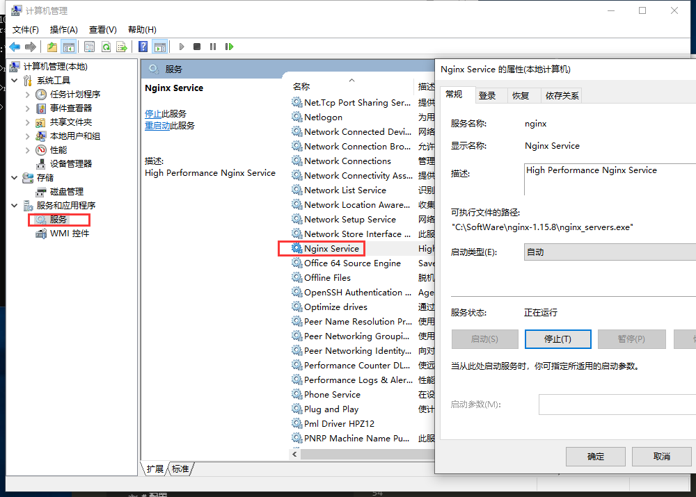

总操作流程：
- 1、下载
- 2、配置
- 3、测试

***

# 下载

[](https://pan.baidu.com/s/1ePqPxiuWAoS9VNhNYk_VHA)

密钥：gqo0

# 配置

> 1、将winsw-1.18-bin.exe名字改成nginx_servers.exe

> 2、创建nginx_servers.xml

```xml
<service>
  <id>nginx</id>
  <name>Nginx Service</name>
  <description>High Performance Nginx Service</description>
  <logpath>C:\SoftWare\nginx-1.15.8\logs</logpath>
  <log mode="roll-by-size">
    <sizeThreshold>10240</sizeThreshold>
    <keepFiles>8</keepFiles>
  </log>
  <executable>C:\SoftWare\nginx-1.15.8\nginx.exe</executable>
  <startarguments>-p C:\SoftWare\nginx-1.15.8</startarguments>
  <stopexecutable>D:C:\SoftWare\nginx-1.15.8\nginx.exe</stopexecutable>
  <stoparguments>-p C:\SoftWare\nginx-1.15.8\nginx.exe -s stop</stoparguments>
</service>
```

>3、创建nginx_service.exe.config

```xml
<configuration>
  <startup>
    <supportedRuntime version="v2.0.50727" />
    <supportedRuntime version="v4.0" />
  </startup>
  <runtime>
    <generatePublisherEvidence enabled="false"/> 
  </runtime>
</configuration>
```

>3、将他们放到nginx文件夹目录下

>4、cmd安装

```
cd C:\SoftWare\nginx-1.15.8

nginx_servers.exe install
```

# 测试



